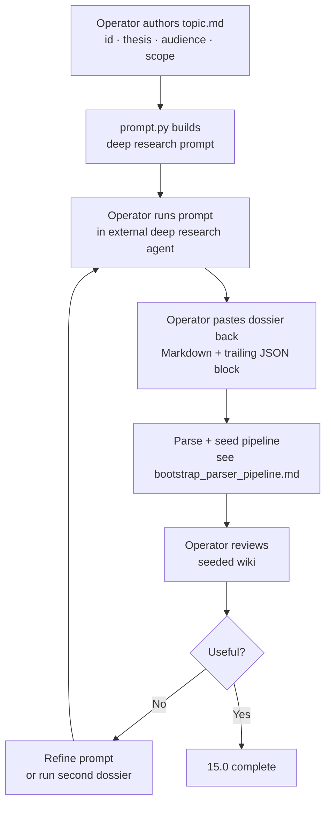

# Bootstrap — Operator Flow

Task 15.0 — human-in-the-loop journey from a new topic to a seeded wiki. Parser/seeder internals are covered in `bootstrap_parser_pipeline.md`.

```mermaid
flowchart TD
    A[Operator authors topic.md<br/>id · thesis · audience · scope] --> B[prompt.py builds<br/>deep research prompt]
    B --> C[Operator runs prompt<br/>in external deep research agent]
    C --> D[Operator pastes dossier back<br/>Markdown + trailing JSON block]
    D --> E[Parse + seed pipeline<br/>see bootstrap_parser_pipeline.md]
    E --> F[Operator reviews<br/>seeded wiki]
    F --> G{Useful?}
    G -->|No| H[Refine prompt<br/>or run second dossier]
    H --> C
    G -->|Yes| I[15.0 complete]
```
