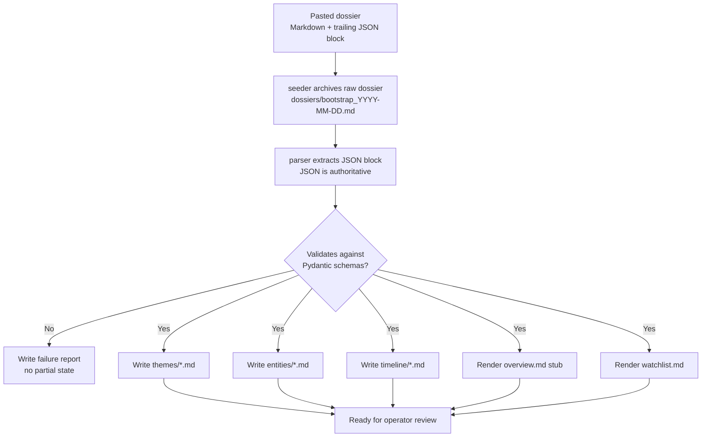

# Bootstrap — Parser and Seeder Pipeline

Task 15.0 — internal processing from pasted dossier to seeded wiki files. Validation is a hard gate; partial writes are never committed.

```mermaid
flowchart TD
    A[Pasted dossier<br/>Markdown + trailing JSON block] --> B[seeder archives raw dossier<br/>dossiers/bootstrap_YYYY-MM-DD.md]
    B --> C[parser extracts JSON block<br/>JSON is authoritative]
    C --> D{Validates against<br/>Pydantic schemas?}
    D -->|No| E[Write failure report<br/>no partial state]
    D -->|Yes| F[Write themes/*.md]
    D -->|Yes| G[Write entities/*.md]
    D -->|Yes| H[Write timeline/*.md]
    D -->|Yes| I[Render overview.md stub]
    D -->|Yes| J[Render watchlist.md]
    F --> K[Ready for operator review]
    G --> K
    H --> K
    I --> K
    J --> K
```
