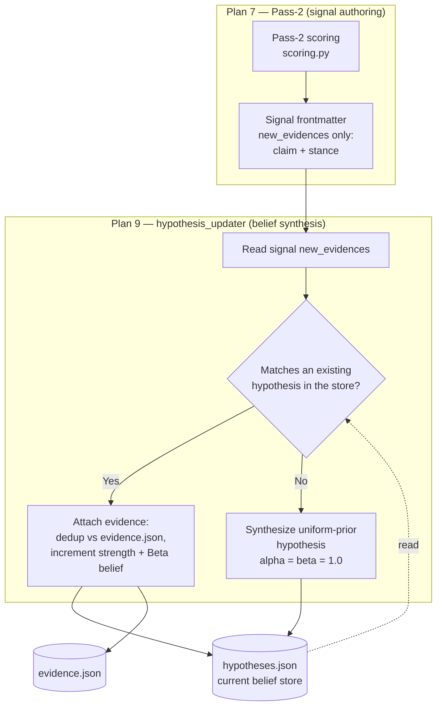

# Pass-2 Evidence → Hypothesis Boundary

Task 15.3b (Plan 7, revision 2026-06-06) — where signal authoring stops and belief synthesis begins. A pass-2 signal emits `new_evidences` (claim + stance) **only**; it never authors hypotheses. Synthesizing a new resolvable hypothesis from unmatched evidence is owned by Plan 9's `hypothesis_updater`, because the match-or-create decision needs the current hypothesis store — which the signal text alone does not have.

The dashed read edge is the whole point: the `Yes/No` decision is a function of the **store**, not of the signal. Pushing it into `Pass2Score` would force the signal to answer a question it cannot see the inputs to, and would re-introduce the double-authoring the open-questions→hypotheses refactor removed.
