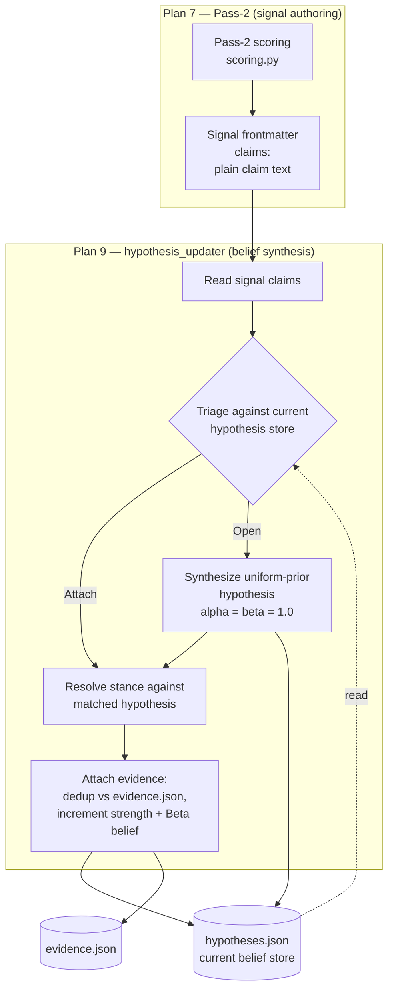

# Pass-2 Claim → Hypothesis Boundary

This diagram shows where signal authoring stops and belief synthesis begins. A pass-2 signal emits plain `claims`; it neither assigns stance nor authors hypotheses. Matching a claim, synthesizing a new resolvable hypothesis, and resolving stance are owned by Plan 9's `hypothesis_updater`, because those decisions need a named hypothesis and the current store — context pass-2 does not have.

The dashed read edge is the whole point: both matching and stance are functions of a **named hypothesis**, not properties of claim text in isolation. Pushing either into `Pass2Score` would force the signal to answer a question whose inputs it cannot see.
