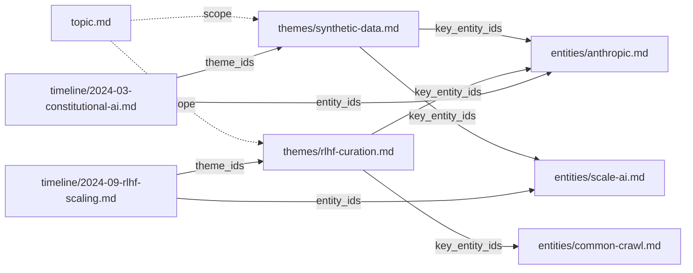

# Wiki — Forward-Link Structure

Zettelkasten-style forward-only links between topic concepts. No reverse-link lists are stored; backlinks are discovered via frontmatter scan.

```mermaid
flowchart LR
    topic[topic.md]

    t1[themes/synthetic-data.md]
    t2[themes/rlhf-curation.md]

    e1[entities/anthropic.md]
    e2[entities/scale-ai.md]
    e3[entities/common-crawl.md]

    tl1[timeline/2024-03-constitutional-ai.md]
    tl2[timeline/2024-09-rlhf-scaling.md]

    topic -.scope.-> t1
    topic -.scope.-> t2

    t1 -->|key_entity_ids| e1
    t1 -->|key_entity_ids| e2
    t2 -->|key_entity_ids| e1
    t2 -->|key_entity_ids| e3

    tl1 -->|theme_ids| t1
    tl1 -->|entity_ids| e1
    tl2 -->|theme_ids| t2
    tl2 -->|entity_ids| e2
```
