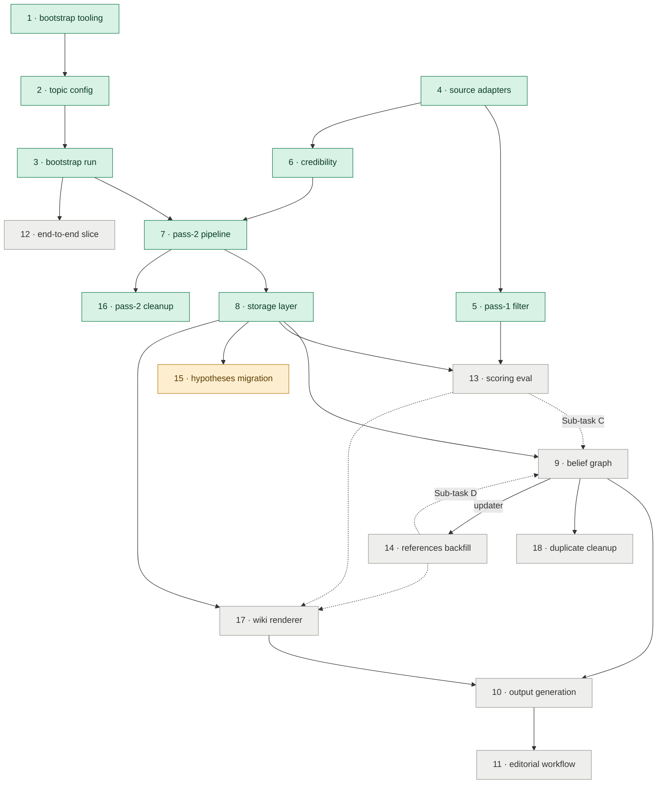

# Planning

Task plans for Distill, organized by status.

```
done/     ← completed tasks, kept for reference and traceability
doing/    ← the task actively being worked on (one at a time)
backlog/  ← upcoming tasks in dependency order, ready to be started
```

## Workflow

1. Pick the lowest-numbered file in `backlog/`.
2. Move it to `doing/` when work starts.
3. Move it to `done/` (and update its status line) when tests pass.

## Dependencies

Plans are numbered in rough build order, but some dependencies run against it — Plan 9's evaluation sub-tasks, for instance, need the higher-numbered Plans 13 and 14. The graph below shows the real edges.



**Reading it.** Arrows run from a plan to the one that builds on it. A **solid** arrow means the target needs the source built first; a **dashed** arrow means the source only gates one of the target's *evaluation* sub-tasks, so the target's core work can start before it exists. Where several plans feed one, only the nearest link is drawn — each plan's own file lists its full `Depends on` set. Node colour marks status: green = done, amber = in progress, grey = backlog.

Plan 9 and Plan 17 are **parallel siblings** — they read the same pass-2 signals through a shared contract and never call each other, so no edge joins them.

## Numbering

Numbers are globally unique across all folders. Done tasks hold the lowest numbers (reflecting completion order); backlog tasks continue the sequence. When a task moves from backlog to doing to done, its number stays the same — and its colour in the graph above moves green.

## Specs

Detailed test specifications live separately in `docs/specs/` as `.test.md` files and are not moved by this workflow.
