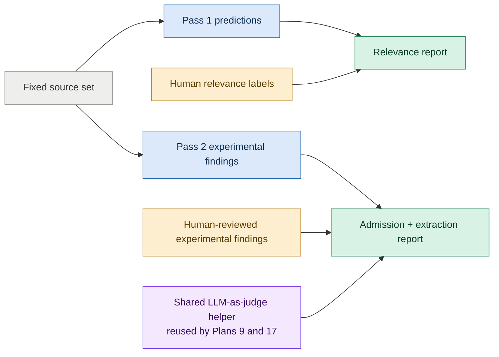

# Plan 13 — Relevance And Finding-Extraction Quality Evaluation

**Depends on:** Plan 5 (pass-1 relevance filter); Plan 19 (experiment-grounded pass-2 findings).

**Shared infrastructure:** Plan 9 reuses this plan's judge helper for matching/stance quality; Plan 17 reuses it for narrative-novelty quality. Those plans own their own golden cases and reports.

---

Build a small, repeatable evaluation set that tells us whether pass-1 admits the right sources and pass-2 admits only complete, experiment-grounded findings from them.

**Why this matters:** Unit tests can prove that an LLM response has the expected shape, but not that it captured the right experiment, preserved its design and limitations, or correctly rejected unsupported commentary. The graph can only be as good as the findings it receives. A fixed, human-reviewed yardstick makes prompt and model changes measurable rather than anecdotal.

---

## §1 · What this plan evaluates

Plan 19 removes applicability, strategic significance, audience, stance, and themes from pass-2. This plan follows that responsibility boundary.

The evaluation has two production dimensions:

1. **Pass-1 relevance** — does the cheap filter admit genuinely on-topic sources and reject obvious noise?
2. **Pass-2 experimental admission and fidelity** — does pass-2 reject non-experimental material and preserve every eligible proposition, dataset, method, result, condition, and locator accurately?

Graph interpretation is deliberately evaluated elsewhere: hypothesis matching, attach/open/drop, stance, and theme assignment belong to Plan 9; narrative novelty belongs to Plan 17; output-time applicability and significance belong to Plan 10.

---

## §2 · Generate human-reviewed golden values

Use a small fixed set at launch—roughly ten sources per pass—large enough to expose obvious regressions and small enough for line-by-line human review.

Pass-1 golden entries carry the source URL, expected pass/fail label, and a short explanation tied to the topic boundary.

Pass-2 golden entries carry:

- expected authors and affiliations;
- the important experimentally grounded findings a good extraction should capture;
- for each finding, the expected proposition, data, method, result, conditions, and source location;
- an explicit empty expectation for a source, or source section, with no eligible experiment; and
- notes identifying acceptable variation rather than forcing one exact wording.

A frontier model may draft the golden findings, but a human verifies every entry against the source before it becomes the yardstick. Golden labels are committed separately from production predictions so a model is never graded against labels it generated unreviewed.

### Initial golden corpus

The architecture changed what we grade, not the deliberately chosen source set. Keep the original papers so results remain comparable across the refactor. Verify the arXiv ids when the golden files are authored.

**Pass-1 — relevance boundary (10 papers):**

| # | Title | arXiv | Label | Why it is in the set |
|---|---|---|---|---|
| 1 | Textbooks Are All You Need (Phi-1) | 2306.11644 | pass | Flagship synthetic-data paper |
| 2 | Self-Rewarding Language Models | 2401.10020 | pass | Bootstrap-data / self-play loop |
| 3 | The FineWeb Datasets | 2406.17557 | pass | Web-scale curation pipeline |
| 4 | DataComp-LM | 2406.11794 | pass | Open data-curation benchmark |
| 5 | The Curse of Recursion | 2305.17493 | pass | Risks of training on generated data |
| 6 | Mamba: Linear-Time Sequence Modeling | 2312.00752 | fail | Pure architecture |
| 7 | FlashAttention | 2205.14135 | fail | Pure systems / inference |
| 8 | MMLU | 2009.03300 | fail | Evaluation benchmark |
| 9 | Direct Preference Optimization (DPO) | 2305.18290 | edge | Alignment method that relies on preference data |
| 10 | Self-RAG | 2310.11511 | edge | Retrieval-augmented method, data-adjacent |

For edge cases, default to `fail` when the human reviewer cannot make a clear in-scope case. This keeps the admission threshold sharp.

**Pass-2 — finding-extraction fidelity (10 papers):**

| # | Title | arXiv | Extraction coverage |
|---|---|---|---|
| 1 | Textbooks Are All You Need (Phi-1) | 2306.11644 | Synthetic-data propositions, data, methods, and results |
| 2 | Self-Rewarding Language Models | 2401.10020 | Iterative self-play and data-generation experiments |
| 3 | The FineWeb Datasets | 2406.17557 | Experimental curation comparisons and their scale conditions; descriptive construction details are excluded |
| 4 | DataComp-LM | 2406.11794 | Head-to-head data-curation experiments; descriptive benchmark construction is excluded |
| 5 | The Curse of Recursion | 2305.17493 | Negative findings, failure conditions, and limitations |
| 6 | Beyond Human Data (ReST^EM) | 2312.06585 | Iterative synthetic-data findings and bounded conditions |
| 7 | OLMo | 2402.00838 | Reported evaluations only; provenance and openness claims are excluded |
| 8 | The False Promise of Imitating Proprietary LLMs | 2305.15717 | Counterevidence and limits of imitation data |
| 9 | WRAP: Rephrasing the Web for Pretraining | 2401.16380 | Web-rewriting method, supporting comparisons, and constraints |
| 10 | Nemotron-4 340B Technical Report | 2406.11704 | Large-scale synthetic-data experiments with technical-report complexity |

The old primary-theme column is intentionally replaced by extraction coverage. These papers no longer test pass-2 theme placement; they test whether experimental findings retain their complete evidence chain and whether descriptive or argumentative sections stay out of the findings collection.

Add two small HTML cases alongside the paper set: one research blog with a documented experiment that must yield findings, and one topical announcement or opinion post that must yield zero. This proves that admission follows the evidence shape rather than the source format.

---

## §3 · Generate predictions once, evaluate many times

Full-text prediction runs are the expensive step. Store each run with its source set, model identities, prompts, configuration, timestamps, and raw structured outputs. Evaluation scripts are pure functions over a golden set and a run directory, so grading rules can change without repeating source fetches or pass-2 calls.

The exact run-directory shape and CLI are pinned at `doing`, but every report must point back to the prompt and model that produced the prediction.

---

## §4 · Grade relevance and extraction separately

### Pass-1 relevance

Report false admissions and false rejections per source, plus aggregate precision/recall or an equally legible small-set summary. Every failure names the source and why the golden label differs, so prompt changes are actionable.

### Pass-2 finding extraction

Grade objective metadata deterministically and use the shared judge for semantic fidelity. The finding rubric covers:

- **Experimental admission** — only findings backed by an identifiable evaluation, comparison, intervention, or ablation are emitted.
- **Coverage** — the important topic-relevant experiments were captured without extracting descriptive or argumentative material indiscriminately.
- **Proposition fidelity** — the source-level claim being tested is preserved without turning it into an endorsed Distill fact or graph hypothesis.
- **Experimental completeness** — the data, method, and measured result are all present and do not exceed what the source supports.
- **Conditions and limitations** — scope boundaries that change interpretation are not omitted.
- **Traceability** — source locations let a reviewer verify the extraction.
- **Atomicity** — distinct findings are not collapsed into one ambiguous record, and one result is not fragmented unnecessarily.

The report scores each finding and names missing, unsupported, or poorly bounded content. It also reports false extractions from non-experimental material and missed experiments. It does not grade applicability, strategic significance, audience, theme assignment, or stance because pass-2 no longer produces them.

### Shared judge helper

The judge wrapper, frozen rubric format, and report conventions live in reusable infrastructure. Plans 9 and 17 call the helper with their own domain-specific golden cases; they do not move their evaluations into this plan.

---

## §5 · Bootstrap hypothesis-generation quality remains separate

The existing need to evaluate bootstrap-authored hypotheses still stands, but it is not part of pass-2 extraction. Reuse the same judge infrastructure to check that seed hypotheses are directional, resolvable, strategically meaningful, atomic, and non-duplicative. Keep its golden inputs and report separate so extraction changes cannot obscure hypothesis-authoring regressions.

---

## Indicative changes — pinned at `doing`

| Area | Purpose |
|---|---|
| `evals/golden/` | Human-reviewed pass-1 labels, pass-2 findings, and separate bootstrap-hypothesis cases |
| `evals/generate_predictions.py` | Reproducible production predictions with full prompt/model provenance |
| `src/topics/eval_judge.py` | Shared strict judge wrapper used by this plan, Plan 9, and Plan 17 |
| `evals/eval_pass1.py` | Relevance comparison and readable failure report |
| `evals/eval_pass2_extraction.py` | Metadata checks plus finding-fidelity judgment |
| `evals/eval_hypothesis_generation.py` | Separate bootstrap hypothesis quality report |

---

## Verification

- Prediction generation and evaluation are separate; regrading does not rerun pass-2.
- Every run records model, prompt, configuration, source, and timestamp provenance.
- Pass-1 failures identify concrete false admissions or rejections.
- Pass-2 reports identify missed experiments, false extraction of non-experimental claims, unsupported synthesis, missing data/method/result fields, lost conditions, and unverifiable source locations.
- A mixed source yields only its experimental findings; a purely argumentative or announcement source yields an empty findings collection.
- Changing graph state or audience does not change pass-2 extraction expectations.
- No pass-2 eval expects themes, stance, applicability, strategic significance, audience, or freshness.
- Plans 9 and 17 can reuse the judge helper without coupling their golden cases to this plan.
- Re-evaluating the same stored predictions is deterministic except for explicitly reported judge drift.

## Non-goals

- Evaluating Plan 9's graph interpretation; Plan 9 owns that quality gate.
- Evaluating Plan 17's narrative novelty; Plan 17 owns that quality gate.
- Evaluating Plan 10's contextual assessments or output quality.
- Using evaluation labels as production data.
