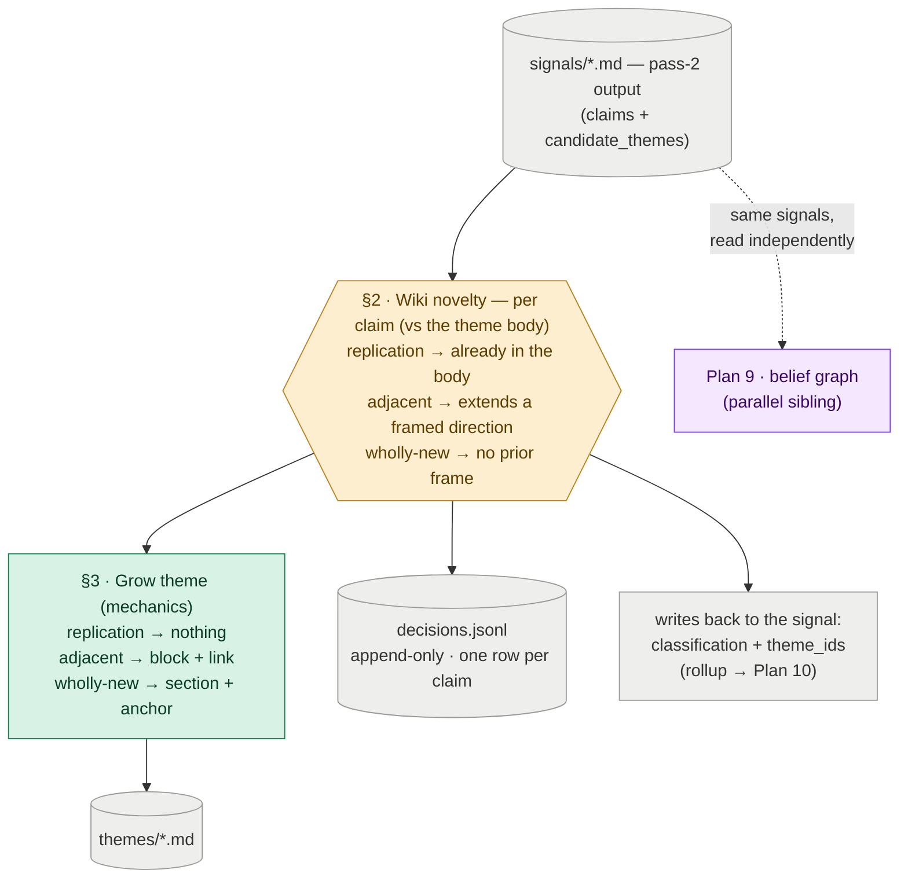

# Plan 17 — Wiki Renderer: Theme Novelty And Growth

**Original task id:** 15.5 (wiki-update half).

**Split note (2026-06-29):** Split out of Plan 9, which originally covered both the belief graph and the wiki renderer. This plan owns the **renderer**: the old Plan 9 §5 wiki-novelty decision, the theme-growth rules, and anchors. Plan 9 now owns the belief graph. The two are parallel siblings — they consume the same pass-2 signals and never call each other. **This plan never reads `hypotheses.json`:** a claim finds its theme through the signal's own `candidate_themes` (§2), which is what keeps the renderer independent of the belief graph.

**Depends on:** Plan 7 (pass-2 signals carry `new_evidences` claims and `candidate_themes`); Plan 8 (the shared `storage` module and signal frontmatter I/O — see Plan 9 Sub-task A for the shared-ownership note); Plan 13 (the LLM-as-judge helper, reused by Sub-task B).

---

Turn each scored signal's claims into an evolving thematic wiki: decide how new each claim is to the theme it touches, grow the theme accordingly, and leave an auditable record of every call.

**Why this matters:** The wiki is the human-readable product surface. If every incoming claim were appended verbatim, a theme would degrade into an undifferentiated pile within a few dozen papers. The renderer is what keeps a theme a coherent narrative: a replication adds nothing, a small extension is linked to what it extends, and only a genuine novelty opens new ground. The same judgment also tells the downstream tweet filter (Plan 10) which signals are worth surfacing.

---

## §1 · What this plan does

The renderer makes **one decision per claim**, plus deterministic growth mechanics.

The decision (**wiki novelty**, §2) asks *is this claim replication, adjacent, or wholly new* against the theme body it touches. It runs over **every** claim a signal carries, whatever role the belief graph gave it — an evidential claim that moved a belief, *and* a claim the belief graph routed out as a non-evidence fact (a new dataset or benchmark is often the most novel thing a paper brings to a theme, even though it is evidence for no bet).

Everything else is **mechanics, not a decision** (§3): the verdict deterministically drives whether and how the theme body grows. The renderer also writes an append-only decision log and stamps the signal done.

Whether the *paper* is worth surfacing is not this plan's decision — it is a **rollup** over its claims that Plan 10's tweet filter composes from the stamp this plan writes.

**The split decoupled the renderer from the belief graph.** Because each subsystem now writes its own stamp, the renderer no longer has to run after the belief graph (the old §5 ran last because a single stamp marked the whole signal done). It reads the same signals and can run independently — before or after the belief graph, in either order, but never concurrently: both subsystems read-modify-write the same signal frontmatter for their stamps, so interleaved runs could silently drop each other's stamp.

*Amber = the model call · green = deterministic mechanics this plan owns · grey = outputs (files on disk, and the stamp written back to the signal) · purple = the parallel belief graph (Plan 9).*

---

## Sub-task A — The renderer

One entry-point module drives the renderer. `wiki_updater.py` runs the novelty decision per claim (§2), grows the theme (§3), appends each call to `decisions.jsonl`, and stamps the signal. Reading and stamping signals uses the **shared** signal frontmatter I/O described in Plan 9's Sub-task A — this plan writes only the `classification` / `theme_id_assigned` stamp. A run consumes the signals missing `classification`; the stamp is written **last**, once all of a signal's claims are classified, so a crash leaves the signal unstamped and the next run re-opens it (re-classification is idempotent — see Verify).

### §2 · Decision — Wiki novelty (per claim)

**Classify each claim against the theme body and grow the theme accordingly.** The unit is the *claim* — the same `new_evidences` entry the belief graph uses, not the paper: a paper with one novel result among three replications should grow the theme from the one claim and leave the rest alone, which a single paper-level verdict cannot express.

| File | Action | Description |
|---|---|---|
| `src/topics/wiki_updater.py` | **NEW** | Classifies the contribution, grows the theme, stamps `classification` / `theme_id_assigned` on the signal, and appends the full decision to `decisions.jsonl` |
| `src/topics/anchors.py` | **NEW** | Stable `` generation and resolution for adjacent-block links |
| `tests/test_wiki_updater.py` | **NEW** | Idempotency across replication / adjacent / wholly-new; classification written back; decision logged with reasoning; multi-theme non-redundancy |

**Which theme a claim touches.** A claim finds its theme through the signal's own `candidate_themes` (set by pass-2), **not** through the hypothesis the belief graph matched. This is deliberate: it is what lets the renderer run without reading `hypotheses.json`, keeping it independent of the belief graph. It also means the quality of theme placement is already covered by an eval we build elsewhere — Plan 13 D.2 grades `candidate_themes` (top-1 theme match + recall@3).

**A claim may grow more than one theme — but never with the same content.** `candidate_themes` can name several themes, and one claim can legitimately bear on more than one. When it does, novelty is judged against each theme separately, and the claim grows a theme only where it adds something that theme does not already have. The non-redundancy rule: take the claim's themes best-fit first and grow that one; then for each further theme, compare what the claim would add not only against that theme's body but against what the same claim already contributed to the earlier theme. If it is the same point, that is a copy, not a new contribution — do not write it. A claim lands in two themes only when it tells each one something genuinely different. The default is therefore a single theme; a second has to earn it.

The `replication / adjacent / wholly_new` verdict drives the theme growth rules in §3. The verdict encodes both scoring axes at once. **Landscape fit** answers "how does this relate to what we already know?" — the replication/adjacent/wholly-new gradient itself. **Technical novelty** answers "is this genuinely new, or incremental?" — replication is incremental, adjacent a meaningful extension, wholly-new a genuine advance. Technical novelty is why this judgment lives in the renderer and not in pass-2: it needs the full theme body as context and cannot be made reliably from the abstract alone.

The decisions are recorded in **two places**, each answering a different question:

- The **log** (`decisions.jsonl`, per topic, append-only) holds one row **per claim**: verdict, the model's **reasoning**, the theme touched, the source `signal_id`, and a timestamp. It is JSONL — one decision per line — so each row is appended without rewriting the file; a deliberate break from the project's flat-array JSON, because a log only grows.
- The **stamp** on the signal frontmatter is a **rollup**, not a per-claim verdict: the signal's headline `classification` (its best claim, what Plan 10 ranks on), the set of `theme_id`s its claims touched, and the "already processed" marker. Plan 10's output filter reads it to drop a pure-replication signal as a tweet candidate and rank incremental signals below genuine advances, without reopening the log.

The stamp says what a signal is worth *now*; the log says what we decided about *every claim*, and why. The stamp's rollup is derived from the same step that writes the log rows, so it always agrees with them — a disagreement is a bug. Each claim is classified once, so the log holds exactly one row per claim, not a version history. The log is what makes an LLM classifier auditable: the reasoning trail is the only way to debug a bad call or watch the verdict mix drift. It does not duplicate Plan 9's §4 belief provenance — provenance records which evidence moved which belief; this log records the novelty call and where each claim was filed.

- **Open —** the *adjacent* rule must pick *which* prior block to link to, itself an unspecified similarity judgment. (Theme mapping itself is no longer open — it is resolved above via `candidate_themes`.)

**Verify.**
- **`[llm]`** Each claim's verdict grows the theme correctly: `replication` adds no body; `adjacent` appends a block plus a Markdown link to the prior block's stable anchor; `wholly_new` opens a standalone section with a fresh anchor.
- **`[llm]`** A mixed paper grows the theme only from its novel claims: one wholly-new claim among replications appends one block, not a whole section, and contributes one wholly-new entry to the rollup.
- **`[llm]`** A claim that bears on two themes grows each only with what is new *to that theme*; if its contribution to the second theme repeats what it added to the first, the second theme is not grown (non-redundancy).
- **`[det]`** The signal frontmatter rollup (headline `classification` + the `theme_id`s touched) is written back — the values Plan 10's output filter later ranks on.
- **`[det]`** Re-applying an already-stamped signal is idempotent: no claim is re-classified and no `adjacent` block is appended a second time.
- **`[det]`** Each claim appends exactly one row to `decisions.jsonl` (verdict, reasoning, theme, `signal_id`, timestamp); a stamped signal is skipped by later runs, so there is one row per claim and the stamp's rollup is consistent with them.

### §3 · Mechanics — grow the theme (deterministic)

**These are consequences, not decisions.** Once §2 returns a verdict for a claim against a theme, the growth runs as deterministic code — no model calls.

- **replication** — confirms the existing theme body with no new information → **no body growth**.
- **adjacent** — extends the theme in a direction it already frames → **append a block + Markdown link to the prior block's stable anchor** (`anchors.py` generates and resolves the anchor).
- **wholly-new** — something the topic has no prior frame for → **standalone section + fresh anchor**.

### The model-judgment surface

The novelty decision (§2) is a model call, not deterministic code — the single amber node in this plan. As with Plan 9's two judgments, its model machinery — prompt contract, model + fallback selection, and the parse/validation path — is **not yet specified** and must be pinned at the `doing/` boundary. Its quality gate is Sub-task B.

**Acceptance gate (not a test).** Before `doing/`, the novelty call needs a recorded prompt contract, model + fallback selection, and parse/validation path. This gate blocks every `[llm]` check above.

### Verification — renderer invariants

- A second run grows existing themes instead of recreating them from scratch.
- A run consumes the signals missing the `classification` stamp; the stamp is written **last**, after all of a signal's claims are classified.
- Re-applying a stamped signal is idempotent (covered per-step in §2).
- Themes remain legible after a run.

---

## Sub-task B — Novelty Judgment Evaluation

**Depends on:** Plan 13 (reuses its LLM-as-judge helper, `eval_judge.py`).

The novelty call in §2 is a judgment, so the shape tests in Sub-task A cannot tell whether it is *correct*. This sub-task is its quality gate — the renderer's analogue of Plan 9's Sub-task C and Plan 13's scoring eval: a small golden set scored with an LLM-as-judge. The tie to Plan 13 is narrow, just the judge helper.

### Changes

| File | Action | Description |
|---|---|---|
| `evals/golden/wiki_novelty.yaml` | **NEW** | A handful of claims, each paired with a theme body and a human verdict (`replication` / `adjacent` / `wholly_new`), including a mixed-paper case and a multi-theme case |
| `evals/eval_wiki_novelty.py` | **NEW** | Runs the novelty call over the golden claims against fixed theme bodies and judges each verdict; writes a markdown report. Reuses Plan 13's `eval_judge.py`; does not modify Plan 13 |

### Verification

- A claim wrongly called `replication` when it extends the theme — or `wholly_new` when the theme already frames it — scores low and is named in the report.
- A mixed paper's per-claim verdicts are graded individually, not collapsed to a paper-level call.
- Re-running on the same predictions is near-identical (±1 judge drift), matching Plan 13's eval contract.

---

## Sub-task C — At-Scale Theme Legibility (after backfill)

**Depends on:** Plan 14 (produces the backfilled signal batch) and Sub-task A (grows themes over it).

The evals above check one verdict at a time. They cannot see the property that only emerges when the renderer runs over a large batch: after ~100 papers, does a theme still read as a **coherent narrative**, or has it become append-sludge? This sub-task checks that on the Plan 14 backfill (~100 papers).

What it must demonstrate, on the real backfilled themes:

- A theme reads as a coherent narrative, not an undifferentiated pile of appended blocks.
- Adjacent blocks link sensibly to what they extend; wholly-new sections are genuinely new ground, not restated existing material.

**How is left open.** Whether this is an LLM-as-judge over the resulting theme files, a human read, or a deterministic structural check (block counts, link density) — and what counts as "legible" — is pinned at the `doing/` boundary. This sub-task names *what* it checks and *why*; the method is a later decision.
