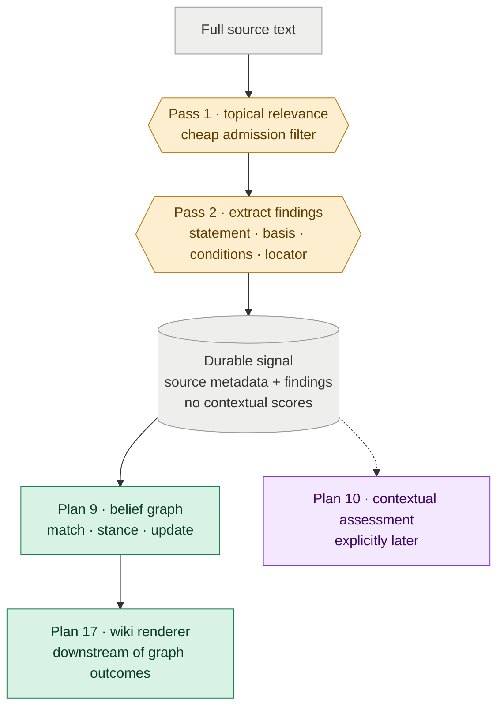

# Plan 19 — Pass-2 Source-Grounded Finding Extraction

**Depends on:** Plan 7 (the shipped pass-2 pipeline this plan refactors); Plan 16 (the shipped removal of pass-2-authored open questions).

**Feeds:** Plan 9 consumes findings and becomes their sole interpretation gateway; Plan 13 evaluates extraction quality; Plan 14 backfills the finding contract. Plan 17 receives Plan 9's durable graph outcomes, not pass-2 findings. Contextual applicability and strategic-significance assessment are deliberately deferred to Plan 10.

---

Turn pass-2 from a paper scorer into a source-grounded extraction stage that gives the belief graph complete, verifiable findings instead of thin claim strings and premature judgments.

**Why this matters:** The current pass-2 mixes two jobs. It extracts what a source says, then immediately judges applicability, strategic significance, audience, and theme placement before the knowledge graph is involved. At the same time, its plain claim strings discard the reasoning, measurements, conditions, and limitations Plan 9 needs to make a high-quality belief update. This plan removes that complexity from ingestion: pass-2 preserves the source; the graph decides what the source means for beliefs; outputs decide what deserves attention later.

---

## §1 · What this plan does

Pass-2 becomes a narrow boundary between full source text and the two graph consumers.



The plan makes three changes, all serving the same extraction responsibility:

1. **Replace thin claims with self-contained findings.** Each extracted unit carries what the source reports and the support needed to interpret it correctly.
2. **Remove contextual judgments from pass-2.** Applicability, strategic significance, audience fit, and recency are not durable source properties.
3. **Remove themes from pass-2.** Theme placement is knowledge interpretation, not source extraction.

This plan stops at the written signal contract. It does not build the later contextual-assessment system.

---

## §2 · Pass-2 preserves findings, not verdicts

**A finding must be understandable and checkable without reopening the entire paper.** A conclusion alone is too lossy: the same sentence can move a belief differently depending on the comparison, dataset, model scale, assumptions, and limitations behind it.

The exact schema is pinned when this plan moves to `doing`, but every finding must preserve these semantic parts:

- **Statement** — the concrete proposition the source reports, written with appropriate attribution rather than as an endorsed fact.
- **Basis** — the measurements, comparisons, observations, or reasoning the source uses to support the statement.
- **Conditions** — the population, dataset, model scale, task, assumptions, and limitations that bound where the finding holds.
- **Source location** — enough of a section, table, figure, or page reference for a human to verify the extraction.

An indicative shape—not yet the settled contract—is:

```yaml
findings:
  - statement: >
      The authors report that fuzzy deduplication improves downstream accuracy
      over exact deduplication.
    basis:
      - The comparison reports a 2.1 percentage-point gain on benchmark X.
      - The paper attributes the gain to semantic duplicates missed by exact matching.
    conditions:
      - Evaluated on C4-derived training data.
      - Tested on models up to 7B parameters.
    source_location: "Section 4.2, Table 3"
```

### Extraction is topic-conditioned but graph-independent

Pass-1 remains the cheap admission filter. Pass-2 may use the topic thesis and taxonomy to select which findings are relevant, but it must not read hypotheses, existing evidence, belief confidence, theme bodies, or audience priorities. The same source and topic configuration should produce materially the same findings regardless of what Distill currently believes.

This boundary protects novelty. If extraction sees the current graph, it can over-extract familiar support and under-extract results that do not fit existing beliefs—the opposite of what a research monitor should do.

### Contextual fields leave the signal

Pass-2 no longer authors:

- `applicability_score` or its rationale;
- `strategic_significance` or its rationale;
- `paper_audience`; or
- `temporal_freshness`.

Their raw ingredients still belong in the signal: demonstrated scale, implementation requirements, observed effects, constraints, intended use, and `published_at`. Their interpretation belongs to Plan 10, where the current graph and target audience exist. Recency is derived from `published_at` when used rather than frozen as a score that immediately becomes stale.

Source identity, URL, publication date, authors, affiliations, ingestion timestamp, and source-credibility inputs remain durable provenance. Credibility is separate from importance and remains available to Plan 9's belief mechanics.

### Themes leave pass-2 entirely

Pass-2 does not emit `candidate_themes` at paper or finding level. A small fixed taxonomy is not a useful long-term hypothesis shortlist, and a mistaken extraction-time theme must not hide the correct hypothesis from Plan 9. Existing evidence inherits theme context from its matched hypothesis; a newly opened hypothesis receives themes when Plan 9 creates it. Plan 17 renders those graph decisions later.

---

## §3 · Downstream handoff stays narrow

**This plan improves graph inputs without adding a new graph-scoring system.** Plan 9 receives the complete finding, performs the decisions it already owns, and emits the durable outcome Plan 17 renders. The required handoff and theme-ownership changes are specified in those downstream plans rather than implemented here.

The finding's basis, conditions, and source location must remain connected to resulting evidence and rendered knowledge so a human can trace a belief change back to what the source actually showed.

This plan does not change Beta weighting. Richer support may later justify an evaluated evidence-quality judgment beyond source credibility, but that is not assumed here. The immediate goal is better provenance and better model context, not another scoring system.

| Area | Responsibility after this plan |
|---|---|
| Pass-2 models and prompts | Extract complete findings; stop producing contextual paper verdicts |
| Signal writer and examples | Store provenance plus findings; remove frozen applicability, significance, audience, and freshness scores |
| Plan 9 belief updater | Consume finding objects while retaining its existing triage, stance, and Beta responsibilities |
| Plan 17 wiki renderer | Consume Plan 9 graph outcomes; never re-interpret raw pass-2 findings |
| Plan 13 quality evaluation | Grade source fidelity, support completeness, conditions, and traceability instead of pass-2 contextual scores |
| Plan 14 backfill | Re-run historical sources through the finding extractor rather than manufacture findings from thin claims |

---

## §4 · Migration must preserve source fidelity

**Do not mechanically wrap legacy claim strings and call them findings.** They lack the supporting reasoning, measurements, conditions, and source locations that motivate this refactor.

When this plan moves to `doing`, choose the transition path based on the amount of live data:

- for the current small store, re-extract and migrate all signals to one strict contract; or
- if meaningful external history exists, add an explicit legacy reader that marks thin records incomplete and schedules re-extraction.

Silent coercion is forbidden. A legacy record must be migrated, visibly marked incomplete, or rejected with a clear error.

Completed plans remain historical records. This plan supersedes their signal-contract assumptions without editing them.

---

## §5 · Decisions to pin when this moves to `doing`

The extraction boundary is settled; these implementation details remain open while the plan is in backlog.

### Finding contract

- The smallest schema that captures statement, basis, conditions, and source location without becoming a general-purpose paper parser.
- Whether basis is free text, typed measurements/reasoning, or a small discriminated structure.
- How missing source locations are handled for HTML posts without stable pages or sections.

### Consumers

- How Plan 9 references complete finding context in evidence provenance without duplicating the source record unnecessarily.
- The smallest durable graph-outcome handoff that lets Plan 17 render evidence, new hypotheses, and routed entities without reading pass-2 signals.

### Migration and evaluation

- Whether the current signal corpus is fully re-extracted or temporarily supports visibly incomplete legacy records.
- The source-fidelity golden cases and rubric that replace pass-2 score evaluation in Plan 13.
- Which old pass-2 configuration fields are removed now and which move later with Plan 10.

---

## Verification

The plan is complete when pass-2 is visibly an extraction boundary:

- **Source fidelity:** a reviewer can understand and verify every finding from its statement, basis, conditions, and source location.
- **No unsupported synthesis:** pass-2 does not add reasoning or measurements the source does not contain.
- **Graph independence:** changing hypotheses, belief confidence, or audience does not change the extracted findings.
- **Finding granularity:** a mixed paper produces independently interpretable findings rather than one paper-level claim/theme bundle.
- **Simpler signal contract:** no applicability, strategic-significance, paper-audience, or freshness score is stored on new signals.
- **Graph continuity:** Plan 9 can match and resolve stance from the finding without changing its existing Beta mechanics.
- **Renderer handoff:** Plan 17 can render Plan 9's durable outcomes without reading raw pass-2 findings.
- **Migration integrity:** no old claim silently masquerades as a fully supported finding.

## Non-goals

- Implementing applicability, strategic-significance, recency, or audience-fit assessment; Plan 10 owns those output-time concerns.
- Changing evidence strength or the Beta belief model.
- Adding a database, dashboard, or general-purpose document parser.
- Using current graph confidence to decide what pass-2 may extract.
