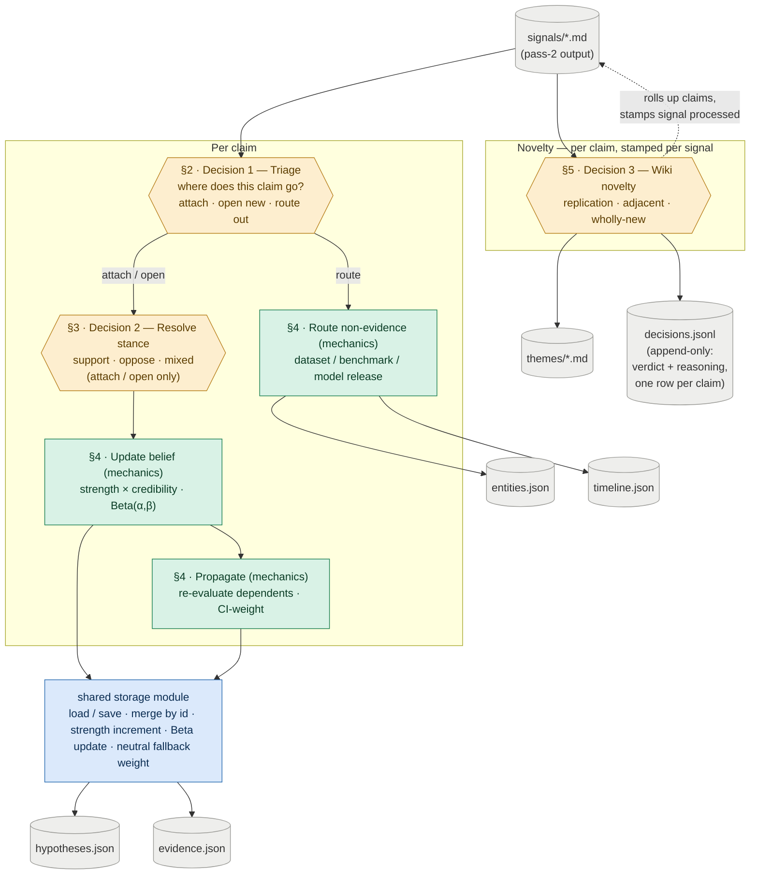

# Plan 9 — Hypothesis And Wiki Update Loop

**Original task ids:** 15.5 (Hypothesis And Wiki Update Loop), 15.5b (Hypothesis Revision And Propagation Evaluation)

---

Build the mechanism that turns newly scored signals into updated topic beliefs and an evolving thematic wiki, then prove that knowledge updates actually propagate coherently.

**Why this matters:** The wiki is the human-readable product surface, but it should not be the only place the system stores what it believes. Without a hypothesis update loop, the system stays a feed summarizer with nicer prose. A system has not really updated its knowledge if it can store new evidence but still briefs as though the old world is true — so this plan tests ripple effects directly, to keep the product from quietly degrading into a prose append-only log.

---

## §1 · What this plan does

Each signal is exploded into the pieces it carries — claims, and the non-evidence facts (a new dataset, benchmark, model release). The loop is **three decisions plus the mechanics they trigger**, and all three work *below* the paper level:

- **Two decisions per claim.** Decision 1 (**triage**, §2) asks *where does this claim go?* — attach to an existing hypothesis, open a new one, or route out as a non-evidence fact. Decision 2 (**resolve stance**, §3) asks *which way does it cut?* — support, oppose, or mixed — and runs only when Decision 1 said attach or open.
- **One decision per claim.** Decision 3 (**wiki novelty**, §5) asks *is this replication, adjacent, or wholly new?* of each claim against the theme body — **every** claim, including the ones triage routed out as non-evidence (a routed-out "dataset X released" is often the most novel thing for a theme). The theme grows only from the novel claims; whether the *paper* is worth surfacing is a rollup over them, not a verdict on the paper. It runs **after** the signal's claims are processed, and the stamp it writes marks the signal done.

Everything else is **mechanics, not decisions** — deterministic logic that fires on its own once a decision is made: the belief update, the routed-fact writes, and propagation (§4). The mechanics call the shared `storage` module, which owns load/save, merge-by-id, the credibility-weighted `strength` increment, and the Beta update. **This plan owns the decisions and orchestrates the mechanics; `storage` owns the merge/Beta machinery.** That split is stated here once and not repeated below.

*Amber = a model call (a judgment) · green = deterministic mechanics this plan owns · blue = the shared `storage` module · grey = files on disk.*

---

## Sub-task A — Hypothesis And Wiki Update Loop

Two entry-point modules drive the loop. `hypothesis_updater.py` reads pass-2 signals and runs the two per-claim decisions (§2, §3), then the mechanics they trigger (§4). `wiki_updater.py` runs the wiki novelty decision (§5) per claim: it grows the theme from the novel claims, logs each one, and stamps the signal processed once they are all classified. The shared `storage` module owns the merge/Beta mechanics that §4 calls. The **signal-specific storage** Plan 8 deliberately left out lives with its consumer, `wiki_updater.py`: the `SignalFrontmatter` model, the signal read helper, and the `classification` / `theme_id_assigned` write-back. Each section below opens with the new files it introduces, so a file's responsibility is read where it is explained.

### §2 · Decision 1 — Triage: where does this claim go? (per claim)

**Every claim runs through triage first.** Pass-2 hands over each claim as `{claim, stance}` with **no hypothesis attached** (see Plan 7's `Pass2Score`), so triage classifies the claim into exactly one branch.

| File | Action | Description |
|---|---|---|
| `src/topics/hypothesis_updater.py` | **NEW** | The updater entry point; reads pass-2 signals and runs Decision 1 and Decision 2, then the mechanics in §4 |
| `tests/test_hypothesis_updater.py` | **NEW** | Triage branches; stance cases; `strength` scales with source credibility; a new uncertainty creates a uniform-prior hypothesis |

The branches:

- **Attach** — the claim bears on an existing hypothesis. Match it against `hypotheses.json` and pick the one it speaks to. The signal's `candidate_themes` are a natural prefilter: a claim most plausibly bears on hypotheses sharing its theme. Dedup by stable id (`claim hash + hypothesis_id`) so the same claim re-matched to the same hypothesis attaches once. → resolve stance (§3), then the belief update (§4).
- **Open a new hypothesis** — nothing matches, but the claim is worth its own bet. Open a uniform-prior `Beta(1, 1)` hypothesis. **This is also how a genuinely new uncertainty enters the store** — there is no separate `open_questions.json`; an "open question" is just a low-evidence hypothesis near its prior, and rendering one as such in `overview.md` is a downstream concern. → resolve stance (§3), then the belief update (§4).
- **Route out** — nothing matches and the claim is not worth a bet, but it is a fact worth keeping: a new dataset, benchmark, or model release. It is not evidence. → the routed-fact write (§4). If it is not even that, drop it.

*How finely* to split the questions the system tracks — open a new hypothesis, or attach to an existing one — is the granularity question, resolved in **§6**.

- **Open —** the **matching mechanism** is the hinge of the whole loop and is undecided (LLM judgment over candidate hypotheses, embedding similarity, or theme-prefiltered LLM). The dedup id depends on the matched `hypothesis_id`, so this must be settled first. The rule that separates a "belief-irrelevant fact worth keeping" from a "drop," and the `entities.json` record schema (seeded by Plan 1, not restated anywhere this plan can build against), are open alongside it. Decide at the `doing/` boundary. The model-contract side of this judgment lives in "The model-judgment surface" below.

**Verify.** *(`[det]` = deterministic, asserts exact behavior; `[llm]` = model judgment, verified by eval cases and blocked until the model-judgment gate closes.)*
- **`[det]`** An unmatched, bet-worthy claim opens a uniform-prior `Beta(1, 1)` hypothesis — the same path by which a genuinely new uncertainty enters the store.
- **`[det]`** Claim-level dedup is keyed on `claim hash + hypothesis_id`: the same claim re-matched to the same hypothesis attaches once, not twice (signal-level no-double-count is a loop invariant — see the end).
- **`[llm]`** A non-evidence fact (dataset / benchmark / model release) is routed out, not attached as evidence; a bet-worthy unmatched claim opens a hypothesis rather than being routed or dropped.

### §3 · Decision 2 — Resolve stance: which way does it cut? (per claim, attach / open only)

**Once a claim is evidence — attached or opening a new bet — resolve its stance against *that* hypothesis.** The pass-2 `stance` describes the claim's own framing, not its bearing on the matched hypothesis, so it must be re-read once the hypothesis is named: a claim emitted `for` its own framing can be `against` the bet it attaches to.

A `neutral` verdict is **never stored as inert evidence**. Surfacing a claim against a *specific* hypothesis already implies a direction, so each "neutral" candidate is really one of — directional once the bet is named (`for`/`against`), a null / "no difference" result (`against` a directional bet), or conflicting (`mixed`). A claim that is genuinely belief-irrelevant was not evidence in the first place and should have routed out in Decision 1, not arrived here. So this step always collapses to `for | against | mixed`; the updater never writes a `neutral` row in `evidence.json` and never calls the belief-update helper for one. (Plan 8 keeps a `neutral` → no-op branch as defensive insurance against a stray value; the pass-2 `Evidence` enum is a shipped contract and stays unchanged — the filtering lives here, where the hypothesis is known.)

**Wrinkle on the open branch.** When a claim *opens* a new hypothesis, the new bet is framed so its founding claim supports it, so stance here is almost always `for` by construction. The interesting re-resolution happens on the **attach** branch, where the claim meets a hypothesis it did not create.

- **Open —** re-resolution is a model judgment; its prompt/model contract is specified in "The model-judgment surface" below.

**Verify.**
- **`[llm]`** Stance is re-resolved against the *matched* hypothesis, not copied from pass-2: a claim emitted `for` its own framing can resolve `against` the bet it attaches to, and a `neutral` candidate collapses to `for`/`against`/`mixed` — no `neutral` row is ever written to `evidence.json`.

### §4 · Mechanics — update belief, route the fact, propagate (deterministic)

**These are consequences, not decisions.** Once Decision 1 picks a branch and Decision 2 resolves stance, the following run as deterministic code — no model calls.

| File | Action | Description |
|---|---|---|
| `src/topics/entities.py` | **NEW** | Entity extraction / normalization for routed facts |
| `src/topics/timeline.py` | **NEW** | Appends notable shifts (substantive only; replication never appends) |
| `src/topics/propagation.py` | **NEW** | Re-evaluates dependents when belief moves; derives each edge weight as the credible-interval lower bound (multi-step tests live in Sub-task B) |

**Update belief** (attach / open branches). Increment `strength` weighted by the signal's `source_credibility` (`weight_applied = source_credibility / 10`; `null` credibility → `NEUTRAL_CREDIBILITY_WEIGHT`), append `{signal_id, weight_applied}` to provenance, and apply the Beta update through `storage` (`alpha += strength` for `for`, `beta += strength` for `against`, split for `mixed`). Updates are bounded and Bayesian-style: stronger credible evidence moves the posterior more, and negative evidence lowers belief rather than spawning a separate contradiction object.

- **Open —** the plan says to "revise action posture based on accumulated evidence" but gives no belief→`action_posture` mapping. Decide whether posture is recomputed here or is a read-time rendering, and on what rule.
- **Open —** convergence (whether recent evidence agrees or conflicts) is unreconciled with Plan 8, which treats the convergence *label* as a read-time derivative of `alpha`/`beta` and stores nothing. Before building, settle three axes: is convergence **stored or derived at read time**, computed **from `alpha`/`beta` or from provenance**, and over what "recent" window? Its behavioral case lives in Sub-task B.

**Route the non-evidence fact** (route branch). Append to `entities.json` (by id) or `timeline.json`. The timeline appends only on a substantive shift; replication never appends.

**Propagate** (after a belief move). When a hypothesis moves meaningfully, re-evaluate its dependents, discounting weak dependencies automatically. `depends_on` is the canonical first-pass edge field. The weight on each edge is derived at propagation time as the lower bound of the dependency's credible interval — `scipy.stats.beta.ppf(DEPENDENCY_WEIGHT_PERCENTILE, α, β)`, with `DEPENDENCY_WEIGHT_PERCENTILE = 0.05` a named constant (raise for more conservative propagation, lower for more aggressive). A dependency with mean 0.71 but only 3.5 units of accumulated evidence yields ≈0.30 rather than 0.71 — fragile beliefs are discounted without any hand-authored weight.

Comparative hypotheses are handled as **pairwise edges**: a hypothesis naming two subjects (`comparison: {subject_a, subject_b}`, see Plan 8) accumulates its own Beta over observed head-to-heads. A new contender adds new edges rather than rebuilding anything, and **no global ranking is stored** — a "who leads" view is *derived* at read time. Cycles among comparisons (A>B, B>C, C>A) are valid data (conditional dominance), not contradictions to resolve.

- **Open —** the edge *weight* is fully specified but the *operation* is not: how the parent's change, the `supports`/`weakens` sign, and that weight actually modify the dependent's `alpha`/`beta`; what counts as a "meaningful" change worth propagating; and whether propagation recurses transitively (and if so, how it terminates, since `depends_on` can cycle). Pin these down before building.

**Verify.**
- **`[det]`** A high-`source_credibility` increment moves the posterior more than the same claim from a low-credibility paper (`weight_applied = source_credibility / 10`; `null` → `NEUTRAL_CREDIBILITY_WEIGHT`).
- **`[det]`** An `against` claim lowers posterior belief (raises `beta`) rather than only being mentioned in prose.
- **`[det]`** A routed fact lands in `entities.json` (by id) or `timeline.json` instead of being dropped; the timeline appends only on a substantive shift (replication never appends).
- **`[det]`** A meaningful belief move updates at least one dependent hypothesis or briefing-facing conclusion; the edge weight is the credible-interval lower bound (mean 0.71 with 3.5 units of evidence → ≈0.30, not 0.71). Multi-step ripple, convergence, and comparative cases live in Sub-task B (`tests/test_hypothesis_propagation.py`).
- **`[det]`** Convergence reflects agreement vs conflict in recent evidence — **blocked** on the stored-vs-derived decision (Open, above).

### §5 · Decision 3 — Wiki novelty (per claim, after the belief work)

**Once a signal's claims have been processed, classify each one against the theme body and grow the theme accordingly.** The unit is the *claim* — the same `new_evidences` entry belief uses, not the paper: a paper with one novel result among three replications should grow the theme from the one claim and leave the rest alone, which a single paper-level verdict cannot express. Novelty runs over **every** claim, whatever role triage gave it — an evidential claim that moved a belief, *and* a claim triage routed out as a non-evidence fact (a new dataset, benchmark, or model release is often the most novel thing a paper brings to a theme even though it is evidence for no bet). Belief and novelty read the same claims; belief just acts only on the evidential subset.

Whether the *paper* is worth surfacing is not this decision — it is a **rollup** over its claims (e.g. surface a paper if it has at least one wholly-new claim, ranked by its best one), which Plan 10's output filter composes. This decision runs **after** the signal's belief work, and the stamp it writes marks the signal processed once all its claims are classified — write it earlier and a crash leaves a signal marked done with belief unmoved.

| File | Action | Description |
|---|---|---|
| `src/topics/wiki_updater.py` | **NEW** | Classifies the contribution, grows the theme, stamps `classification` / `theme_id_assigned` on the signal, appends the full decision to `decisions.jsonl`, and owns the `SignalFrontmatter` model and signal read/write helpers |
| `src/topics/anchors.py` | **NEW** | Stable `` generation and resolution for adjacent-block links |
| `tests/test_wiki_updater.py` | **NEW** | Idempotency across replication / adjacent / wholly-new; classification written back; decision logged with reasoning |

The `replication / adjacent / wholly_new` verdict drives the theme growth rules:

- **replication** — confirms the existing theme body with no new information → **no body growth**.
- **adjacent** — extends the theme in a direction it already frames → **append a block + Markdown link to the prior block's stable anchor**.
- **wholly-new** — something the topic has no prior frame for → **standalone section + fresh anchor**.

The verdict encodes both scoring axes at once. **Landscape fit** answers "how does this relate to what we already know?" — the replication/adjacent/wholly-new gradient itself. **Technical novelty** answers "is this genuinely new, or incremental?" — replication is incremental, adjacent a meaningful extension, wholly-new a genuine advance. Technical novelty is why this judgment lives in the wiki updater and not in pass-2: it needs the full theme body as context and cannot be made reliably from the abstract alone.

The decisions are recorded in **two places**, each answering a different question:

- The **log** (`decisions.jsonl`, per topic, append-only) holds one row **per claim**: verdict, the model's **reasoning**, the theme touched, the source `signal_id`, and a timestamp. It is JSONL — one decision per line — so each row is appended without rewriting the file; a deliberate break from the project's flat-array JSON, because a log only grows.
- The **stamp** on the signal frontmatter is a **rollup**, not a per-claim verdict: the signal's headline `classification` (its best claim, what Plan 10 ranks on), the set of `theme_id`s its claims touched, and the "already processed" marker. Plan 10's output filter reads it to drop a pure-replication signal as a tweet candidate and rank incremental signals below genuine advances, without reopening the log.

The stamp says what a signal is worth *now*; the log says what we decided about *every claim*, and why. The stamp's rollup is derived from the same step that writes the log rows, so it always agrees with them — a disagreement is a bug. Each claim is classified once, so the log holds exactly one row per claim, not a version history. The log is what makes an LLM classifier auditable: the reasoning trail is the only way to debug a bad call or watch the verdict mix drift. It does not duplicate the §4 belief provenance — provenance records which evidence moved which belief; this log records the novelty call and where each claim was filed.

- **Open —** how each claim maps to a theme: via the hypothesis it matched in Decision 1 (which already carries a theme), or via the signal's `candidate_themes`, and whether one claim can legitimately grow more than one theme. And the *adjacent* rule must pick *which* prior block to link to, itself an unspecified similarity judgment.

**Verify.**
- **`[llm]`** Each claim's verdict grows the theme correctly: `replication` adds no body; `adjacent` appends a block plus a Markdown link to the prior block's stable anchor; `wholly_new` opens a standalone section with a fresh anchor.
- **`[llm]`** A mixed paper grows the theme only from its novel claims: one wholly-new claim among replications appends one block, not a whole section, and contributes one wholly-new entry to the rollup.
- **`[det]`** The signal frontmatter rollup (headline `classification` + the `theme_id`s touched) is written back — the values Plan 10's output filter later ranks on.
- **`[det]`** Re-applying an already-stamped signal is idempotent: no claim is re-classified and no `adjacent` block is appended a second time.
- **`[det]`** Each claim appends exactly one row to `decisions.jsonl` (verdict, reasoning, theme, `signal_id`, timestamp); a stamped signal is skipped by later runs, so there is one row per claim and the stamp's rollup is consistent with them.

### §6 · Granularity — how finely to split the questions the system tracks

§6 settles one thing: **how finely the system splits the questions it keeps an opinion on.** A topic is never one question. For deduplication, "does dedup help at all?" is one bet; "is fuzzy matching better than exact?" is a different bet; "is per-dump dedup better than global?" is a third. Every question the system opens as a hypothesis is one it can hold an opinion on. Every question it never opens is one it can never answer — even after reading the paper that settles it.

**The resolution: separate a result from a question, then open freely and link.** Setting aside the non-evidence facts that route out (§2 — a dataset or benchmark release), each *evidential* claim is one of two things.

- A **result** — a measurement the paper reports, e.g. "exact dedup of C4 raised accuracy 2%". A result is *evidence*: it attaches to the hypothesis whose question it speaks to and moves that opinion. It does not become a hypothesis of its own. A hypothesis named after a single measurement is a dead end — nothing else will ever attach to it.
- A **standing question** — something the field genuinely disagrees on, e.g. "is fuzzy better than exact?". This is worth its own hypothesis, even when only one claim speaks to it so far. "A standing question the field disagrees on" is the plain-language form of Plan 8's **betting-market test** (resolvable + strategically significant); the per-claim call below applies that same bar at ingestion time that Plan 8 applies when authoring the seed hypotheses.

Two rules stop this from spiralling:

- **A thinly-evidenced hypothesis is fine.** A bet with one piece of evidence is just a weakly-held opinion sitting near its starting point — which is exactly what §2 already calls an "open question." A store full of many weakly-held opinions is honest, not broken. Sparsity is expected here, not a failure.
- **A narrow hypothesis links to the broader one it sits under** (`depends_on`). "Fuzzy beats exact" sits under "dedup helps." That link does real work: if the broad premise ever collapses — strong evidence that dedup actually hurts — §4 propagation discounts the narrow bets automatically, instead of leaving them standing as live questions about a dead premise. The link is also what keeps a narrow hypothesis from being an orphan: it hangs off a parent.

The rule, in one line: open a hypothesis whenever a claim names a real question, keep results as evidence, let the store be sparse, and link narrow bets to the broad ones above them. A complementary lever from Plan 1: seeding more parent hypotheses up front gives narrow claims something to attach to, so the updater opens fewer brand-new bets.

**The two failure modes this avoids** — most visible when Plan 14 backfill replays a dossier's references as one large batch (~200–300 claims across ~100 papers against ~10 seeded hypotheses):

- **Too coarse:** every claim piles onto the same few broad hypotheses. "Does dedup help" climbs, but "fuzzy vs exact" and "per-dump vs global" — the specific questions — vanish into it. Well-evidenced, but unable to answer anything specific. *Avoided by* giving a real question its own hypothesis.
- **Too fine:** a hypothesis is opened for every measurement. The store fills with dead one-liners ("exact dedup of C4 gives 2%") that no later claim will ever join. *Avoided by* keeping results as evidence, not bets.

**Still open — two judgments to specify before building.**

1. **The per-claim call.** For each claim: is this a result (evidence) or a standing question (a new bet)? And if it bears on a bet that already exists, which one? This is the matching judgment §2 and the model-judgment surface below already flag — the loop's largest gap to close.
2. **Cleaning up duplicates.** Opening freely will sometimes open two hypotheses for the same question under different wording ("fuzzy beats exact" and "shard-local beats corpus-wide"). The plan accepts this on the way in and folds duplicates together in a later batch pass, rather than trying to prevent it on every claim. That pass is not yet specified: what flags two hypotheses as candidates to merge, how a merge is confirmed, and its safety rules — never merge two hypotheses that *disagree* (same subjects, opposite finding), and keep every merge reversible.

**Acceptance gate (not a test).** Both judgments above are recorded in this plan (or its `doing/` spec) before implementation, and the result demonstrably avoids both failure modes on the Plan 14 backfill batch: specific questions keep their own hypotheses (no flattening), and the store does not fill with one-measurement hypotheses (no dead one-liners).

### The model-judgment surface (cross-cutting)

Three of the loop's steps are model calls, not deterministic code — the amber nodes:

1. **Triage / matching** (§2) — which hypothesis a claim bears on, or whether it routes out. (Whether matching and route-out are one model call or two is itself an implementation detail to settle.)
2. **Stance re-resolution** (§3) — the claim's bearing on the named hypothesis.
3. **Wiki novelty** (§5) — replication / adjacent / wholly-new for each claim against the theme body.

**Unlike Plan 7, this plan does not yet specify their model machinery** — prompt contract, model + fallback selection, and the parse/validation path — for any of them. That is the single largest gap to close at the `doing/` boundary; treat it as a prerequisite for §2–§5, not an afterthought.

**Acceptance gate (not a test).** Before `doing/`, each of the three model calls needs a recorded prompt contract, model + fallback selection, and parse/validation path. This gate blocks every `[llm]` check above: until it closes, the amber behaviors have no harness to verify against.

### Verification — loop-level invariants

Per-step checks sit with the step they test (§2–§5). What remains here is what no single step owns — the whole-loop invariants.

- A second run updates existing belief and wiki state instead of recreating it from scratch.
- Re-processing a signal already recorded in provenance does **not** double-count it (provenance is keyed by `signal_id` — distinct from §2's claim-level dedup).
- The plan states which signals each run consumes (e.g. all un-`classification`-stamped signals) — **open**.
- Auto-updated human surfaces (timeline, watchlist, themes) remain legible after a run.

---

## Sub-task B — Hypothesis Revision And Propagation Evaluation

Build a focused evaluation suite for the hardest part of the system: whether knowledge updates actually propagate coherently.

### Changes

| File | Action | Description |
|---|---|---|
| `tests/test_hypothesis_propagation.py` | **NEW** | Multi-step fixtures that verify support, weakening, opposition, convergence, downstream propagation, and comparative (pairwise-edge) updates |
| `docs/specs/15_5b_hypothesis_revision_propagation.test.md` | **NEW** | Human-readable spec describing why ripple-effect failures matter to briefing quality |

### Evaluation cases

- a support case where new evidence strengthens an existing hypothesis
- a weakening case where new evidence lowers confidence without full replacement
- an opposition case where evidence against a current hypothesis lowers posterior belief
- a propagation case where changing one hypothesis updates a dependent hypothesis or briefing conclusion
- a convergence case where multiple weak signals together change belief state
- a comparative-update case where head-to-head evidence moves the belief on the *correct* pairwise edge; a new contender adds a fresh edge without disturbing existing ones; and a cycle (A>B, B>C, C>A) is preserved as conditional dominance rather than forced into a total order

### Verification

- belief state changes are visible in durable files, not only theme prose
- downstream derived outputs change when upstream beliefs change
- opposing evidence remains visible in the hypothesis history and affects posterior belief
- head-to-head evidence moves the belief on the correct pairwise edge; a new contender adds edges rather than rebuilding, and cycles are not "resolved" away into a fabricated global ranking
