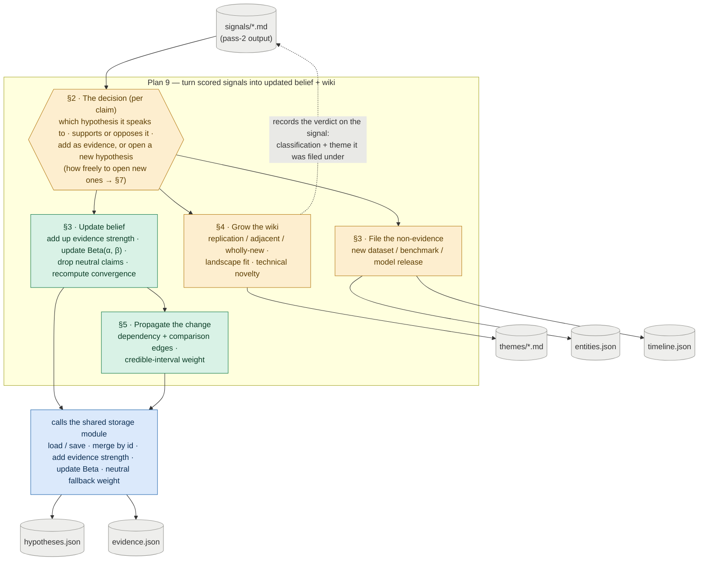

# Plan 9 — Hypothesis And Wiki Update Loop

**Original task ids:** 15.5 (Hypothesis And Wiki Update Loop), 15.5b (Hypothesis Revision And Propagation Evaluation)

---

Build the mechanism that turns newly scored signals into updated topic beliefs and an evolving thematic wiki, then prove that knowledge updates actually propagate coherently.

**Why this matters:** The wiki layer is the human-readable product surface, but it should not be the only place where the system stores what it believes. Without a hypothesis update loop, the system remains a feed summarizer with nicer prose. A system has not really updated its knowledge if it can store new evidence but still briefs as though the old world is true — this plan tests ripple effects directly so the product does not quietly degrade into a prose append-only log.

---

## What this plan does

Every update runs through **one decision**, made once per claim: which existing hypothesis does this claim speak to, does it support or oppose it, and should it be added as evidence to that hypothesis or become a new one? That decision then fans into four branches, each writing a specific part of the store. The diagram maps each branch (and the section that details it) to the files it touches. The belief and propagation branches don't write files themselves — they call the shared `storage` module, which owns the load/save, merge, and Beta-update mechanics. This plan owns the decisions; `storage` owns the mechanics.

*Amber = needs a model call (a judgment) · green = deterministic logic this plan owns · blue = calls into the shared `storage` module · grey = files on disk.*

---

## Storage boundary (Plan 8)

Plan 8 owns the belief-graph **storage mechanics** — load/save and merge-by-id for `hypotheses.json` and `evidence.json`, the credibility-weighted `strength` increment with provenance append, the Beta `alpha`/`beta` belief update, and the `NEUTRAL_CREDIBILITY_WEIGHT` constant. This plan owns the **decisions** that drive them: which hypothesis a signal's evidence attaches to, stance resolution, dedup, and when to mint a new hypothesis. `hypothesis_updater.py` and `wiki_updater.py` call Plan 8's helpers rather than reimplementing the mutation logic.

This plan also owns all **signal-specific storage**, which was deliberately kept out of Plan 8 so that plan stays focused on the belief graph: the `SignalFrontmatter` model, the signal read helper, and writing the resolved `classification` and `theme_id_assigned` back to the signal frontmatter (see `wiki_updater.py` below).

---

## Sub-task A — Hypothesis And Wiki Update Loop

### Changes

| File | Action | Description |
|---|---|---|
| `src/topics/wiki_updater.py` | **NEW** | Reads pass-2 signals; for each top-confidence `candidate_theme`, classifies the contribution as `replication` / `adjacent` / `wholly_new` against the theme body; appends to themes (Markdown, anchor-stable); writes the resolved `classification` and `theme_id_assigned` back to the signal frontmatter |
| `src/topics/hypothesis_updater.py` | **NEW** | Reads pass-2 signals; dedups `new_evidences` against `evidence.json` and increments `strength` (weighted by signal `source_credibility`; `null` credibility uses a configured neutral weight); attaches evidence to existing hypotheses, or creates a new uniform-prior hypothesis when no match exists (this is also how a genuinely new uncertainty — formerly an "open question" — enters the store); updates posterior belief state and per-hypothesis `convergence` from recent provenance |
| `src/topics/entities.py` | **NEW** | Entity extraction or normalization helpers |
| `src/topics/timeline.py` | **NEW** | Append/update notable changes over time (substantive shifts only; replication does not append) |
| `src/topics/propagation.py` | **NEW** | Re-evaluates dependent hypotheses when belief changes; dependency weight is derived at propagation time as the lower bound of the dependency hypothesis's credible interval — `scipy.stats.beta.ppf(DEPENDENCY_WEIGHT_PERCENTILE, α, β)` — where `DEPENDENCY_WEIGHT_PERCENTILE = 0.05` is a named constant; this discounts weakly evidenced dependencies automatically without any manually authored weight |
| `src/topics/anchors.py` | **NEW** | Stable `` generation and resolution for adjacent-block linking (architecture §12) |
| `tests/test_wiki_updater.py` | **NEW** | Theme updates remain idempotent across replication, adjacent, and wholly_new cases; classification is written back to signal frontmatter |
| `tests/test_hypothesis_updater.py` | **NEW** | Support, weakening, opposing, and new-hypothesis cases update durable belief state correctly; strength increments scale with source credibility; a signal raising a new uncertainty creates a uniform-prior hypothesis |

### Update logic must support

- recurring themes (continuous update): appends to `themes/*.md` (Markdown, anchor-stable)
- classification of signal-to-theme contribution: `replication` (no body growth), `adjacent` (append block + Markdown link to prior block's stable anchor), or `wholly_new` (standalone section + fresh anchor); write the resolved `classification` and `theme_id_assigned` back to the signal frontmatter
- evidence integration: dedup by stable id (claim hash + hypothesis_id); increment `strength` weighted by signal `source_credibility` (null → configured neutral weight); append `{signal_id, weight_applied}` to provenance
- stance filtering at link time: pass-2's `Evidence` model lists `stance` as `for | against | mixed | neutral`, but a `neutral` verdict is **not** stored as inert evidence. Surfacing a claim as evidence against a *specific* hypothesis already implies a direction — every candidate "neutral" claim is really one of: directional once the bet is named (`for`/`against`), a null/"no difference" result (`against` a directional bet), conflicting (`mixed`), or genuinely belief-irrelevant. Genuinely belief-irrelevant facts (a new dataset, benchmark, or model release) are **not evidence** — they route to `entities.json` / `timeline.json`. So this plan filters `neutral` at link time: it never creates a `neutral` row in `evidence.json` (effective stored stance is `for | against | mixed`), and it does not call Plan 8's belief-update helper for it. Plan 8 keeps a `neutral` → no-op branch purely as defensive insurance against a stray value reaching the helper (see Plan 8 discussion). The pass-2 `Evidence` enum is a shipped contract and is left unchanged; the filtering lives here, in the linker, where the hypothesis is known
- hypothesis maintenance: attach new evidences to existing hypotheses; create new hypotheses when no match exists; update priors/posteriors; revise action posture based on accumulated evidence
- comparative hypotheses (pairwise edges): a hypothesis that names two subjects (`comparison: {subject_a, subject_b}`, see Plan 8) is a pairwise edge — each comparison accumulates its own Beta over observed head-to-heads. A new contender adds new edges; it does not rebuild anything. **No global ranking is stored** — a "who leads" view is *derived* at read time (via the aggregation pass), never persisted as durable state. Cycles among comparisons (A>B, B>C, C>A) are valid data — conditional/contextual dominance — not contradictions to resolve
- open questions are hypotheses: there is no separate open-question record or `open_questions.json` maintenance. A signal raising a genuinely new uncertainty creates a uniform-prior hypothesis (handled by "hypothesis maintenance" above); rendering low-confidence (near-uniform) hypotheses as an "open questions" view in `overview.md` is a rendering concern (see Plan 8), out of scope for the updater
- convergence computation: derive `convergence` from recent supporting-signal density and stance alignment in evidence provenance
- entity and timeline updates: appends new entries by id (timeline only on substantive shifts; replication does not append)
- bounded Bayesian-style updates: stronger credible evidence moves posterior more; negative evidence lowers belief rather than spawning a separate contradiction object
- propagation rules: when a hypothesis changes meaningfully, re-evaluate dependent hypotheses; the weight applied to each `depends_on` edge is `scipy.stats.beta.ppf(DEPENDENCY_WEIGHT_PERCENTILE, α, β)` — the lower bound of the dependency hypothesis's credible interval; a hypothesis with mean 0.71 but only 3.5 units of accumulated evidence yields a weight of ≈ 0.30 rather than 0.71, correctly discounting fragile beliefs; `DEPENDENCY_WEIGHT_PERCENTILE = 0.05` is a named constant — raising it makes propagation more conservative, lowering it more aggressive

The updater should treat `depends_on` as the canonical first-pass edge field.

### Hypothesis granularity under backfill

When Plan 14 backfill replays the dossier's references, the updater receives a large batch at once — ~200–300 `new_evidences` across ~100 papers — against a dossier that seeded only ~10 hypotheses. The updater's create-vs-attach decision is what sets the resulting granularity, and it can fail in two opposite directions:

- **Under-capture:** every claim matches loosely onto the same ~10 seeded bets as evidence; specific resolvable sub-bets the dossier never framed (e.g. "per-dump dedup beats global dedup", "DPO matches PPO on capability but not robustness") get flattened into "more mass on hypothesis X." Well-evidenced, low-resolution.
- **Over-capture:** a hypothesis is minted on every unmatched claim; `hypotheses.json` floods with paper-level findings ("method X beats Y on benchmark Z") that fail the betting-market test (Plan 8) and make the low-confidence "open questions" view unreadable.

The updater must sit between these, but **how** is an open design question — not yet decided. One candidate direction, recorded so it is not lost: gate new-hypothesis creation by the same resolvability + strategic-significance bar that governs bootstrap authoring (Plan 8), so a claim mints a new bet only when it is **both** unmatched against the existing store **and** clears that bar — otherwise it attaches as evidence to the nearest matching hypothesis, or is dropped as non-strategic. Under this direction backfill claims would *mostly thicken* the seeded hypotheses, minting new ones sparingly. Other directions are possible (e.g. a clustering/merge pass that mints freely then consolidates, or a human-review queue for borderline mints); the choice is deferred until this plan moves into `doing/`.

A bootstrap-side lever owned by Plan 1 is complementary to whatever is chosen here: seeding more hypotheses up front (including claims the literature treats as largely *settled*, all at uniform `Beta(1,1)`) gives backfill richer scaffolding to attach to, and accumulated mass then differentiates them — settled claims acquire high one-sided mass, genuinely open ones stay near 50/50. Richer seeds reduce how often the updater must mint at all, which lowers the stakes of the gating decision above.

### Landscape fit and technical novelty axes

The `replication / adjacent / wholly_new` classification produced by `wiki_updater.py` is the operational form of two scoring concepts:

**Landscape fit** answers "how does this signal relate to what we already know?" Replication confirms an existing theme body with no new information; adjacent extends it in a direction already framed by the topic; wholly new represents something the topic has no prior frame for. This classification is written back to the signal frontmatter as `classification` and drives both theme growth rules (replication → no body growth; adjacent → append block with stable anchor; wholly_new → standalone section) and the output filter in Plan 10 (replication signals are not surfaced as tweet candidates).

**Technical novelty** answers "is this genuinely new — a new method, corpus, or result — or is it incremental over prior work?" This judgment requires the full theme body as context and cannot be made reliably from the abstract alone or without knowing what the topic already knows. The wiki updater is therefore the right place to assess it: the `replication / adjacent / wholly_new` classification already encodes this — replication is incremental, adjacent is a meaningful extension, wholly_new is a genuine advance. Incremental signals may still be worth monitoring but should rank lower in the output filter than genuine advances.

### Verification

- A second run updates existing belief and wiki state instead of recreating it from scratch
- New items can extend an existing theme (`adjacent`) or create a new one (`wholly_new`); replication is reflected as no theme growth
- The resolved `classification` and `theme_id_assigned` are written back to the signal frontmatter
- A signal raising a genuinely new uncertainty creates a uniform-prior hypothesis rather than a separate open-questions record
- An evidence increment from a high-credibility paper moves posterior more than the same claim from a low-credibility paper
- Evidence against an existing hypothesis lowers posterior belief instead of only being mentioned in prose
- A changed hypothesis can update at least one dependent hypothesis or briefing-facing conclusion
- Timeline and watchlist are updated automatically and remain legible

---

## Sub-task B — Hypothesis Revision And Propagation Evaluation

Build a focused evaluation suite for the hardest part of the system: whether knowledge updates actually propagate coherently.

### Changes

| File | Action | Description |
|---|---|---|
| `tests/test_hypothesis_propagation.py` | **NEW** | Multi-step fixtures that verify support, weakening, opposition, convergence, downstream propagation, and comparative (pairwise-edge) updates |
| `docs/specs/15_5b_hypothesis_revision_propagation.test.md` | **NEW** | Human-readable spec describing why ripple-effect failures matter to briefing quality |

### Evaluation cases

- a support case where new evidence strengthens an existing hypothesis
- a weakening case where new evidence lowers confidence without full replacement
- an opposition case where evidence against a current hypothesis lowers posterior belief
- a propagation case where changing one hypothesis updates a dependent hypothesis or briefing conclusion
- a convergence case where multiple weak signals together change belief state
- a comparative-update case where head-to-head evidence moves the belief on the *correct* pairwise edge; a new contender adds a fresh edge without disturbing existing ones; and a cycle (A>B, B>C, C>A) is preserved as conditional dominance rather than forced into a total order

### Verification

- belief state changes are visible in durable files, not only theme prose
- downstream derived outputs change when upstream beliefs change
- opposing evidence remains visible in the hypothesis history and affects posterior belief
- head-to-head evidence moves the belief on the correct pairwise edge; a new contender adds edges rather than rebuilding, and cycles are not "resolved" away into a fabricated global ranking
