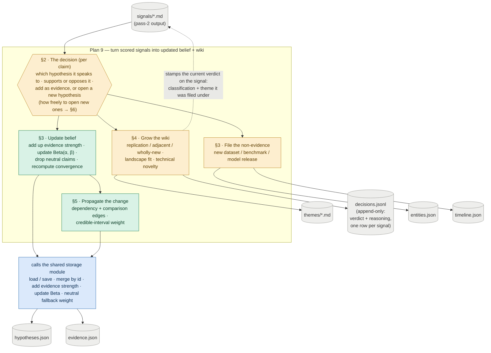

# Plan 9 — Hypothesis And Wiki Update Loop

**Original task ids:** 15.5 (Hypothesis And Wiki Update Loop), 15.5b (Hypothesis Revision And Propagation Evaluation)

---

Build the mechanism that turns newly scored signals into updated topic beliefs and an evolving thematic wiki, then prove that knowledge updates actually propagate coherently.

**Why this matters:** The wiki layer is the human-readable product surface, but it should not be the only place where the system stores what it believes. Without a hypothesis update loop, the system remains a feed summarizer with nicer prose. A system has not really updated its knowledge if it can store new evidence but still briefs as though the old world is true — this plan tests ripple effects directly so the product does not quietly degrade into a prose append-only log.

---

## §1 · What this plan does

Every update runs through **one decision**, made once per claim: which existing hypothesis does this claim speak to, does it support or oppose it, and should it be added as evidence to that hypothesis or become a new one? That decision then fans into four branches, each writing a specific part of the store. The diagram maps each branch (and the section that details it) to the files it touches. The belief and propagation branches don't write files themselves — they call the shared `storage` module, which owns the load/save, merge, and Beta-update mechanics. This plan owns the decisions; `storage` owns the mechanics.

*Amber = needs a model call (a judgment) · green = deterministic logic this plan owns · blue = calls into the shared `storage` module · grey = files on disk.*

---

## Sub-task A — Hypothesis And Wiki Update Loop

Two entry-point modules drive the loop in the diagram. `hypothesis_updater.py` reads pass-2 signals and runs each claim through the decision (§2), then the belief and propagation branches (§3, §5); `wiki_updater.py` grows the themes and writes the verdict back to the signal (§4). They own the **decisions**; the shared `storage` module owns the **mechanics** — load/save and merge-by-id for `hypotheses.json` and `evidence.json`, the credibility-weighted `strength` increment with provenance append, the Beta `alpha`/`beta` update, and the `NEUTRAL_CREDIBILITY_WEIGHT` constant — which the updaters call rather than reimplement. The **signal-specific storage** that Plan 8 deliberately left out also lives here: the `SignalFrontmatter` model, the signal read helper, and the `classification` / `theme_id_assigned` write-back (all alongside `wiki_updater.py`, their consumer). Each branch below opens with the new files it introduces, so a file's responsibility is read in the context that explains it.

### §2 · The decision: match, resolve stance, attach or open

**Every claim runs through one decision before anything is written.** Pass-2 hands over each claim as `{claim, stance}` with **no hypothesis attached** (see Plan 7's `Pass2Score`), so the updater must decide where the claim belongs in three steps.

| File | Action | Description |
|---|---|---|
| `src/topics/hypothesis_updater.py` | **NEW** | The updater entry point; reads pass-2 signals and runs this decision, then the belief and routing branches (§3) and triggers propagation (§5) |
| `tests/test_hypothesis_updater.py` | **NEW** | Support, weakening, opposing, and new-hypothesis cases; `strength` scales with source credibility; a new uncertainty creates a uniform-prior hypothesis |

1. **Match the claim to a hypothesis.** Compare the claim against the existing `hypotheses.json` and pick the one it bears on, if any. The signal's `candidate_themes` are a natural prefilter — a claim most plausibly bears on hypotheses sharing its theme.
   - **Open —** the matching mechanism is undecided (LLM judgment over candidate hypotheses, embedding similarity, or theme-prefiltered LLM). This is the hinge the rest of §2 hangs on, because the dedup id below is keyed on the matched `hypothesis_id`. Decide at the `doing/` boundary.
2. **Resolve the stance against *that* hypothesis.** The pass-2 `stance` describes the claim's own framing, not its bearing on the matched hypothesis, so it must be re-read once the hypothesis is named — a claim emitted `for` its own framing can be `against` the bet it attaches to. A `neutral` verdict is **never stored as inert evidence**: surfacing a claim against a *specific* hypothesis already implies a direction, so each "neutral" candidate is really one of — directional once the bet is named (`for`/`against`), a null/"no difference" result (`against` a directional bet), conflicting (`mixed`), or genuinely belief-irrelevant. Belief-irrelevant facts are not evidence and route out to §3; the rest collapse to `for | against | mixed`. The updater therefore never writes a `neutral` row in `evidence.json` and never calls the belief-update helper for one. (Plan 8 keeps a `neutral` → no-op branch only as defensive insurance against a stray value; the pass-2 `Evidence` enum is a shipped contract and stays unchanged — the filtering lives here, where the hypothesis is known.)
   - **Open —** re-resolution is a model judgment with no specified prompt/model contract (see "The model-judgment surface" below).
3. **Attach, or open a new hypothesis.** Dedup by stable id (`claim hash + hypothesis_id`); on a match, attach by incrementing `strength` (the belief update, §3). When nothing matches, open a new uniform-prior `Beta(1, 1)` hypothesis — **this is also how a genuinely new uncertainty enters the store.** There is no separate open-question record or `open_questions.json`: an "open question" is just a low-evidence hypothesis near its uniform prior, and rendering those as an "open questions" view in `overview.md` is a downstream rendering concern, not the updater's. *How freely* to open new hypotheses versus attaching to existing ones is the granularity question (§6).

**Verify.** *(`[det]` = deterministic, asserts exact behavior — the green nodes; `[llm]` = model judgment, verified by eval cases — the amber nodes; every `[llm]` check is blocked until the model-judgment surface gate is closed.)*
- **`[llm]`** Stance is re-resolved against the *matched* hypothesis, not copied from pass-2: a claim emitted `for` its own framing can resolve `against` the bet it attaches to, and a `neutral` candidate collapses to `for`/`against`/`mixed` or routes to §3 — no `neutral` row is ever written to `evidence.json`.
- **`[det]`** An unmatched claim opens a uniform-prior `Beta(1, 1)` hypothesis rather than a separate open-questions record — the same path by which a genuinely new uncertainty enters the store.
- **`[det]`** Claim-level dedup is keyed on `claim hash + hypothesis_id`: the same claim re-matched to the same hypothesis attaches once, not twice (signal-level no-double-count is a loop invariant — see the end).

### §3 · Update belief, and file what isn't evidence

**A matched, stance-resolved claim moves belief; a belief-irrelevant fact is filed rather than dropped.**

The belief update and routing run inside `hypothesis_updater.py` (introduced in §2); the new files here are the routing targets.

| File | Action | Description |
|---|---|---|
| `src/topics/entities.py` | **NEW** | Entity extraction / normalization for routed facts |
| `src/topics/timeline.py` | **NEW** | Appends notable shifts (substantive only; replication never appends) |

- **Update belief.** Increment `strength` weighted by the signal's `source_credibility` (`weight_applied = source_credibility / 10`; `null` credibility → `NEUTRAL_CREDIBILITY_WEIGHT`), append `{signal_id, weight_applied}` to provenance, and apply the Beta update through `storage` (`alpha += strength` for `for`, `beta += strength` for `against`, split for `mixed`). Updates are bounded and Bayesian-style: stronger credible evidence moves the posterior more, and negative evidence lowers belief rather than spawning a separate contradiction object.
  - **Open —** the plan says to "revise action posture based on accumulated evidence" but gives no belief→`action_posture` mapping. Decide whether posture is recomputed here or is a read-time rendering, and on what rule.
- **Convergence.** Reflect whether recent evidence agrees (high convergence) or conflicts (low), from supporting-signal density and stance alignment in provenance.
  - **Open —** this contradicts Plan 8, which treats the convergence *label* as a read-time derivative of `alpha`/`beta` and stores nothing. Reconcile three axes before building: is convergence **stored on the hypothesis or derived at read time**, and is it computed **from `alpha`/`beta` or from provenance**, and over what "recent" window?
- **File the non-evidence.** A genuinely belief-irrelevant fact (a new dataset, benchmark, or model release) is not evidence — it appends to `entities.json` (by id) or `timeline.json`. Timeline appends only on substantive shifts; replication never appends.
  - **Open —** `entities.json` is seeded by Plan 1 and its record schema is not restated anywhere this plan can build against; confirm the schema, and the rule that decides "belief-irrelevant fact" vs. "drop entirely."

**Verify.**
- **`[det]`** A high-`source_credibility` increment moves the posterior more than the same claim from a low-credibility paper (`weight_applied = source_credibility / 10`; `null` → `NEUTRAL_CREDIBILITY_WEIGHT`).
- **`[det]`** An `against` claim lowers posterior belief (raises `beta`) rather than only being mentioned in prose.
- **`[det]`** A belief-irrelevant fact routes to `entities.json` (by id) or `timeline.json` instead of being dropped; the timeline appends only on a substantive shift (replication never appends).
- **`[det]`** Convergence reflects agreement vs conflict in recent evidence — but it is **blocked** on the stored-vs-derived decision (Open, above); its behavioral case lives in Sub-task B.

### §4 · Grow the wiki

**Each signal's top-confidence theme contribution is classified against the theme body and grows the theme accordingly. The current verdict is stamped on the signal; the full decision — verdict plus reasoning — is appended to a central log.**

| File | Action | Description |
|---|---|---|
| `src/topics/wiki_updater.py` | **NEW** | Classifies the contribution, grows the theme, stamps `classification` / `theme_id_assigned` on the signal, appends the full decision to `decisions.jsonl`, and owns the `SignalFrontmatter` model and signal read/write helpers |
| `src/topics/anchors.py` | **NEW** | Stable `` generation and resolution for adjacent-block links |
| `tests/test_wiki_updater.py` | **NEW** | Idempotency across replication / adjacent / wholly-new; classification written back; decision logged with reasoning |

The `replication / adjacent / wholly_new` classification is the operational form of two scoring concepts and drives the theme growth rules:

- **replication** — confirms the existing theme body with no new information → **no body growth**.
- **adjacent** — extends the theme in a direction it already frames → **append a block + Markdown link to the prior block's stable anchor**.
- **wholly-new** — something the topic has no prior frame for → **standalone section + fresh anchor**.

The decision is recorded in two places, each answering a different question.

The signal frontmatter gets a minimal **stamp**: `classification` and `theme_id_assigned`. This is the current verdict, and it doubles as the "already processed" marker. A later stage reads it — Plan 10's output filter drops a replication as a tweet candidate and ranks incremental signals below genuine advances.

The full decision is also appended as one row to a per-topic append-only log (`decisions.jsonl`): the verdict, the model's **reasoning**, the theme touched, and a timestamp. It is JSONL — one decision per line — so each new decision is appended without rewriting the file; that is a deliberate break from the project's flat-array JSON, because a log only ever grows. The stamp says what a signal's verdict is now. The log says what we decided about everything, and why. Both are written in the same step, so the stamp always matches the signal's row in the log; a disagreement is a bug. A signal is classified once: the stamp keeps later runs from re-touching it, so the log holds exactly one row per signal, not a version history.

The log is what makes the classifier auditable. Classification is an LLM judgment, so the reasoning trail is the only way to debug a bad call or watch the verdict mix drift over time. Frontmatter is the wrong home for that reasoning: it would bloat every signal file, and you could only read decisions one signal at a time. The log keeps the reasoning out of the signal and puts every decision in one place you can scan. It does not duplicate the belief provenance in §3: provenance records which evidence moved which belief; this log records the novelty call and where each signal was filed.

The classification simultaneously encodes both axes. **Landscape fit** answers "how does this relate to what we already know?" — the replication/adjacent/wholly-new gradient itself. **Technical novelty** answers "is this genuinely new, or incremental over prior work?" — replication is incremental, adjacent a meaningful extension, wholly-new a genuine advance. Technical novelty is why this judgment lives in the wiki updater and not in pass-2: it requires the full theme body as context and cannot be made reliably from the abstract alone.

- **Open —** "top-confidence `candidate_theme`" (singular): confirm whether only the #1 theme grows, or every candidate above a confidence bar — a signal can legitimately bear on two themes. And the *adjacent* rule must pick *which* prior block to link to, itself a similarity judgment that is not yet specified.

**Verify.**
- **`[llm]`** Each classification grows the theme correctly: `replication` adds no body; `adjacent` appends a block plus a Markdown link to the prior block's stable anchor; `wholly_new` opens a standalone section with a fresh anchor.
- **`[det]`** The resolved `classification` and `theme_id_assigned` are written back to the signal frontmatter — the verdict Plan 10's output filter later reads.
- **`[det]`** Re-applying an already-classified signal is idempotent: the `adjacent` block is not appended a second time.
- **`[det]`** Each classification appends exactly one row to `decisions.jsonl` (verdict, reasoning, theme, timestamp); a stamped signal is skipped by later runs, so there is one row per signal and the stamp matches it.

### §5 · Propagate the change

**When a hypothesis moves meaningfully, its dependents are re-evaluated, with weak dependencies discounted automatically.** `depends_on` is the canonical first-pass edge field.

| File | Action | Description |
|---|---|---|
| `src/topics/propagation.py` | **NEW** | Re-evaluates dependents when belief moves; derives each edge weight as the credible-interval lower bound (multi-step tests live in Sub-task B, `tests/test_hypothesis_propagation.py`) |

The weight applied to each `depends_on` edge is derived at propagation time as the lower bound of the dependency hypothesis's credible interval — `scipy.stats.beta.ppf(DEPENDENCY_WEIGHT_PERCENTILE, α, β)`, where `DEPENDENCY_WEIGHT_PERCENTILE = 0.05` is a named constant (raise it for more conservative propagation, lower it for more aggressive). A dependency with mean 0.71 but only 3.5 units of accumulated evidence yields a weight of ≈ 0.30 rather than 0.71 — fragile beliefs are discounted without any manually authored weight.

Comparative hypotheses are handled as **pairwise edges**: a hypothesis naming two subjects (`comparison: {subject_a, subject_b}`, see Plan 8) accumulates its own Beta over observed head-to-heads. A new contender adds new edges rather than rebuilding anything, and **no global ranking is stored** — a "who leads" view is *derived* at read time. Cycles among comparisons (A>B, B>C, C>A) are valid data (conditional dominance), not contradictions to resolve.

- **Open —** the edge *weight* is fully specified but the *operation* is not: how the parent's change, the `supports`/`weakens` sign, and that weight actually modify the dependent's `alpha`/`beta`; what counts as a "meaningful" change worth propagating; and whether propagation recurses transitively (and if so, how it terminates, since `depends_on` can cycle). Pin these down before building §5.

**Verify.**
- **`[det]`** A meaningful belief move updates at least one dependent hypothesis or briefing-facing conclusion. Multi-step ripple, convergence, and comparative (pairwise-edge) cases live in Sub-task B (`tests/test_hypothesis_propagation.py`), not restated here.
- **`[det]`** The edge weight is the credible-interval lower bound: a dependency at mean 0.71 with only 3.5 units of evidence yields ≈0.30, not 0.71, so a fragile dependency propagates less (`scipy.stats.beta.ppf(DEPENDENCY_WEIGHT_PERCENTILE, α, β)`).

### §6 · How freely to open new hypotheses (granularity under backfill)

The §2 attach-vs-open decision sets the granularity of the whole store, and it can fail in two opposite directions — most visibly when Plan 14 backfill replays a dossier's references as one large batch (~200–300 `new_evidences` across ~100 papers against a dossier that seeded only ~10 hypotheses):

- **Under-capture:** every claim attaches loosely onto the same ~10 seeded bets; specific resolvable sub-bets the dossier never framed (e.g. "per-dump dedup beats global dedup") flatten into "more mass on hypothesis X." Well-evidenced, low-resolution.
- **Over-capture:** a hypothesis is opened on every unmatched claim; `hypotheses.json` floods with paper-level findings ("method X beats Y on benchmark Z") that fail the betting-market test (Plan 8) and make the "open questions" view unreadable.

**Open — the rule that sits between these is not yet decided.** One candidate, recorded so it is not lost: gate new-hypothesis creation by the same resolvability + strategic-significance bar that governs bootstrap authoring (Plan 8), so a claim opens a new bet only when it is **both** unmatched **and** clears that bar — otherwise it attaches to the nearest match, or is dropped as non-strategic. Other directions are possible (a clustering/merge pass that opens freely then consolidates; a human-review queue for borderline cases). The choice is deferred until this plan moves into `doing/`. A complementary, Plan 1-side lever: seeding more hypotheses up front (including claims the literature treats as *settled*, all at `Beta(1,1)`) gives backfill richer scaffolding to attach to — accumulated mass then differentiates them, and the updater has to open new bets less often, lowering the stakes of this decision.

**Acceptance gate (not a test).** The attach-vs-open rule is an open design decision; nothing in §6 is testable until it is made. Gate: the chosen rule is recorded in this plan (or its `doing/` spec) before implementation, and demonstrably avoids both failure modes on the Plan 14 backfill batch — sub-bets must not flatten onto the seeded hypotheses (under-capture), and `hypotheses.json` must not flood with paper-level findings that fail the betting-market test (over-capture).

### The model-judgment surface (cross-cutting)

Four steps above are model calls, not deterministic code — the amber nodes in the diagram: matching (§2), stance re-resolution (§2), the replication/adjacent/wholly-new classification (§4), and the evidence-vs-non-evidence routing (§3). **Unlike Plan 7, this plan does not yet specify their model machinery** — prompt contract, model + fallback selection, and the parse/validation path — for any of them. That is the single largest gap to close at the `doing/` boundary; treat it as a prerequisite for the §2–§4 sections above, not an afterthought.

**Acceptance gate (not a test).** Before `doing/`, each of the four model calls — matching (§2), stance re-resolution (§2), the replication/adjacent/wholly-new classification (§4), and evidence-vs-non-evidence routing (§3) — needs a recorded prompt contract, model + fallback selection, and parse/validation path. This gate blocks every `[llm]` check above: until it closes, the amber behaviors have no harness to verify against.

### Verification — loop-level invariants

Per-branch checks now sit with the mechanism they test (§2–§5, each a **Verify** block). What remains here is what no single branch owns — the whole-loop invariants.

- A second run updates existing belief and wiki state instead of recreating it from scratch.
- Re-processing a signal already recorded in provenance does **not** double-count it (provenance is keyed by `signal_id` — distinct from §2's claim-level dedup).
- The plan states which signals each run consumes (e.g. all un-`classification`-stamped signals) — **open**.
- Auto-updated human surfaces (timeline, watchlist, themes) remain legible after a run.

---

## Sub-task B — Hypothesis Revision And Propagation Evaluation

Build a focused evaluation suite for the hardest part of the system: whether knowledge updates actually propagate coherently.

### Changes

| File | Action | Description |
|---|---|---|
| `tests/test_hypothesis_propagation.py` | **NEW** | Multi-step fixtures that verify support, weakening, opposition, convergence, downstream propagation, and comparative (pairwise-edge) updates |
| `docs/specs/15_5b_hypothesis_revision_propagation.test.md` | **NEW** | Human-readable spec describing why ripple-effect failures matter to briefing quality |

### Evaluation cases

- a support case where new evidence strengthens an existing hypothesis
- a weakening case where new evidence lowers confidence without full replacement
- an opposition case where evidence against a current hypothesis lowers posterior belief
- a propagation case where changing one hypothesis updates a dependent hypothesis or briefing conclusion
- a convergence case where multiple weak signals together change belief state
- a comparative-update case where head-to-head evidence moves the belief on the *correct* pairwise edge; a new contender adds a fresh edge without disturbing existing ones; and a cycle (A>B, B>C, C>A) is preserved as conditional dominance rather than forced into a total order

### Verification

- belief state changes are visible in durable files, not only theme prose
- downstream derived outputs change when upstream beliefs change
- opposing evidence remains visible in the hypothesis history and affects posterior belief
- head-to-head evidence moves the belief on the correct pairwise edge; a new contender adds edges rather than rebuilding, and cycles are not "resolved" away into a fabricated global ranking
