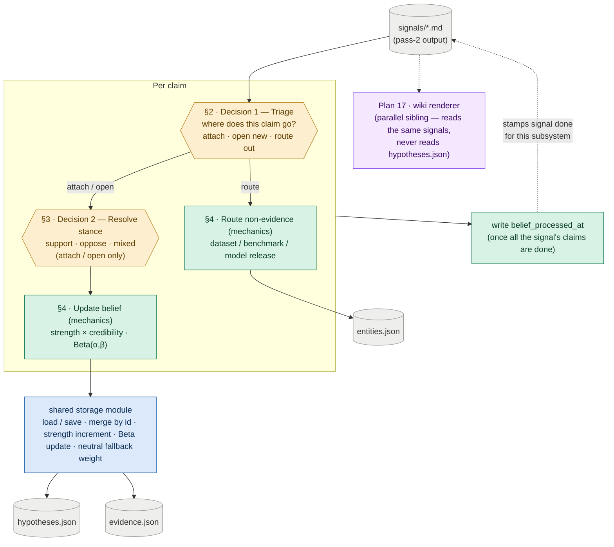

# Plan 9 — Hypothesis Update Loop (Belief Graph)

**Original task ids:** 15.5 (Hypothesis Update Loop — belief half), 15.5b (Hypothesis Revision And Propagation Evaluation)

**Split note (2026-06-29):** This plan was originally "Hypothesis And Wiki Update Loop" and covered both the belief graph and the wiki renderer. It was split so each subsystem can be built and proven on its own. This plan owns the **belief graph**. The **wiki renderer** — the old §5 wiki-novelty decision, theme growth, and anchors — is now **Plan 17**. The two are parallel siblings: they consume the same pass-2 signals through the shared signal contract and never call each other.

**Timeline note (2026-07-05):** `timeline.json` writes also live in Plan 17, not here. A dated fact earns a timeline entry only when it grows a theme, and that verdict — the novelty call — is the renderer's. This plan's route branch writes `entities.json` only.

---

Build the mechanism that turns newly scored signals into updated topic beliefs, then prove those updates are coherent.

**Why this matters:** The system should not only store new evidence — it must let that evidence move what it believes. Without a hypothesis update loop, the system stays a feed summarizer: it can file a new result but still reasons as though the old world holds. So this plan tests that directly — that a new claim moves the right belief — to keep the product from quietly degrading into an append-only log of unconnected results.

---

## §1 · What this plan does

Each signal is exploded into the claims it carries. The belief graph makes **two decisions per claim, plus the mechanics they trigger** — all *below* the paper level:

- Decision 1 (**triage**, §2) asks *where does this claim go?* — attach to an existing hypothesis, open a new one, or route out as a non-evidence fact (a dataset, benchmark, or model release).
- Decision 2 (**resolve stance**, §3) asks *which way does it cut?* — support, oppose, or mixed — and runs only when Decision 1 said attach or open.

Everything else is **mechanics, not decisions** — deterministic logic that fires on its own once a decision is made: the belief update and the routed-fact writes (§4). The mechanics call the shared `storage` module, which owns load/save, merge-by-id, the credibility-weighted `strength` increment, and the Beta update. **This plan owns the decisions and orchestrates the mechanics; `storage` owns the merge/Beta machinery.** That split is stated here once and not repeated below.

A signal carries one further decision — *is each claim new to the theme it touches?* — but that is the **wiki renderer's** job, now **Plan 17**. The renderer reads the same signals independently and never reads this plan's `hypotheses.json`; the two stay decoupled through the signal contract.



*Amber = a model call (a judgment) · green = deterministic mechanics this plan owns · blue = the shared `storage` module · grey = files on disk · purple = the parallel renderer (Plan 17).*

---

## Sub-task A — Hypothesis Update Loop

One entry-point module drives the loop. `hypothesis_updater.py` reads pass-2 signals and runs the two per-claim decisions (§2, §3), then the mechanics they trigger (§4). The shared `storage` module owns the merge/Beta mechanics that §4 calls.

**Reading and stamping signals is shared with the renderer.** Both this plan and Plan 17 read pass-2 signals and write a small "done" stamp back to the signal frontmatter — this plan writes `belief_processed_at`, the renderer writes `classification`. So the `SignalFrontmatter` model and the signal read/write helper are **shared infrastructure**, owned by neither subsystem: they live in a neutral module both import (the Plan 8 `storage` module, or a small new `signals.py` — pinned at the `doing/` boundary), and each subsystem writes only its own stamp field. A run of this plan consumes the signals missing `belief_processed_at`; writing that stamp is the **last** step for a signal, so a crash mid-signal leaves it unstamped and the next run safely re-opens it. The per-claim dedup keyed on `claim hash + hypothesis_id` is what stops an already-attached claim from counting twice on that re-open — so the stamp can stay one mark for the whole signal rather than one per claim. The two subsystems run in either order but never concurrently: both read-modify-write the same signal frontmatter for their stamps, and interleaved runs could silently drop each other's stamp.

Each section below opens with the new files it introduces, so a file's responsibility is read where it is explained.

### §2 · Decision 1 — Triage: where does this claim go? (per claim)

**Every claim runs through triage first.** Pass-2 hands over each claim as `{claim, stance}` with **no hypothesis attached** (see Plan 7's `Pass2Score`), so triage classifies the claim into exactly one branch.

| File | Action | Description |
|---|---|---|
| `src/topics/hypothesis_updater.py` | **NEW** | The updater entry point; reads pass-2 signals and runs Decision 1 and Decision 2, then the mechanics in §4 |
| `tests/test_hypothesis_updater.py` | **NEW** | Triage branches; stance cases; `strength` scales with source credibility; a new uncertainty creates a uniform-prior hypothesis |

The branches:

- **Attach** — the claim bears on an existing hypothesis. Match it against `hypotheses.json` and pick the one it speaks to. The signal's `candidate_themes` are a natural prefilter: a claim most plausibly bears on hypotheses sharing its theme. Dedup by stable id (`claim hash + hypothesis_id`) so the same claim re-matched to the same hypothesis attaches once. → resolve stance (§3), then the belief update (§4).
- **Open a new hypothesis** — nothing matches, but the claim is worth its own bet. Open a uniform-prior `Beta(1, 1)` hypothesis. **This is also how a genuinely new uncertainty enters the store** — there is no separate `open_questions.json`; an "open question" is just a low-evidence hypothesis near its prior, and surfacing one as such is Plan 10's read-time composition (`overview.md` is retired — no stored landing page gets updated). → resolve stance (§3), then the belief update (§4).
- **Route out** — nothing matches and the claim is not worth a bet, but it is a fact worth keeping: a new dataset, benchmark, or model release. It is not evidence. → the routed-fact write (§4). If it is not even that, drop it.

*How finely* to split the questions the system tracks — open a new hypothesis, or attach to an existing one — is the granularity question, resolved in **§6**.

- **Matching mechanism (resolved) —** an **LLM judgment** picks the hypothesis a claim bears on. Start with the LLM ranking over the full hypothesis set (theme overlap is an available scope, not required at current scale). Theme overlap is *not* the long-term shortlister: the taxonomy's ~8-theme resolution is fixed, so its selectivity flattens as the store grows. When Sub-task C shows matching quality sagging with scale, add a shortlisting stage — embedding similarity to a fixed-size top-k is the leading candidate — and let the LLM judge over that shortlist. Retrieval only narrows the candidates; the LLM always makes the attach / open / route / drop call, which similarity alone cannot. The dedup id keys on the *matched* `hypothesis_id`, so it is stable either way. The prompt/model/parse contract for this call is pinned in "The model-judgment surface" below.
- **Keep-vs-drop rule (resolved) —** relevance is inherited (the claim's signal already passed pass-1/pass-2), so the route branch judges only **centrality**: register the artifact the signal is *about*, drop one it merely *mentions* — the same central-vs-incidental cut §6 applies to hypotheses. An entity record is `{id, name, entity_type, description}` (Plan 1's `DossierEntity`; `entity_type` ∈ dataset / benchmark / model / institution). Because a release claim commonly bundles an artifact with a result, **entity registration runs as an independent mechanic, not only on the route branch**: a claim that attaches or opens *and* names a central artifact both updates its belief and registers its entity. The route branch proper is for artifact-only claims; drop is for neither.

**Verify.** *(`[det]` = deterministic, asserts exact behavior; `[llm]` = model judgment, verified by eval cases and blocked until the model-judgment gate closes.)*
- **`[det]`** An unmatched, bet-worthy claim opens a uniform-prior `Beta(1, 1)` hypothesis — the same path by which a genuinely new uncertainty enters the store.
- **`[det]`** Claim-level dedup is keyed on `claim hash + hypothesis_id`: the same claim re-matched to the same hypothesis attaches once, not twice (signal-level no-double-count is a loop invariant — see the end).
- **`[llm]`** A non-evidence fact (dataset / benchmark / model release) is routed out, not attached as evidence; a bet-worthy unmatched claim opens a hypothesis rather than being routed or dropped.

### §3 · Decision 2 — Resolve stance: which way does it cut? (per claim, attach / open only)

**Once a claim is evidence — attached or opening a new bet — resolve its stance against *that* hypothesis.** The pass-2 `stance` describes the claim's own framing, not its bearing on the matched hypothesis, so it must be re-read once the hypothesis is named: a claim emitted `for` its own framing can be `against` the bet it attaches to.

A `neutral` verdict is **never stored as inert evidence**. Surfacing a claim against a *specific* hypothesis already implies a direction, so each "neutral" candidate is really one of — directional once the bet is named (`for`/`against`), a null / "no difference" result (`against` a directional bet), or conflicting (`mixed`). A claim that is genuinely belief-irrelevant was not evidence in the first place and should have routed out in Decision 1, not arrived here. So this step always collapses to `for | against | mixed`; the updater never writes a `neutral` row in `evidence.json` and never calls the belief-update helper for one. (Plan 8 keeps a `neutral` → no-op branch as defensive insurance against a stray value; the pass-2 `Evidence` enum is a shipped contract and stays unchanged — the filtering lives here, where the hypothesis is known.)

**Wrinkle on the open branch.** When a claim *opens* a new hypothesis, the new bet is framed so its founding claim supports it, so stance here is almost always `for` by construction. The interesting re-resolution happens on the **attach** branch, where the claim meets a hypothesis it did not create.

**Verify.**
- **`[llm]`** Stance is re-resolved against the *matched* hypothesis, not copied from pass-2: a claim emitted `for` its own framing can resolve `against` the bet it attaches to, and a `neutral` candidate collapses to `for`/`against`/`mixed` — no `neutral` row is ever written to `evidence.json`.

### §4 · Mechanics — update belief, route the fact (deterministic)

**These are consequences, not decisions.** Once Decision 1 picks a branch and Decision 2 resolves stance, the following run as deterministic code — no model calls.

| File | Action | Description |
|---|---|---|
| `src/topics/entities.py` | **NEW** | Entity extraction / normalization for routed facts |

**Update belief** (attach / open branches). Increment `strength` weighted by the signal's `source_credibility` (`weight_applied = source_credibility / 10`; `null` credibility → `NEUTRAL_CREDIBILITY_WEIGHT`), append `{signal_id, weight_applied}` to provenance, and apply the Beta update through `storage` (`alpha += strength` for `for`, `beta += strength` for `against`, split for `mixed`). Updates are bounded and Bayesian-style: stronger credible evidence moves the posterior more, and negative evidence lowers belief rather than spawning a separate contradiction object.

- **Resolved —** `action_posture` is derived from `alpha`/`beta` at read time, not stored; §4 never writes it. The confidence→label threshold rule lives in the read-time renderer (Plan 10).

**Route the non-evidence fact** (route branch; the entity write also co-fires for an attach/open claim whose central subject is a named artifact — see §2's keep-vs-drop resolution). Append to `entities.json` (by id). The timeline is not written here: a dated fact earns a `timeline.json` entry only when it grows a theme, and that verdict is the renderer's — timeline writes live in Plan 17 (see the timeline note at the top).

Comparative hypotheses are handled as **pairwise edges**: a hypothesis naming two subjects (`comparison: {subject_a, subject_b}`, see Plan 8) accumulates its own Beta over observed head-to-heads. A new contender adds new edges rather than rebuilding anything, and **no global ranking is stored** — a "who leads" view is *derived* at read time. Cycles among comparisons (A>B, B>C, C>A) are valid data (conditional dominance), not contradictions to resolve.

**Verify.**
- **`[det]`** A high-`source_credibility` increment moves the posterior more than the same claim from a low-credibility paper (`weight_applied = source_credibility / 10`; `null` → `NEUTRAL_CREDIBILITY_WEIGHT`).
- **`[det]`** An `against` claim lowers posterior belief (raises `beta`) rather than only being mentioned in prose.
- **`[det]`** A routed fact lands in `entities.json` (by id) instead of being dropped. (Timeline appends are Plan 17's mechanics — a dated fact enters the timeline only by growing a theme.)
- **`[det]`** Accumulation and comparative (pairwise-edge) belief updates behave correctly; multi-step cases live in Sub-task B (`tests/test_hypothesis_revision.py`).

### §6 · Granularity — how finely to split the questions the system tracks

§6 settles one thing: **how finely the system splits the questions it keeps an opinion on.** A topic is never one question. For deduplication, "does dedup help at all?" is one bet; "is fuzzy matching better than exact?" is a different bet; "is per-dump dedup better than global?" is a third. Every question the system opens as a hypothesis is one it can hold an opinion on. Every question it never opens is one it can never answer — even after reading the paper that settles it.

**The resolution: separate a result from a question, then open freely.** Setting aside the non-evidence facts that route out (§2 — a dataset or benchmark release), each *evidential* claim is one of two things.

- A **result** — a measurement the paper reports, e.g. "exact dedup of C4 raised accuracy 2%". A result is *evidence*: it attaches to the hypothesis whose question it speaks to and moves that opinion. It does not become a hypothesis of its own. A hypothesis named after a single measurement is a dead end — nothing else will ever attach to it.
- A **standing question** — something the field genuinely disagrees on, e.g. "is fuzzy better than exact?". This is worth its own hypothesis, even when only one claim speaks to it so far. "A standing question the field disagrees on" is the plain-language form of Plan 8's **betting-market test** (resolvable + strategically significant); the per-claim call below applies that same bar at ingestion time that Plan 8 applies when authoring the seed hypotheses.

One rule stops this from spiralling:

- **A thinly-evidenced hypothesis is fine.** A bet with one piece of evidence is just a weakly-held opinion sitting near its starting point — which is exactly what §2 already calls an "open question." A store full of many weakly-held opinions is honest, not broken. Sparsity is expected here, not a failure.

Narrow and broad bets that touch the same subject are grouped by their shared **theme**, not chained to each other — there is no cross-hypothesis dependency edge (`depends_on` and its propagation were removed; each bet accumulates only its own evidence).

The rule, in one line: open a hypothesis whenever a claim names a real question, keep results as evidence, and let the store be sparse. A complementary lever from Plan 1: seeding more hypotheses up front gives incoming claims something to attach to, so the updater opens fewer brand-new bets.

**The two failure modes this avoids** — most visible when Plan 14 backfill replays a dossier's references as one large batch (~200–300 claims across ~100 papers against ~10 seeded hypotheses):

- **Too coarse:** every claim piles onto the same few broad hypotheses. "Does dedup help" climbs, but "fuzzy vs exact" and "per-dump vs global" — the specific questions — vanish into it. Well-evidenced, but unable to answer anything specific. *Avoided by* giving a real question its own hypothesis.
- **Too fine:** a hypothesis is opened for every measurement. The store fills with dead one-liners ("exact dedup of C4 gives 2%") that no later claim will ever join. *Avoided by* keeping results as evidence, not bets.

Opening freely inevitably creates near-duplicates of the same underlying bet; folding them back together runs at a different cadence than the belief update, so it is its own periodic pass — **Plan 18 — duplicate hypothesis cleanup**.

**Acceptance gate (not a test).** Before implementation, the matching judgment (specified in the model-judgment surface) is recorded, and the result demonstrably avoids both failure modes on the Plan 14 backfill batch — checked by Sub-task D: specific questions keep their own hypotheses (no flattening), and the store does not fill with one-measurement hypotheses (no dead one-liners).

### The model-judgment surface (cross-cutting)

The loop needs two model judgments per claim — the two amber nodes in the §1 diagram; everything else is deterministic. Each is described below by its **consumers** (the loop steps that call it), what it decides, and its input → output. Both are the `[llm]` behaviors flagged above and share one acceptance gate.

- **Matching / triage.** 
  - *Consumers:* §2 Decision 1 (route the claim) and §6's per-claim call (result vs standing question) — the **same** judgment from two angles, not two separate gaps. 
  - *Decides:* given a claim and the current hypothesis set, whether it attaches to an existing bet (and which one), opens a new bet, routes out as a non-evidence fact, or drops. 
  - *In → out:* `{claim, candidate hypotheses}` → `attach hypothesis_id | open new | route entity | drop`. The loop's hardest call — and matching and route-out are **one** model call, not two (contract below).

- **Stance re-resolution.** 
  - *Consumer:* §3 Decision 2. 
  - *Decides:* for the hypothesis the claim just matched or opened, whether the claim supports, opposes, or mixes against *that* bet — re-read against it, never copied from pass-2. 
  - *In → out:* `{claim, matched hypothesis}` → `for | against | mixed` (never `neutral`, which is filtered here).

(The wiki-novelty judgment that used to be a third call now lives in Plan 17, with its own model-judgment surface.)

**The prompt contracts.** Each judgment is pinned the way Plan 7 pinned pass-2 — a `build_*_prompt(...) → str` builder in `prompts.py`, a strict-JSON schema the model must return, and a Pydantic parse model in `models.py` that fails fast on a bad shape.

*Triage* — `build_triage_prompt(claim, candidate_hypotheses, candidate_themes, topic_config) → str`. The prompt shows each candidate hypothesis by its **identity only** — `id`, `statement`, `theme_ids`, and `comparison` subjects. It **withholds the belief state** (`alpha`/`beta`), the evidence list, and the posture. This mirrors `build_pass2_prompt`, which withholds theme bodies and current evidence for the same reason: a matcher that sees a hypothesis is already confident will over-attach to it. The claim's `candidate_themes` ride along as a prefilter hint, though at current scale the model still ranks over the full set (§2). It returns:

```json
{
  "decision": "attach | open | route | drop",
  "hypothesis_id": "<existing id — required when attach>",
  "new_statement": "<a resolvable, directional bet — required when open>",
  "entity": {"name": "...", "entity_type": "dataset | benchmark | model | institution", "description": "..."},
  "rationale": "<one sentence>"
}
```

`entity` is required on `route`, and may **co-fire** on `attach`/`open` when the claim names a central artifact (§2's keep-vs-drop rule). The parse model enforces each branch — `attach` needs a `hypothesis_id` drawn from the candidates, `open` needs a `new_statement` — and raises on anything else rather than coercing it.

**Matching and route-out are one call, not two.** A claim is often only recognizable as a non-evidence artifact *because* nothing attaches to it, so an artifact-first call would decide blind. Folding them also matches the co-fire case: the attach branch already emits an entity, so there is no clean seam to split on.

*Stance* — `build_stance_prompt(claim, matched_hypothesis) → str`. Only the one matched hypothesis is in context, never the candidate set. That is the point: because this call never picks a hypothesis, the model cannot lean on the pass-2 stance — it has to read the claim against the single named bet, which is what §3 requires. It returns:

```json
{ "stance": "for | against | mixed", "rationale": "<one sentence>" }
```

`neutral` is not offered, and the parse model rejects it if it appears — §3 already argued it away.

**Model selection.** Both calls reuse the existing `SCORING_MODEL` / `SCORING_FALLBACK_MODEL` pair and the call-with-fallback loop pass-2 already runs in `scoring.py`. No new model split is introduced up front. Matching is the harder call, so if Sub-task C shows its quality sagging, that is the moment to give it a stronger model — not before.

**Acceptance gate (not a test) — met by the contracts above.** Each judgment now has a recorded prompt contract, model + fallback selection, and parse/validation path. Until that held, the `[llm]` checks in §2–§3 had no harness to verify against; what remains is proving the two calls are *correct*, which is Sub-task C's quality gate.

### Verification — loop-level invariants

Per-step checks sit with the step they test (§2–§4). What remains here is what no single step owns — the whole-loop invariants.

- A second run updates existing belief state instead of recreating it from scratch.
- Re-processing a signal already recorded in provenance does **not** double-count it (provenance is keyed by `signal_id` — distinct from §2's claim-level dedup).
- A run consumes the signals missing this plan's `belief_processed_at` stamp; the stamp is written **last**, after all of a signal's claims are processed (resolves the previously-open "which signals does a run consume?" question, now answered per subsystem).
- Auto-updated surfaces this plan writes — the entity records from routed facts — remain legible after a run. (Theme and timeline legibility are Plan 17's concern.)

---

## Sub-task B — Hypothesis Revision Evaluation

Build a focused evaluation suite for the belief-update mechanics: whether new evidence revises beliefs coherently. This is the **per-mechanic** eval — multi-step fixtures over the deterministic §4 machinery. The **per-judgment** eval (the §2–§3 model calls) is Sub-task C; the **at-scale** eval (the whole loop over a large batch) is Sub-task D.

### Changes

| File | Action | Description |
|---|---|---|
| `tests/test_hypothesis_revision.py` | **NEW** | Multi-step fixtures that verify support, weakening, opposition, accumulation, and comparative (pairwise-edge) updates |
| `docs/specs/15_5b_hypothesis_revision.test.md` | **NEW** | Human-readable spec describing why belief-revision failures matter to briefing quality |

### Evaluation cases

- a support case where new evidence strengthens an existing hypothesis
- a weakening case where new evidence lowers confidence without full replacement
- an opposition case where evidence against a current hypothesis lowers posterior belief
- an accumulation case where multiple weak signals together change belief state
- a comparative-update case where head-to-head evidence moves the belief on the *correct* pairwise edge; a new contender adds a fresh edge without disturbing existing ones; and a cycle (A>B, B>C, C>A) is preserved as conditional dominance rather than forced into a total order

### Verification

- belief state changes are visible in durable files, not only theme prose
- opposing evidence remains visible in the hypothesis history and affects posterior belief
- head-to-head evidence moves the belief on the correct pairwise edge; a new contender adds edges rather than rebuilding, and cycles are not "resolved" away into a fabricated global ranking

---

## Sub-task C — Triage And Stance Judgment Evaluation

**Depends on:** Plan 13 (reuses its LLM-as-judge helper, `eval_judge.py`).

The two model calls in §2–§3 are judgments, not deterministic code, so the shape tests in Sub-task A cannot tell whether they are *correct*. This sub-task is their quality gate, built the way Plan 13 gates pass-1/pass-2: a small golden set scored with an LLM-as-judge. It is the belief-graph analogue of Plan 13's scoring eval — and the tie to Plan 13 is narrow, just the judge helper, so this needs that one module to exist, not all of Plan 13.

### Changes

| File | Action | Description |
|---|---|---|
| `evals/golden/update_loop.yaml` | **NEW** | A handful of claims, each paired with a human judgment: which hypothesis it should attach to (or `open new` / `route out`), and its resolved stance against that hypothesis, against a fixed seed hypothesis store |
| `evals/eval_update_loop.py` | **NEW** | Runs triage + stance over the golden claims against the fixed store and judges each call with the rubric; writes a markdown report. Reuses Plan 13's `eval_judge.py`; does not modify Plan 13 |

### Verification

- **Matching is the call to prioritise** — §6 names it the loop's largest gap.
- A claim attached to the wrong hypothesis, routed when it should have opened a bet, or whose stance was copied from pass-2 instead of re-resolved against the matched hypothesis, scores low and is named in the report.
- Re-running on the same predictions is near-identical (±1 judge drift), matching Plan 13's eval contract.

---

## Sub-task D — At-Scale Belief Health (after backfill)

**Depends on:** Plan 14 (produces the backfilled signal batch) and Sub-task A (moves beliefs over it).

The evals above check one mechanic or one judgment at a time. They cannot see the property that only emerges when the whole loop runs over a large batch: does the **store keep its shape?** This sub-task checks that on the Plan 14 backfill (~200–300 claims across ~100 papers against ~10 seeded hypotheses) — the same batch §6's acceptance gate calls out.

What it must demonstrate, measured on the real backfilled store:

- Specific questions keep their own hypotheses — no flattening into a few broad ones (the §6 "too coarse" failure).
- The store does not fill with one-evidence dead-ends (the §6 "too fine" failure).
- Hypotheses the literature supports carry visibly more evidence mass than genuinely open ones, with every unit of mass traceable to a `signal_id` in provenance. *(Moved here from Plan 14, where it could not be verified without this plan's updater.)*

**How is left open.** Whether this is a deterministic measurement over `hypotheses.json` (mass distribution, count of one-evidence bets), an LLM-as-judge over the resulting store, or a human read — and what threshold counts as "flattening" or "dead-end" — is pinned at the `doing/` boundary. This sub-task names *what* it checks and *why*; the method is a later decision.
