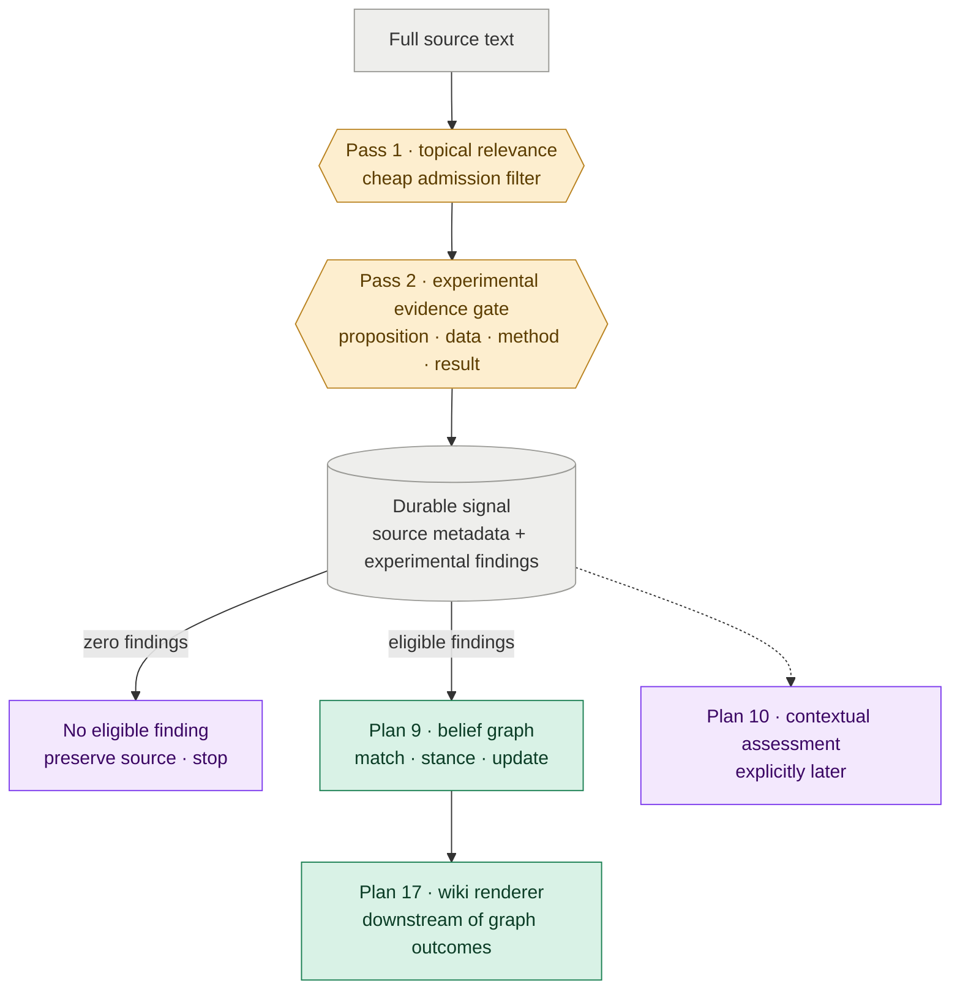

# Plan 19 — Pass-2 Experiment-Grounded Finding Extraction

**Depends on:** Plan 7 (the shipped pass-2 pipeline this plan refactors); Plan 16 (the shipped removal of pass-2-authored open questions).

**Feeds:** Plan 9 consumes findings and becomes their sole interpretation gateway; Plan 13 evaluates extraction quality; Plan 14 backfills the finding contract. Plan 17 receives Plan 9's durable graph outcomes, not pass-2 findings. Contextual applicability and strategic-significance assessment are deliberately deferred to Plan 10.

---

Turn pass-2 from a paper scorer into a strict experimental-evidence boundary: it preserves complete, verifiable experimental findings for the belief graph and emits no finding for unsupported or non-experimental material.

**Why this matters:** The current pass-2 mixes extraction with judgments about applicability, significance, audience, and theme placement, while its thin claim strings discard the experiment that would justify a belief change. A first version does not need to interpret every kind of research communication. It needs a small, trustworthy path from a reported experiment to a durable belief update. This plan therefore admits only findings with an identifiable proposition, data, method, and result; the graph decides what those findings mean for beliefs, and outputs decide what deserves attention later.

---

## §1 · What this plan does

Pass-2 becomes an experimental-evidence gate between full source text and the belief graph.



The plan makes three changes, all serving that narrow responsibility:

1. **Admit only experimentally grounded findings.** A finding must report a concrete measurement from an identifiable evaluation, comparison, intervention, or ablation.
2. **Preserve the complete experimental chain.** Each finding separates the proposition being tested from the data, method, result, conditions, and source location that make it checkable.
3. **Remove interpretation from pass-2.** Applicability, strategic significance, audience fit, recency, stance, and theme placement are not source-extraction responsibilities.

This plan stops at the written signal contract. It does not interpret non-experimental material or build the later contextual-assessment system.

---

## §2 · A finding is a complete experimental result

**A conclusion is eligible only when a reviewer can see what was tested, how, on what data, and with what outcome.** The same proposition can move a belief differently depending on the comparison, dataset, model scale, assumptions, and limitations behind it.

Every finding has this strict semantic contract:

- **Proposition** — the source-level, truth-evaluable claim tested by the experiment, written with appropriate attribution rather than as an endorsed Distill fact. It is not a durable graph hypothesis; Plan 9 performs that normalization.
- **Data** — the dataset, population, samples, models, observations, or other experimental material used.
- **Method** — the evaluation, comparison, intervention, or ablation that produced the measurement.
- **Result** — the observed outcome, including null and negative results, without adding a conclusion the source does not support.
- **Conditions** — the scale, task, assumptions, limitations, and other boundaries that determine where the result holds. The field remains present and may be empty only when the source states no material qualification.
- **Source location** — a section, table, figure, page, heading, or similarly usable locator that lets a human verify the extraction.

The settled shape is:

```yaml
findings:
  - proposition: >
      The authors test the proposition that fuzzy deduplication improves
      downstream accuracy over exact deduplication.
    data: >
      C4-derived training data evaluated on benchmark X.
    method: >
      A controlled comparison between otherwise equivalent models trained with
      fuzzy and exact deduplication.
    result: >
      Fuzzy deduplication improved accuracy by 2.1 percentage points.
    conditions:
      - Tested on models up to 7B parameters.
      - Evaluated only on English-language web data.
    source_location: "Section 4.2, Table 3"
```

### The admission gate is about evidence, not source format

Papers and research blog posts use the same rule. A blog that reports an identifiable experiment may produce findings; a paper section that offers only motivation, synthesis, or speculation may not.

Pass-2 emits no finding for:

- opinions, forecasts, conceptual arguments, and literature summaries without a new experiment;
- model, dataset, product, or organizational announcements without an evaluation;
- performance claims that do not identify the data, method, or measured result; or
- conclusions that cannot be traced to a usable source location.

A mixed source emits only its eligible experimental findings. A source with none retains its source metadata and archived content but writes an empty findings collection. “Discard” means no graph input, not deletion of the source. This preserves provenance and permits later reprocessing without expanding the first-version belief contract.

### Extraction is topic-conditioned but graph-independent

Pass-1 remains the cheap topical admission filter. Pass-2 may use the topic thesis and taxonomy to select which experimental findings are relevant, but it must not read hypotheses, existing evidence, belief confidence, theme bodies, or audience priorities. The same source and topic configuration should produce materially the same findings regardless of what Distill currently believes.

This boundary protects novelty. If extraction sees the current graph, it can over-extract familiar support and under-extract results that do not fit existing beliefs—the opposite of what a research monitor should do.

### Contextual fields and themes leave the signal

Pass-2 no longer authors:

- `applicability_score` or its rationale;
- `strategic_significance` or its rationale;
- `paper_audience`;
- `temporal_freshness`; or
- `candidate_themes` at paper or finding level.

The experimental fields retain the raw ingredients later judgments need: demonstrated scale, implementation requirements, measured effects, constraints, and intended use. Source identity, URL, publication date, authors, affiliations, ingestion timestamp, and source-credibility inputs remain durable provenance. Recency derives from `published_at` when used; credibility remains available to Plan 9's belief mechanics.

Existing evidence inherits theme context from its matched hypothesis. A newly opened hypothesis receives themes when Plan 9 creates it. Plan 17 renders those graph decisions later.

---

## §3 · Downstream handoff stays narrow

**Plan 9 receives experiments, not general claims or artifact announcements.** It maps each proposition to an existing or new durable hypothesis, resolves stance from the result in its experimental context, and emits the graph outcome Plan 17 renders.

The finding's data, method, result, conditions, and source location must remain connected to resulting evidence and rendered knowledge so a human can trace a belief change back to what the source actually demonstrated.

This plan does not change Beta weighting. Richer experimental context may later justify an evaluated evidence-quality judgment beyond source credibility, but that is not assumed here. The immediate goal is better provenance and model context, not another scoring system.

| Area | Responsibility after this plan |
|---|---|
| Pass-2 models and prompts | Admit and extract complete experimental findings; reject non-experimental material |
| Signal writer and examples | Store provenance plus zero or more strict findings; remove frozen contextual scores |
| Plan 9 belief updater | Match propositions, resolve stance from results, and update beliefs |
| Plan 17 wiki renderer | Consume Plan 9 evidence/hypothesis outcomes; never re-interpret raw pass-2 findings |
| Plan 13 quality evaluation | Grade experimental completeness, fidelity, rejection quality, and traceability |
| Plan 14 backfill | Re-run historical sources through the same experimental-evidence gate |

---

## §4 · Migration uses one strict contract

**Do not mechanically wrap legacy claim strings and call them findings.** They lack the experimental context that motivates this refactor and may represent non-experimental material that the first version deliberately excludes.

The current small signal store is re-extracted into the strict contract. No legacy compatibility reader is added. A migrated source either receives complete experimental findings or an empty findings collection; silent coercion is forbidden.

Completed plans remain historical records. This plan supersedes their signal-contract assumptions without editing them.

---

## §5 · Remaining implementation decisions

The extraction and schema boundaries are settled. Implementation still pins:

- the stable finding-id derivation used for replay-safe evidence ids;
- the smallest storage representation for multiline data, method, and result fields;
- how Plan 9 references full finding context without duplicating the source record unnecessarily;
- the rejection reason recorded for evaluation and operator reporting without turning rejected material into findings; and
- which old pass-2 configuration fields are removed now and which move later with Plan 10.

---

## Verification

The plan is complete when pass-2 is visibly an experimental-evidence boundary:

- **Experimental completeness:** every finding identifies a proposition, data, method, result, conditions, and source location.
- **Source fidelity:** a reviewer can understand and verify what was tested and observed without reopening the entire source.
- **Correct rejection:** a purely argumentative or announcement source produces zero findings, while a research blog with a documented experiment remains eligible.
- **Mixed-source selectivity:** a mixed source preserves its experimental results and ignores its unsupported commentary.
- **Null-result retention:** a null or negative experiment remains a valid finding rather than disappearing.
- **No unsupported synthesis:** pass-2 does not invent a proposition, method, measurement, or limitation the source does not support.
- **Graph independence:** changing hypotheses, belief confidence, or audience does not change the extracted findings.
- **Finding granularity:** a mixed-result experiment produces independently interpretable findings rather than one paper-level bundle.
- **Simpler signal contract:** no applicability, strategic-significance, paper-audience, freshness, stance, or theme field is stored on new findings.
- **Graph continuity:** Plan 9 can match the proposition and resolve stance from the result without changing its Beta mechanics.
- **Migration integrity:** no old claim silently masquerades as a complete experimental finding.

## Non-goals

- Extracting or interpreting opinions, predictions, conceptual arguments, literature syntheses, or announcements.
- Registering model, dataset, benchmark, product, company, or lab entities from incoming sources.
- Implementing applicability, strategic-significance, recency, or audience-fit assessment; Plan 10 owns those output-time concerns.
- Changing evidence strength or the Beta belief model.
- Adding a database, dashboard, or general-purpose document parser.
- Using current graph confidence to decide what pass-2 may extract.
