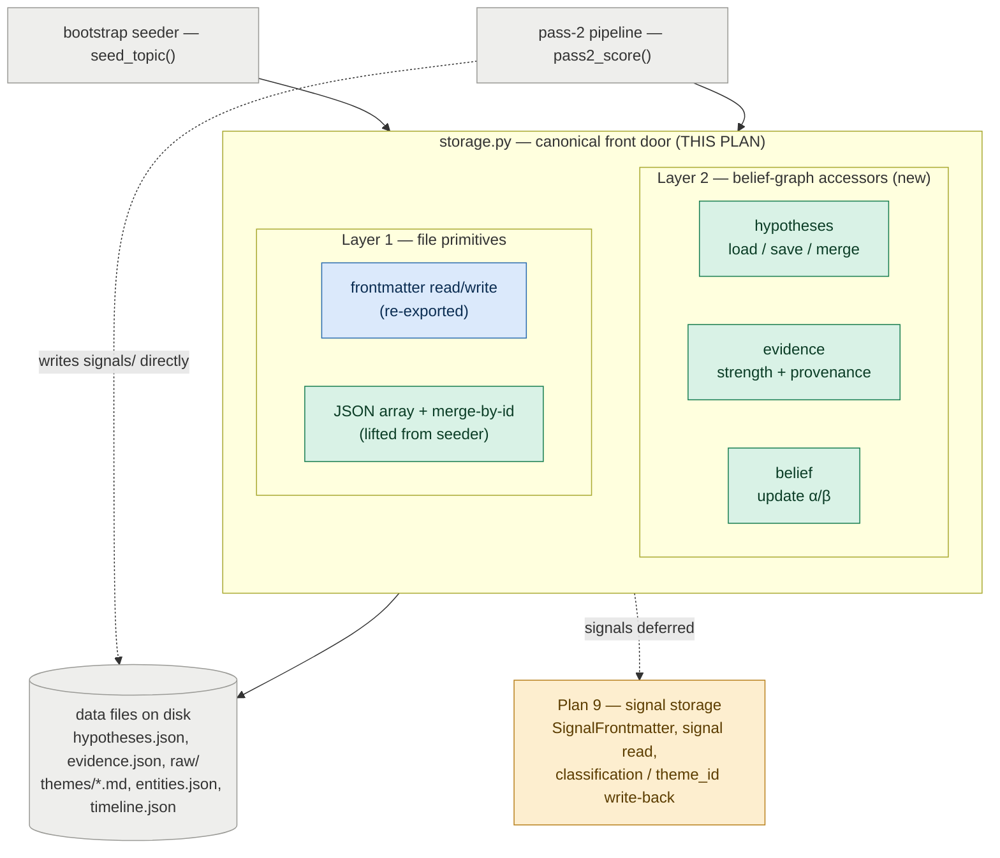

# Plan 8 — Topic Storage Helpers And Layout Documentation

**Original task id:** 15.4
**Depends on:** Plan 1 (bootstrap tooling, seeds `overview.md`, `themes/`, `entities.json`, `timeline.json`, `hypotheses.json`); Plan 7 pass-2 pipeline (defines the signal frontmatter schema that storage helpers must honour).

---

## Responsibility (this plan)



*Green = new in this plan · blue = existing module, reused · grey = callers and on-disk data (not part of the API) · amber = deferred to Plan 9.*

Add the read/merge helpers that make topic files safely accessible to downstream stages, seed the initial `hypotheses.json` and `evidence.json`, and document the full flat layout.

**Why this matters:** A strategic briefing product cannot rely on per-run summaries alone. It needs durable topic memory that persists across runs. The signal schema is already defined by the pass-2 pipeline plan; this task adds the read/merge helpers and documents the complete on-disk contract so every downstream stage builds against a stable foundation.

## Scope and design

`storage.py` is the **canonical storage front door**: downstream stages import their storage operations from here, not from helpers scattered across the codebase. It is organised in three layers:

- **File primitives** — frontmatter read/write/update (re-exported from the existing `frontmatter.py`, not relocated) and JSON-array load + merge-by-id (lifted out of the bootstrap seeder so there is one copy).
- **Belief-graph accessors** — load/save and merge-by-id for `hypotheses.json` and `evidence.json`, the credibility-weighted `strength` increment with provenance append, and the Beta `alpha`/`beta` belief update. These are pure storage *mechanics*; the *decision* of which hypothesis a signal touches belongs to Plan 9.
- **Raw payloads** — a helper to persist original fetched payloads under `raw/`.

This is a **consolidation, not a refactor**: the bootstrap seeder and the pass-2 scorer keep working as they do, calling down into these helpers. No `storage/` package is introduced — a single module is enough until it demonstrably outgrows one file.

**Signals are out of scope here.** They are already written by the Plan 7 scorer and read through the frontmatter primitive. All signal-specific storage — a `SignalFrontmatter` model, a signal read helper, and the `classification` / `theme_id_assigned` write-back — lives with its consumer, the wiki updater, in **Plan 9**. The seam: Plan 8 owns *how the belief graph is stored and safely mutated*; Plan 9 owns *what changes when a signal arrives*.

## Changes

| File | Action | Description |
|---|---|---|
| `src/topics/storage.py` | **NEW** | The canonical storage front door. Re-exports the frontmatter read/write/update primitives and absorbs the JSON-array load + merge-by-id helper lifted out of the bootstrap seeder (one copy). Adds belief-graph accessors for `hypotheses.json` and `evidence.json` — load/save, merge by stable id, the credibility-weighted `strength` increment with provenance append, and the Beta `alpha`/`beta` belief update — plus a `raw/` payload save helper. **Signal-specific storage (a `SignalFrontmatter` model, signal read, and the `classification`/`theme_id_assigned` write-back) is out of scope here — it lives with its consumer in Plan 9.** |
| `data/research_topics/README.md` | **UPDATE** | Document the flat layout from architecture §6, including signal schema reference |
| `data/research_topics/data_advantage/hypotheses.json` | **NEW** | Durable belief store for strategic topic hypotheses; belief state is a Beta distribution parameterised by `(alpha, beta)` — a weighted accumulator over evidence strength. Each record is a single directional, resolvable bet (resolvability is required; the `resolution_criterion` 4-tuple is optional scaffolding); open questions are represented here as uniform-prior records (there is no separate open-questions claim store) |
| `data/research_topics/data_advantage/evidence.json` | **NEW** | Evidence records linking claims to hypotheses; `strength` is a weighted accumulator (sum of `weight_applied` across contributing signals, where `weight_applied = source_credibility / 10`); `provenance` is an append-only list of `{signal_id, weight_applied}` |
| `data/research_topics/data_advantage/raw/` | **NEW** | Original fetched payloads, partitioned `{yyyy-mm-dd}/{source_name}{.xml/.html}` (native format, not coerced to JSON); a `.gitkeep` tracks the otherwise-empty directory |
| `tests/test_topic_storage.py` | **NEW** | Round-trip read/write for the belief-graph stores (`hypotheses.json`, `evidence.json`) and the wiki JSON stores; merge-by-id is idempotent; YAML frontmatter preserved on partial updates of themes/overview |

## Storage layout must support

- raw ingested items (`raw/`)
- scored signals (`signals/`) — written by the Plan 7 scorer; signal-specific read/update helpers live in Plan 9, not here
- durable belief graph state (`hypotheses.json`, `evidence.json`)
- wiki state (flat: `themes/*.md`, `entities.json`, `timeline.json`, `overview.md`); storage helpers do JSON load/merge by id (in addition to YAML frontmatter for themes/overview)
- generated briefings (`briefings/`)
- dossiers (`dossiers/`)

## Hypothesis schema (`hypotheses.json`)

`hypotheses.json` is a flat JSON array. Each record:

```json
{
  "id": "data_scarcity_moat_weakening",
  "statement": "Data scarcity is becoming a weaker moat in benchmark-saturated AI markets.",
  "theme_ids": ["synthetic-data-generation", "quality-filtering-curation"],
  "status": "active",
  "belief": {
    "alpha": 8.7,
    "beta": 3.6
  },
  "action_posture": "monitor",
  "why_it_matters": "If true, durable advantage shifts toward workflow integration and proprietary usage loops rather than static dataset ownership.",
  "resolution_criterion": {
    "metric": "fraction of new frontier-class model releases trained primarily on synthetic or public-curated data rather than proprietary scraped corpora",
    "threshold": "> 50%",
    "scope": "publicly documented frontier-class releases",
    "horizon": "2027-06-30"
  },
  "comparison": null,
  "depends_on": [
    {
      "hypothesis_id": "synthetic_data_quality_rising",
      "relationship": "supports",
    }
  ],
  "created_at": "2026-04-26",
  "last_updated_at": "2026-04-26"
}
```

**Hypothesis authoring constraint (the betting-market test):** each record must be a single *directional, resolvable bet* — a claim concrete enough that two reviewers could independently settle it the same way once evidence arrives. **Resolvability is the requirement.** The optional **resolution criterion** (metric + threshold + scope + horizon) is *scaffolding that helps achieve resolvability*, not a mandatory four-field literal: for an already-crisp binary event claim the metric and threshold are often implicit in the statement, while scope and horizon are usually still worth pinning (scope prevents one Beta from fusing different contexts; horizon makes "against" reachable and keeps the claim an actual bet). Multi-dimensional claims must be decomposed into separate records; relationships between them are expressed through `depends_on` edges.

**"Open" is a belief state, not a shape.** An open question is simply any bet sitting near its uniform prior with little accumulated evidence — high entropy, low evidence mass. It is *not* a separate object type, which is why open questions live in this store with no parallel schema (see "Open questions are hypotheses" below). This is orthogonal to the *shape* of the bet, described next.

### Nature of the bet

Every hypothesis is one resolvable bet; these are the shapes it takes. The shape determines which optional fields carry the resolvability:

- **Standalone** — the claim stands on its own; `comparison` is `null`.
  - *Simple binary* — a discrete outcome ("X is released", "X surpasses Y"). Often resolvable from the `statement` alone.
  - *Magnitude* — a "how far / how much" question reduced to a threshold bet ("metric exceeds X by the horizon"); the `resolution_criterion` carries the cut. A single threshold suffices when only clearing one bar matters; a ladder of thresholds approximates the full curve when the magnitude itself is decision-relevant.
- **Comparative** — a relational claim ("A beats B"); names the two sides under `comparison` and becomes a pairwise edge in the belief graph (Bradley-Terry-style; see Plan 9). A "which of N wins" question is a *set* of these, one per pair.
- **Unframed** — the candidates are not yet known. This is a *transient*, not a durable shape: as incoming signals (papers, which arrive with experiments) name the options, it resolves into comparative or simple-binary bets. The only lasting residue is the open-world catch-all ("some approach nobody has proposed yet wins") — itself a valid bet that self-liquidates into named bets as evidence arrives.

A populated `comparison` looks like:

```json
{
  "id": "synthetic_beats_human_curated_for_instruction_tuning",
  "statement": "Synthetic instruction data will outperform human-curated instruction data for post-training.",
  "comparison": {"subject_a": "synthetic instruction data", "subject_b": "human-curated instruction data"},
  "belief": {"alpha": 1.0, "beta": 1.0},
  "status": "active"
}
```

(Common fields — `theme_ids`, `resolution_criterion`, `action_posture`, timestamps — are identical to the standalone record above and omitted here for brevity.)

Both `resolution_criterion` and `comparison` are **optional fields in service of resolvability**: one operationalizes an otherwise-vague claim, the other anchors a relational one. Populate whichever the bet's shape calls for — a simple binary may need neither. Crucially there is **no type tag**: code infers the shape from content (a populated `comparison` means a pairwise edge), and everything mechanical (`id`, the uniform-prior `belief`, the edge derivation) is derived rather than authored. This keeps the model on what it does well — writing a clear, resolvable claim and naming the subjects involved — and off what it does poorly: classifying into a taxonomy.

Continuous parameter estimates that cannot be reduced to a threshold bet, and vague trend statements with no resolution criterion, remain out of scope for this store.

Field notes:

- `status`: `active | watch | retired | superseded`
- `belief.alpha` / `belief.beta`: Beta distribution parameters; updated by appending evidence strength (`alpha += strength` for `for`, `beta += strength` for `against`, split 50/50 for `mixed`); initialised at `alpha = beta = 1.0` (uniform — no prior belief either way)
- All rendering derivatives (mean, confidence label, convergence label) are computed from `alpha` and `beta` at read time — none are stored
- Belief is read as **both** its mean and its evidence mass (`alpha + beta`): a tie from no evidence (`1, 1`) and a tie from much conflicting evidence (e.g. `40, 40`) share the same mean but mean opposite things — ignorance vs entrenched conflict. Never read the mean alone
- `comparison` (optional): `{subject_a, subject_b}` — non-null only for comparative bets, `null` for standalone ones. A non-null value is what marks the record as a pairwise edge in the belief graph; `null` means a standalone bet. No separate type flag is stored
- `resolution_criterion`: **optional** scaffolding for resolvability — `metric` (what is measured), `threshold` (the yes/no cut), `scope` (the population/domain the claim ranges over), `horizon` (the date by which it should resolve). Populate the parts that the `statement` does not already make unambiguous. What is *required* is that the hypothesis be resolvable; a record that is not resolvable (no shared rule for what counts as for/against) is not a valid hypothesis, with or without this field
- `action_posture`: one of the topic's `action_vocabulary` values (`ignore | monitor | prototype | invest`)
- `depends_on.relationship`: `supports | weakens`; `weight` is 0.0–1.0; edges live on the hypothesis node (no separate edge store)
- Evidence pointers are not stored on the hypothesis — query `evidence.json` filtered by `hypothesis_id` to retrieve supporting and opposing evidence

## Evidence schema (`evidence.json`)

`evidence.json` is a flat JSON array. Each record represents one claim linked to one hypothesis, backed by one or more signals over time:

```json
{
  "id": "ev_001",
  "hypothesis_id": "data_scarcity_moat_weakening",
  "claim": "Synthetic eval sets match human-labeled baselines in narrow domains.",
  "stance": "for",
  "strength": 1.7,
  "provenance": [
    {"signal_id": "arxiv_2026-04-26_a3f7b2c1de", "weight_applied": 0.8},
    {"signal_id": "arxiv_2026-05-01_b9c3d4e2fa", "weight_applied": 0.9}
  ],
  "summary": "Two independent synthetic-evaluation papers in April–May 2026 showed benchmark parity with human annotation in code and reasoning domains.",
  "created_at": "2026-04-26",
  "last_updated_at": "2026-05-01"
}
```

Field notes:

- `stance`: `for | against | mixed | neutral`
- `strength`: weighted accumulator on a 0–1-per-signal scale. Each contributing signal normalises its `source_credibility` (0–10, see Plan 6/7) to `weight_applied = source_credibility / 10`, appends `{signal_id, weight_applied}` to `provenance`, and adds `weight_applied` to `strength`. `null` credibility (no affiliation matched the table) falls back to a neutral `weight_applied = 0.5`, defined here as a named constant `NEUTRAL_CREDIBILITY_WEIGHT = 0.5` (Plan 9 references it and may re-home it). Thus a single maximally-credible signal contributes `1.0`; `strength` reads as an effective count of fully-credible confirmations and never recomputes from scratch.
- `provenance`: append-only list of `{signal_id, weight_applied}`; grows as new signals support the same claim. `weight_applied` is stored per entry so the contribution of each signal stays auditable even if the credibility table changes later
- `summary`: human-readable description of the current evidence state; updated by the wiki updater as new signals arrive

## Open questions are hypotheses (no separate claim store)

There is **no** separate open-question *claim* schema. Per the authoring constraint above, an open question is a hypothesis sitting near its uniform prior — so open questions are stored as records in `hypotheses.json`, not as a parallel store. This removes the duplicated authoring discipline and the question→hypothesis "graduation" sync problem: a question simply *is* a low-evidence hypothesis that concentrates as evidence lands.

Consequences left for downstream plans (out of scope here):

- The legacy `open_questions.json` is removed and bootstrap seeds `hypotheses.json` directly. The bootstrap *code* already does this; migrating the live `data_advantage` data is tracked in **Plan 15**.
- Whether a thin, **non-authoritative rendering** of low-confidence, high-priority hypotheses survives in `overview.md` as an "open questions" view is a rendering decision, not a storage one.

**Explicitly out of scope:** `overview.md`, `themes/`, `entities.json`, `timeline.json` — those come from Plan 1 (bootstrap). There is **no** `wiki/` subdirectory; the wiki is the flat human-readable tree.

## Verification

- One topic folder can store a complete run end-to-end using the flat layout
- Wiki files are human-readable and editable
- The structure is reusable for another topic id
- Storage helpers preserve YAML frontmatter on partial updates (no drift)
- Every hypothesis is resolvable — two reviewers could independently settle the bet the same way; the `resolution_criterion` (metric/threshold/scope/horizon) is the recommended scaffold for that, not a required four-field literal
- Open questions are stored as uniform-prior hypotheses — there is no separate open-questions claim store
