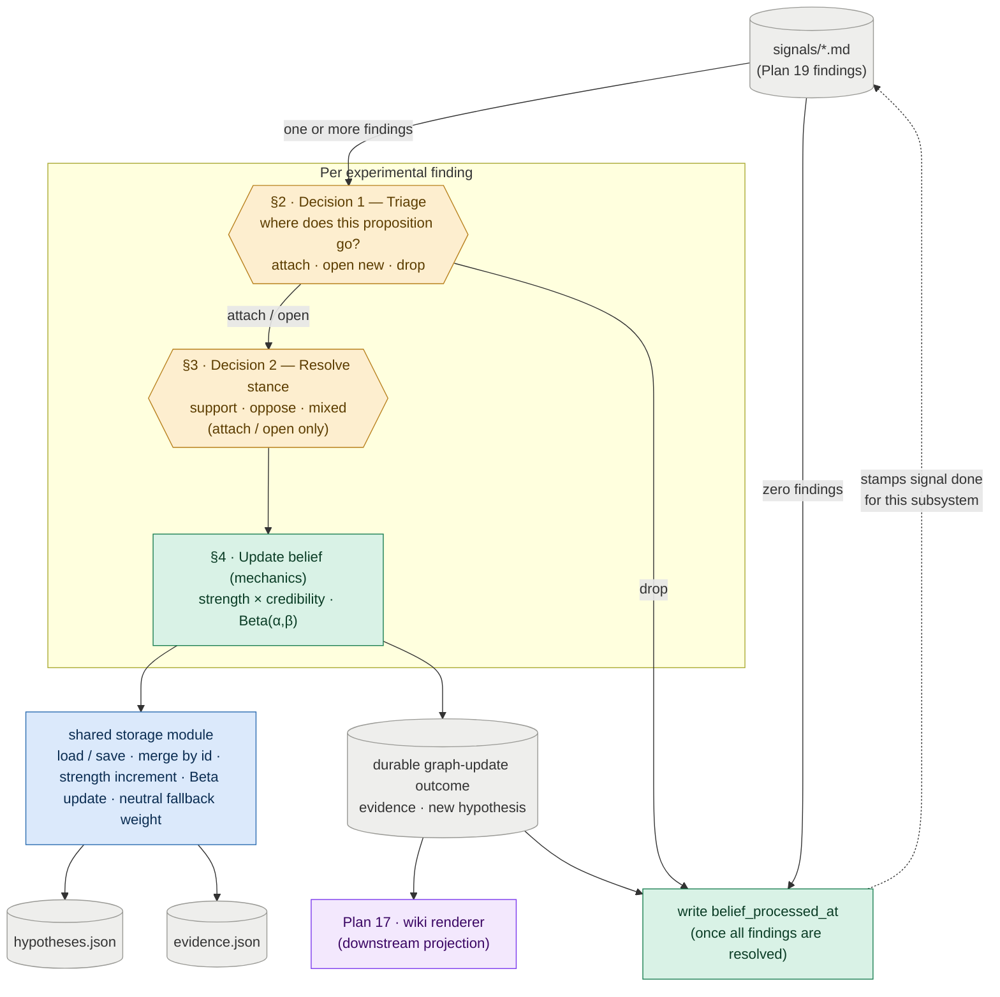

# Plan 9 — Hypothesis Update Loop (Belief Graph)

**Original task ids:** 15.5 (Hypothesis Update Loop — belief half), 15.5b (Hypothesis Revision And Propagation Evaluation)

**Split note (updated 2026-07-19):** This plan owns the **belief graph**; Plan 17 owns wiki rendering. Their code remains separate, but their dataflow is now sequential: Plan 9 is the sole interpreter of Plan 19 findings and emits durable graph-update outcomes; Plan 17 renders those outcomes. The renderer no longer reads pass-2 signals independently.

---

Build the mechanism that turns experiment-grounded findings into updated topic beliefs, then prove those updates are coherent.

**Why this matters:** The system should not only store new evidence — it must let that evidence move what it believes. Without a hypothesis update loop, the system stays a feed summarizer: it can file a new result but still reasons as though the old world holds. So this plan tests that directly — that an experimental result moves the right belief — to keep the product from quietly degrading into an append-only log of unconnected results.

---

## §1 · What this plan does

Each signal is exploded into the experiment-grounded findings Plan 19 defines. The belief graph makes **up to two decisions per finding, plus the mechanics they trigger** — all *below* the paper level:

- Decision 1 (**triage**, §2) asks *where does this proposition go?* — attach to an existing hypothesis, open a new one, or drop it when it cannot support a useful topic belief.
- Decision 2 (**resolve stance**, §3) asks *which way does it cut?* — support, oppose, or mixed — and runs only when Decision 1 said attach or open.

Everything else is **mechanics, not decisions** — deterministic belief updating that fires once both judgments are made (§4). The mechanics call the shared `storage` module, which owns load/save, merge-by-id, the credibility-weighted `strength` increment, and the Beta update. **This plan owns the decisions and orchestrates the mechanics; `storage` owns the merge/Beta machinery.** That split is stated here once and not repeated below.

Whether a graph update should change theme prose is the **wiki renderer's** decision in Plan 17. Plan 9 does not render themes; it hands Plan 17 a durable outcome describing the evidence or new hypothesis it created. The modules stay decoupled through that outcome contract, not through parallel reads of the source signal.



*Amber = a model call (a judgment) · green = deterministic mechanics this plan owns · blue = the shared `storage` module · grey = durable data · purple = the downstream renderer (Plan 17).*

---

## Sub-task A — Hypothesis Update Loop

One entry-point module drives the loop. `hypothesis_updater.py` reads Plan 19 findings and runs the two per-finding decisions (§2, §3), then the mechanics they trigger (§4). The shared `storage` module owns the merge/Beta mechanics that §4 calls.

**Plan 9 alone consumes and stamps source signals.** A run processes signals missing `belief_processed_at`; writing that stamp is the last step, so a crash leaves the signal eligible for retry. Stable finding/evidence ids prevent double-counting on replay. For every non-drop finding, the updater also writes an idempotent graph-update outcome that references the source finding and the durable object created or changed. A signal with zero findings is stamped without creating an outcome, so deliberately rejected non-experimental sources do not loop forever. Plan 17 consumes graph outcomes and tracks its own rendering progress without modifying source signal frontmatter. The exact outcome shape is pinned with the Plan 19 finding contract.

Each section below opens with the new files it introduces, so a file's responsibility is read where it is explained.

### §2 · Decision 1 — Triage: where does this finding go? (per finding)

**Every finding runs through triage first.** Plan 19 hands over a proposition plus its experimental context with no graph hypothesis, stance, or theme attached, so triage classifies it into exactly one branch.

| File | Action | Description |
|---|---|---|
| `src/topics/hypothesis_updater.py` | **NEW** | The updater entry point; reads Plan 19 findings, runs both decisions and mechanics, and emits durable graph outcomes |
| `tests/test_hypothesis_updater.py` | **NEW** | Triage branches; stance cases; `strength` scales with source credibility; a new uncertainty creates a uniform-prior hypothesis |

The branches:

- **Attach** — the finding bears on an existing hypothesis. Match it against the hypothesis set and pick the one it speaks to; theme is not a prefilter. Attached evidence inherits narrative context through the hypothesis's existing `theme_ids`. Dedup by stable finding/evidence id so replay attaches once. → resolve stance (§3), then the belief update (§4).
- **Open a new hypothesis** — nothing matches, but the finding is worth its own bet. Open a uniform-prior `Beta(1, 1)` hypothesis and assign its `theme_ids` as part of creation. **This is also how a genuinely new uncertainty enters the store** — there is no separate `open_questions.json`; an "open question" is just a low-evidence hypothesis near its prior, and surfacing one as such is Plan 10's read-time composition (`overview.md` is retired — no stored landing page gets updated). → resolve stance (§3), then the belief update (§4).
- **Drop** — the record passed extraction but still does not express a resolvable, useful topic proposition. This is a safety valve for malformed or marginal extractions, not a second route for non-experimental material; Plan 19 should already have rejected those.

*How finely* to split the questions the system tracks — open a new hypothesis, or attach to an existing one — is the granularity question, resolved in **§6**.

- **Matching mechanism (resolved) —** an **LLM judgment** picks the hypothesis a proposition bears on, ranking over the full hypothesis set at current scale. Pass-2 themes are not available and theme overlap is not used as a shortlist. If evaluation later shows matching quality sagging with scale, retrieval can be added without changing the attach / open / drop contract; no retrieval mechanism is part of this plan now.
- **Keep-vs-drop rule (resolved) —** relevance and experimental grounding are inherited from Plan 19. Drop only when the proposition still cannot be expressed as useful evidence for a resolvable topic question; do not use drop to preserve announcements or other non-belief facts.

**Verify.** *(`[det]` = deterministic, asserts exact behavior; `[llm]` = model judgment, verified by eval cases and blocked until the model-judgment gate closes.)*
- **`[det]`** An unmatched, bet-worthy finding opens a uniform-prior `Beta(1, 1)` hypothesis — the same path by which a genuinely new uncertainty enters the store.
- **`[det]`** Finding-level dedup is keyed on stable finding id + hypothesis id: the same finding re-matched to the same hypothesis attaches once, not twice.
- **`[llm]`** A bet-worthy unmatched proposition opens a hypothesis; a malformed or non-resolvable proposition drops instead of creating a dead one-line bet.

**Status:** the earlier claim-level triage implementation passed its tests, but
the Plan 19 experimental finding contract, reduced triage branches, theme ownership, and graph-outcome handoff still
need to be applied before this section is complete under the revised design.

### §3 · Decision 2 — Resolve stance: which way does it cut? (per finding, attach / open only)

**Once a finding is evidence — attached or opening a new bet — resolve its stance against *that* hypothesis.** Plan 19 deliberately extracts source content without assigning direction: `for` or `against` has no stable meaning until the hypothesis is named.

A `neutral` verdict is **never stored as inert evidence**. A finding linked to a specific hypothesis must resolve directionally: a null result is `against` a directional bet, while conflicting results are `mixed`. Belief-irrelevant material should have dropped in Decision 1.

**Wrinkle on the open branch.** When a finding opens a hypothesis, the new bet is framed so its founding evidence supports it. The interesting resolution happens on attach, where a finding meets a hypothesis it did not create.

**Verify.**
- **`[llm]`** Stance is resolved against the *matched* hypothesis: a null result resolves `against` a directional bet, conflicting findings resolve `mixed`, and no `neutral` row is ever written to `evidence.json`.

### §4 · Mechanics — update belief (deterministic)

**This is a consequence, not a decision.** Once Decision 1 attaches or opens and Decision 2 resolves stance, the following runs as deterministic code — no model calls.

**Update belief** (attach / open branches). Increment `strength` weighted by the signal's `source_credibility` (`weight_applied = source_credibility / 10`; `null` credibility → `NEUTRAL_CREDIBILITY_WEIGHT`), append `{signal_id, weight_applied}` to provenance, and apply the Beta update through `storage` (`alpha += strength` for `for`, `beta += strength` for `against`, split for `mixed`). Updates are bounded and Bayesian-style: stronger credible evidence moves the posterior more, and negative evidence lowers belief rather than spawning a separate contradiction object.

- **Resolved —** `action_posture` is derived from `alpha`/`beta` at read time, not stored; §4 never writes it. The confidence→label threshold rule lives in the read-time renderer (Plan 10).

Comparative hypotheses are handled as **pairwise edges**: a hypothesis naming two subjects (`comparison: {subject_a, subject_b}`, see Plan 8) accumulates its own Beta over observed head-to-heads. A new contender adds new edges rather than rebuilding anything, and **no global ranking is stored** — a "who leads" view is *derived* at read time. Cycles among comparisons (A>B, B>C, C>A) are valid data (conditional dominance), not contradictions to resolve.

**Verify.**
- **`[det]`** A high-`source_credibility` increment moves the posterior more than the same finding from a low-credibility source.
- **`[det]`** An `against` finding lowers posterior belief rather than only being mentioned in prose.
- **`[det]`** Accumulation and comparative (pairwise-edge) belief updates behave correctly; multi-step cases live in Sub-task B (`tests/test_hypothesis_revision.py`).

### §6 · Granularity — how finely to split the questions the system tracks

§6 settles one thing: **how finely the system splits the questions it keeps an opinion on.** A topic is never one question. For deduplication, "does dedup help at all?" is one bet; "is fuzzy matching better than exact?" is a different bet; "is per-dump dedup better than global?" is a third. Every question the system opens as a hypothesis is one it can hold an opinion on. Every question it never opens is one it can never answer — even after reading the paper that settles it.

**The resolution: Plan 19 separates the proposition from the result, then Plan 9 opens freely.** The finding contains both sides of the distinction:

- The **result** is the measurement the experiment reports, e.g. "exact dedup of C4 raised accuracy 2%". It remains evidence and moves the opinion; it does not become a hypothesis of its own.
- The **proposition** is the truth-evaluable claim the experiment bears on, e.g. "exact deduplication improves downstream accuracy". Plan 9 matches that proposition to the standing graph question or opens a new one when none exists.

One rule stops this from spiralling:

- **A thinly-evidenced hypothesis is fine.** A bet with one piece of evidence is just a weakly-held opinion sitting near its starting point — which is exactly what §2 already calls an "open question." A store full of many weakly-held opinions is honest, not broken. Sparsity is expected here, not a failure.

Narrow and broad bets that touch the same subject are grouped by their shared **theme**, not chained to each other — there is no cross-hypothesis dependency edge (`depends_on` and its propagation were removed; each bet accumulates only its own evidence).

The rule, in one line: open a hypothesis whenever a finding names a real question, keep results as evidence, and let the store be sparse. A complementary lever from Plan 1: seeding more hypotheses up front gives incoming findings something to attach to, so the updater opens fewer brand-new bets.

**The two failure modes this avoids** — most visible when Plan 14 replays a large dossier-reference batch against a small seeded hypothesis set:

- **Too coarse:** every finding piles onto the same few broad hypotheses. Specific questions vanish into broad bets. *Avoided by* giving a real question its own hypothesis.
- **Too fine:** a hypothesis is opened for every measurement. The store fills with dead one-liners ("exact dedup of C4 gives 2%") that no later proposition will ever join. *Avoided by* keeping results as evidence, not bets.

Opening freely inevitably creates near-duplicates of the same underlying bet; folding them back together runs at a different cadence than the belief update, so it is its own periodic pass — **Plan 18 — duplicate hypothesis cleanup**.

**Acceptance gate (not a test).** Before implementation, the matching judgment (specified in the model-judgment surface) is recorded, and the result demonstrably avoids both failure modes on the Plan 14 backfill batch — checked by Sub-task D: specific questions keep their own hypotheses (no flattening), and the store does not fill with one-measurement hypotheses (no dead one-liners).

### The model-judgment surface (cross-cutting)

The loop needs two model judgments per finding — the two amber nodes in the §1 diagram; everything else is deterministic.

- **Matching / triage.** 
  - *Decides:* given an experimental finding and the current hypothesis set, whether its proposition attaches to an existing bet, opens a new bet, or drops.
  - *In → out:* `{finding, candidate hypotheses}` → `attach hypothesis_id | open new | drop` plus theme placement when Plan 9 creates a new hypothesis.

- **Stance re-resolution.** 
  - *Consumer:* §3 Decision 2. 
  - *Decides:* whether the finding supports, opposes, or mixes against the hypothesis it just matched or opened.
  - *In → out:* `{finding, matched hypothesis}` → `for | against | mixed`.

(The wiki-novelty judgment that used to be a third call now lives in Plan 17, with its own model-judgment surface.)

**The prompt contracts.** Each judgment is pinned the way Plan 7 pinned pass-2 — a `build_*_prompt(...) → str` builder in `prompts.py`, a strict-JSON schema the model must return, and a Pydantic parse model in `models.py` that fails fast on a bad shape.

*Triage* — `build_triage_prompt(finding, candidate_hypotheses, topic_config) → str`. The prompt shows the complete experimental finding and each candidate hypothesis by its **identity only** — `id`, `statement`, `theme_ids`, and comparison subjects. It **withholds the belief state** (`alpha`/`beta`), the evidence list, and posture. The model ranks over the full set; no pass-2 theme hint narrows the candidates. When opening a hypothesis, the judgment also supplies the theme placement Plan 9 must preserve for downstream rendering. It returns:

```json
{
  "decision": "attach | open | drop",
  "hypothesis_id": "<existing id — required when attach>",
  "new_statement": "<a resolvable, directional bet — required when open>",
  "comparison": {"subject_a": "...", "subject_b": "..."},
  "theme_ids": ["<topic taxonomy id — required when open>"],
  "rationale": "<one sentence>"
}
```

`comparison` is optional on `open`. The parse model enforces each branch, validates new theme assignments against the topic taxonomy, and raises on anything else rather than coercing it. Attach does not reassign themes: the matched hypothesis remains authoritative.

*Stance* — `build_stance_prompt(finding, matched_hypothesis) → str`. Only the one matched hypothesis is in context, never the candidate set.

```json
{ "stance": "for | against | mixed", "rationale": "<one sentence>" }
```

`neutral` is not offered, and the parse model rejects it if it appears — §3 already argued it away.

**Model selection.** Both calls reuse the existing `SCORING_MODEL` / `SCORING_FALLBACK_MODEL` pair and the call-with-fallback loop pass-2 already runs in `scoring.py`. No new model split is introduced up front. Matching is the harder call, so if Sub-task C shows its quality sagging, that is the moment to give it a stronger model — not before.

**Acceptance gate (not a test) — met by the contracts above.** Each judgment now has a recorded prompt contract, model + fallback selection, and parse/validation path. Until that held, the `[llm]` checks in §2–§3 had no harness to verify against; what remains is proving the two calls are *correct*, which is Sub-task C's quality gate.

### Verification — loop-level invariants

Per-step checks sit with the step they test (§2–§4). What remains here is what no single step owns — the whole-loop invariants.

- A second run updates existing belief state instead of recreating it from scratch.
- Re-processing a signal already recorded in provenance does **not** double-count it.
- A run consumes signals missing `belief_processed_at`; the stamp is written **last**, after every finding has a durable graph outcome or explicit drop.
- A signal with zero findings is stamped without producing graph state or renderer input.
- Every non-drop outcome is idempotent and gives Plan 17 the finding reference, resulting evidence/hypothesis ids, and theme placement it needs without reading pass-2.

---

## Sub-task B — Hypothesis Revision Evaluation

Build a focused evaluation suite for the belief-update mechanics: whether new evidence revises beliefs coherently. This is the **per-mechanic** eval — multi-step fixtures over the deterministic §4 machinery. The **per-judgment** eval (the §2–§3 model calls) is Sub-task C; the **at-scale** eval (the whole loop over a large batch) is Sub-task D.

### Changes

| File | Action | Description |
|---|---|---|
| `tests/test_hypothesis_revision.py` | **NEW** | Multi-step fixtures that verify support, weakening, opposition, accumulation, and comparative (pairwise-edge) updates |
| `docs/specs/15_5b_hypothesis_revision.test.md` | **NEW** | Human-readable spec describing why belief-revision failures matter to briefing quality |

### Evaluation cases

- a support case where new evidence strengthens an existing hypothesis
- a weakening case where new evidence lowers confidence without full replacement
- an opposition case where evidence against a current hypothesis lowers posterior belief
- an accumulation case where multiple weak signals together change belief state
- a comparative-update case where head-to-head evidence moves the belief on the *correct* pairwise edge; a new contender adds a fresh edge without disturbing existing ones; and a cycle (A>B, B>C, C>A) is preserved as conditional dominance rather than forced into a total order

### Verification

- belief state changes are visible in durable files, not only theme prose
- opposing evidence remains visible in the hypothesis history and affects posterior belief
- head-to-head evidence moves the belief on the correct pairwise edge; a new contender adds edges rather than rebuilding, and cycles are not "resolved" away into a fabricated global ranking

---

## Sub-task C — Triage And Stance Judgment Evaluation

**Depends on:** Plan 13 (reuses its LLM-as-judge helper, `eval_judge.py`).

The two model calls in §2–§3 are judgments, not deterministic code, so the shape tests in Sub-task A cannot tell whether they are *correct*. This sub-task is their quality gate, built the way Plan 13 gates pass-1/pass-2: a small golden set scored with an LLM-as-judge. It is the belief-graph analogue of Plan 13's scoring eval — and the tie to Plan 13 is narrow, just the judge helper, so this needs that one module to exist, not all of Plan 13.

### Changes

| File | Action | Description |
|---|---|---|
| `evals/golden/update_loop.yaml` | **NEW** | A handful of experimental findings, each paired with a human judgment: which hypothesis it should attach to (or `open new` / `drop`), its theme assignment where required, and its stance |
| `evals/eval_update_loop.py` | **NEW** | Runs triage + stance over the golden findings against the fixed store and judges each call with the rubric; writes a markdown report |

### Verification

- **Matching is the call to prioritise** — §6 names it the loop's largest gap.
- A proposition attached to the wrong hypothesis, dropped when it should have opened a bet, or assigned the wrong stance from its result scores low and is named in the report.
- Re-running on the same predictions is near-identical (±1 judge drift), matching Plan 13's eval contract.

---

## Sub-task D — At-Scale Belief Health (after backfill)

**Depends on:** Plan 14 (produces the backfilled signal batch) and Sub-task A (moves beliefs over it).

The evals above check one mechanic or one judgment at a time. They cannot see the property that only emerges when the whole loop runs over a large batch: does the **store keep its shape?** This sub-task checks that on Plan 14's experimentally eligible backfill findings against the seeded hypothesis set — the same batch §6's acceptance gate calls out.

What it must demonstrate, measured on the real backfilled store:

- Specific questions keep their own hypotheses — no flattening into a few broad ones (the §6 "too coarse" failure).
- The store does not fill with one-evidence dead-ends (the §6 "too fine" failure).
- Hypotheses the literature supports carry visibly more evidence mass than genuinely open ones, with every unit of mass traceable to a `signal_id` in provenance. *(Moved here from Plan 14, where it could not be verified without this plan's updater.)*

**How is left open.** Whether this is a deterministic measurement over `hypotheses.json` (mass distribution, count of one-evidence bets), an LLM-as-judge over the resulting store, or a human read — and what threshold counts as "flattening" or "dead-end" — is pinned at the `doing/` boundary. This sub-task names *what* it checks and *why*; the method is a later decision.
