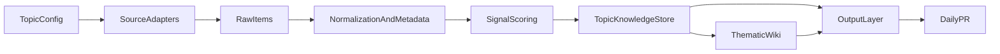

# Sonaryn — Research Briefing Architecture

> **Purpose:** Describe the target architecture for a modular research knowledge and briefing system. This is a design document for a candidate next product shape, not a description of what is already implemented.
> **Date:** 2026-04-18
> **Status:** Proposed architecture

---

## 1. Why This Exists

Sonaryn already contains several useful primitives:

- source monitoring
- explicit goal/topic definitions
- filtering against a user or thesis
- digest generation
- file-based storage

The next candidate system reuses those primitives for a different job:

> maintain an up-to-date knowledge base for a chosen technical topic, then produce strategic signals that help technical decision-makers allocate attention and investment — packaged for publication.

The critical architectural requirement is **modularity**.

The system should allow:

- the audience to be modular
- the active research topic to change
- the source mix to change
- the output framing to remain decision-oriented

without needing a full rewrite every time the focus changes.

---

## 2. System Objective

The system should continuously answer three questions:

1. **What changed recently in this topic?**
2. **How does it fit into the existing landscape?**
3. **Why should this audience care?**

To do that well, Sonaryn needs a layer that existing per-run summarization does not provide:

**durable topic memory**.

That memory should take the form of an evolving knowledge base or wiki that is updated as new signals arrive.

---

## 3. Core Design Principle

Separate the system into:

- **stable infrastructure**
- **topic configuration**
- **source adapters**
- **knowledge representation**
- **output generation** (format-agnostic goal; tweet is the current format)

This separation is what makes topic changes cheap.

---

## 4. High-Level Flow




---

## 5. Core concepts

### 5.1 Audience profile

The audience is modular: swap or extend profiles without rewriting the pipeline.

Current target:

- technical decision-makers who influence AI bets

This audience should be represented as a reusable profile that informs:

- scoring
- explanation style
- recommended actions
- briefing tone

### 5.2 Topic definition

The active topic should be represented explicitly, not implied through prompts scattered across the codebase.

Each topic definition should include:

- topic name
- topic thesis
- included signal classes
- excluded signal classes
- source priority
- taxonomy / subtopics
- scoring rubric
- action vocabulary

Example:

- `data_advantage`
- `evaluation_engineering`
- `agent_reliability`

### 5.3 Signal classes

Signals should be stored with explicit type information.

Examples:

- paper
- lab post
- dataset release
- benchmark release
- engineering writeup
- startup technical launch

This allows topic-specific logic without hardcoding one source type.

### 5.4 Core concept vocabulary

The system organizes topic knowledge around four concepts:


| Concept            | Plain meaning                                                                                                       | Analogy                       | Example (`data_advantage`)                               |
| ------------------ | ------------------------------------------------------------------------------------------------------------------- | ----------------------------- | -------------------------------------------------------- |
| **Topic**          | The whole subject under research. Exactly one per research area. Very stable — changes only on pivot.               | The book                      | "Emerging data advantages in AI"                         |
| **Theme**          | A recurring storyline or angle within the topic. It evolves continuously as new signals land — the knowledge base does not treat themes as going “stale” in the dashboard sense. | A chapter                     | `synthetic-data-generation`, `rlhf-data-curation`        |
| **Entity**         | A proper noun that keeps showing up. A thing, not a story.                                                          | A character, place, or object | `anthropic`, `common-crawl`, `constitutional-ai`, `mmlu` |
| **Timeline entry** | One notable dated event. Frozen after writing — records what mattered at that moment.                               | A dated scene                 | "2024-03-15 — Anthropic released Constitutional AI v2"   |


#### How they relate

- A **topic** is the top-level container.
- **Themes** are *about* something — a recurring angle, story, or question in the topic.
- **Entities** appear inside themes. The same entity can show up in many themes. Themes answer *"what is happening?"*; entities answer *"who or what?"*.
- **Timeline entries** stitch themes and entities together at a specific date.

### 5.5 Hypotheses and evidence

Themes explain the landscape, but they should not be the only place where the system stores what it currently believes.

The system also needs durable, machine-readable belief objects:

- **Hypothesis** — a strategic belief state the system maintains over time
- **Evidence** — a source-grounded observation that pushes belief in a hypothesis up, down, or leaves it unchanged

Examples for `data_advantage`:

- Hypothesis: "Data scarcity is becoming a weaker moat in benchmark-saturated submarkets"
- Evidence for: "Synthetic eval sets now match human benchmarks in several narrow domains"
- Evidence against: "Several frontier workflows still rely on proprietary usage data that synthetic pipelines cannot yet reproduce"

This layer sits between scored signals and wiki prose. The wiki remains the human-readable editorial surface; hypotheses are the durable reasoning surface, and evidence is the update unit that changes belief over time.

### 5.6 Belief graph

Underneath the theme layer and the briefing layer, the system maintains a **belief graph**.

- **Nodes** are hypotheses with a current belief state
- **Edges** represent dependency or influence between hypotheses
- **Evidence** attaches to hypotheses and changes node belief over time

This graph is the machine-readable core of the product:

- themes are a human-readable rendering of relevant graph regions
- briefing conclusions and action postures are derived from the current graph state

The belief graph is **Bayesian-inspired**, but it is **not** a commitment to a fully formal Bayesian network in the first version. The initial goal is a lightweight, inspectable abstraction that supports evidence accumulation, belief revision, and propagation without requiring exact conditional probability tables for every relationship.

#### Deciding where something belongs

- Is it a **story or pattern** that can gain or lose importance over time? → theme
- Is it a **named thing** (person, company, dataset, method, benchmark)? → entity
- Is it a **dated event** worth remembering? → timeline entry
- Is it **the subject itself**? → topic

---

## 6. Proposed Data Model

The file-based approach still fits the current scale.

The storage model is **hybrid**: Markdown for narrative content that humans read, edit, and that the wiki updater appends to; flat JSON arrays for reference data that is purely machine-cross-referenced. Topic configuration lives in **`topic.md` frontmatter** — extended over time as the contract hardens (see §7 and §18).

A topic-oriented structure could look like:

```text
data/research_topics/{topic_id}/
├── topic.md
├── overview.md
├── hypotheses.json
├── evidence.json
├── entities.json
├── timeline.json
├── themes/
│   └── {theme_id}.md
├── signals/
│   └── {yyyy}/{mm}/{dd}/{signal_id}.md
├── raw/
│   └── {yyyy-mm-dd}/{source_name}.json
├── dossiers/
│   └── {purpose}_{yyyy-mm-dd}.md
└── tweets/
    └── {yyyy-mm-dd}.json
```

Intermediate pipeline artifacts (`normalized/` as daily JSON bundles, etc.) can live alongside this layout as implementation details; the **durable human-facing store** is the tree above.

### File roles

| File or directory | Purpose |
| --- | --- |
| `topic.md` | Topic metadata and configuration in frontmatter (id, thesis, audience ref, scope, scoring hooks, enabled source adapters, taxonomy with `theme_ref` links); body optional |
| `overview.md` | Landing view for the topic; rendered from dossier intro prose, theme summary list, and low-evidence hypotheses from `hypotheses.json` |
| `hypotheses.json` | Flat JSON array of strategic belief records; stores prior/posterior belief, rationale, implications, dependencies, and linked evidence ids |
| `evidence.json` | Flat JSON array of evidence records linking signals to hypotheses with stance (`for`, `against`, `mixed`, `neutral`), strength, provenance, and update notes |
| `entities.json` | Flat JSON array of entity records (id, name, entity_type, description); merged by stable id across dossiers |
| `timeline.json` | Flat JSON array of notable dated events; merged by stable id; frozen after creation |
| `themes/` | One file per theme; YAML frontmatter (id, name, description, taxonomy_ref, key_entity_ids, origin, timestamps) + full prose body from the dossier; body grows as signals land (see §11, §12) |
| `signals/` | One file per scored signal (linked from themes and briefs) |
| `raw/` | Original fetched source payloads for traceability and reprocessing |
| `dossiers/` | Pasted outputs from deep research runs (bootstrap, verify, consolidate) |
| `tweets/` | One JSON file per day: array of tweet candidates generated from that day's wiki changes; reviewed and approved in the daily PR before any publish step |

### Belief graph representation

The graph is represented in flat files rather than a dedicated graph database:

- `hypotheses.json` stores node state
- `evidence.json` stores evidence updates linked to nodes
- dependency edges live on hypothesis records under `depends_on`

This keeps the first implementation inspectable and easy to migrate later if the graph outgrows the file-based approach.

### First-pass schema: hypothesis node

The first implementation should keep hypothesis nodes explicit and compact. A record like the following is enough to support scoring, updating, propagation, and rendering:

```json
{
  "id": "data_scarcity_moat_weakening",
  "statement": "Data scarcity is becoming a weaker moat in benchmark-saturated AI markets.",
  "theme_ids": ["data-moats", "synthetic-data"],
  "status": "active",
  "belief": {
    "prior": 0.58,
    "posterior": 0.71,
    "confidence_label": "moderate"
  },
  "action_posture": "monitor",
  "why_it_matters": "If true, durable advantage shifts toward workflow integration, distribution, and proprietary usage loops rather than static dataset ownership.",
  "evidence_for_ids": ["ev_001", "ev_004"],
  "evidence_against_ids": ["ev_003"],
  "depends_on": [
    {
      "hypothesis_id": "synthetic_data_quality_rising",
      "relationship": "supports",
      "weight": 0.7
    },
    {
      "hypothesis_id": "benchmark_reproduction_spreading",
      "relationship": "supports",
      "weight": 0.6
    }
  ],
  "implication_ids": ["brief_market_structure_shift", "brief_moat_reassessment"],
  "last_updated_at": "2026-04-26"
}
```

Recommended first-pass fields:

- `id` — stable machine id
- `statement` — one-sentence human-readable hypothesis
- `theme_ids` — which themes render this node
- `status` — for example `active`, `watch`, `retired`, `superseded`
- `belief.prior` and `belief.posterior` — bounded numeric belief state, typically `0.0` to `1.0`
- `belief.confidence_label` — human-readable summary of current confidence
- `action_posture` — current recommended posture for the audience
- `why_it_matters` — strategic significance in plain language
- `evidence_for_ids` / `evidence_against_ids` — directional evidence references for fast rendering
- `depends_on` — the outgoing dependency edges for the belief graph
- `implication_ids` — ids of briefing-level implications or action statements derived from this node
- `last_updated_at` — operational trace for review

The important design choice is that **dependency edges live on the hypothesis node**. That keeps the graph inspectable in plain JSON and supports local propagation without a separate edge store in the first version.

### First-pass schema: evidence record

Evidence records should stay close to source material and close to the scoring decision that attached them to a hypothesis.

```json
{
  "id": "ev_004",
  "signal_id": "signal_2026_04_26_synth_eval",
  "hypothesis_id": "data_scarcity_moat_weakening",
  "stance": "for",
  "strength": 0.12,
  "source_credibility": 0.8,
  "freshness": 0.9,
  "convergence": 0.65,
  "summary": "Synthetic evaluation sets match human-labeled baselines in several narrow domains.",
  "source_excerpt": "Synthetic eval sets now match human benchmarks in several narrow domains.",
  "source_url": "https://example.com/post",
  "published_at": "2026-04-24",
  "notes": "Supports erosion of scarcity moats in benchmark-heavy categories.",
  "created_at": "2026-04-26"
}
```

Recommended first-pass fields:

- `id` — stable evidence id
- `signal_id` — trace back to the scored signal file
- `hypothesis_id` — which node this evidence currently affects
- `stance` — `for`, `against`, `mixed`, or `neutral`
- `strength` — bounded effect size after scoring
- `source_credibility`, `freshness`, `convergence` — component scores that explain why the evidence moved belief by the amount it did
- `summary` — compact human-readable explanation
- `source_excerpt` — the exact passage or close paraphrase that grounds the evidence
- `source_url` and `published_at` — provenance and recency
- `notes` — optional reasoning note for reviewers
- `created_at` — operational timestamp

This schema keeps evidence directional and inspectable. "Contradiction" is therefore not a separate object type in the first version; it is represented as evidence with `stance: "against"` or `stance: "mixed"` attached to an existing hypothesis.


### Reference rule: forward-only links

Files only list what they point to, not what points to them. A theme declares its `key_entity_ids`; an entity does not store a list of themes that mention it. Timeline entries declare which themes and entities they involve; themes and entities do not store a list of timeline entries that reference them.

Reverse queries (*"which themes reference Anthropic?"*) are answered by scanning frontmatter on demand. This keeps each fact canonical in one place and avoids two-way sync bugs.

---

## 7. Topic Configuration Layer

This is the most important new abstraction.

Each topic should be configurable without modifying core orchestration logic.

### Minimum topic config

Each topic config should answer:

- what counts as in-scope?
- what counts as out-of-scope?
- what source types matter most?
- what taxonomy should incoming items map into?
- what kinds of actions should the brief recommend?
- what makes a signal strategically important?

### Why this matters

Without a first-class topic config, the system will quickly become coupled to the initial topic and difficult to retarget after 1-3 months.

---

## 8. Source Adapter Layer

Source acquisition should be modular and source-specific.

### Examples of likely adapters

- arXiv
- lab blogs
- dataset announcements
- engineering blogs
- benchmark pages

Each adapter should be responsible for:

- fetching source data
- extracting canonical fields
- preserving source URLs and publication dates
- recording enough raw context for reprocessing later

### Adapter output contract

Each source adapter should output a common normalized item shape, for example:

- `id`
- `source_type`
- `source_name`
- `title`
- `url`
- `published_at`
- `authors_or_org`
- `summary`
- `metadata`

This keeps later stages source-agnostic.

---

## 9. Normalization And Enrichment

After fetch, items should be normalized and lightly enriched before scoring.

### Normalization goals

- deduplicate repeated items across sources
- standardize dates and entity names
- classify source type
- capture authors, labs, datasets, methods, and topics

### Enrichment goals

- identify candidate subtopics
- identify named entities
- extract likely evidence candidates
- identify whether the item appears novel, derivative, benchmark-only, or operationally relevant

This stage should avoid final editorial judgment. It prepares the item for later scoring.

**Classification of how a signal should update a theme** (replication vs adjacent vs new block) is a **scoring** responsibility (§10), not an enrichment guess — enrichment may surface hints (candidate themes, entities, hypotheses, evidence) that scoring uses.

Enrichment should also preserve enough evidence for later hypothesis updates:

- source URL
- publication date
- extracted evidence candidates
- source passages or spans supporting those candidates
- entity mentions and normalization hints

---

## 10. Signal Scoring Layer

This layer is the closest conceptual match to Sonaryn's existing goal filtering system.

Instead of asking "is this relevant to a user's goals?", the system asks:

- is this relevant to the active topic?
- is it strategically meaningful for the target audience?
- how urgent or important is it?
- what kind of action does it suggest?
- **what does this item change in our knowledge base, and how much?** (feeds §11)

### Time axis for “recent”

For reader-facing recency (digest, “what changed”), the authoritative clock is **`published_at`** from the source. Ingestion time is for operations (dedup, idempotency) — not for defining “news.”

### Suggested output fields

- topical relevance
- strategic significance
- confidence
- source credibility
- author or publisher track record
- temporal freshness
- evidence strength
- convergence with other recent signals
- suggested action
- rationale
- **`published_at`** (passed through from normalized items)
- **impact on theme** — how this signal should update theme documents (see below); this is the bridge into the wiki updater
- **impact on hypothesis** — how this signal should change current hypotheses (supports, weakens, opposes, creates, or leaves unchanged)
- affected hypothesis ids
- suggested evidence payload

### Impact on themes (three outcomes)

The scorer should classify how a signal relates to what is already written in the relevant theme(s), so the wiki updater can apply the right edit:

| Outcome | Meaning | Theme update |
| --- | --- | --- |
| **Replication** | Substantively repeats what the theme already captures | Do not add bulk to the theme; optional trace only (implementation choice; see §11 timeline note) |
| **Adjacent** | Adds something new, but clearly extends or varies existing material | Add a new paragraph (or block) and **link to the prior block** using stable in-document anchors (`<a id="..."></a>` and `[text](#id)` — see §12) |
| **Wholly new in context** | No adequate anchor in the theme yet | Add a new standalone paragraph or section |

This replaces a single opaque “novelty score” for knowledge-store purposes. Strategic novelty for the *brief* can still be expressed via the other fields above.

### Impact on hypotheses

Theme-edit classification is not sufficient for reasoning. A signal can be adjacent in a theme and still either increase or decrease belief in an existing hypothesis.

The scorer should therefore also classify the signal's effect on current knowledge:

| Outcome | Meaning |
| --- | --- |
| **Supports existing** | Increases belief in an existing hypothesis |
| **Weakens existing** | Decreases belief in an existing hypothesis without overturning it |
| **Opposes existing** | Supplies meaningful evidence against the current belief state |
| **Creates new** | Introduces a new hypothesis the store does not yet contain |
| **No meaningful effect** | Adds context but should not materially move belief |

This is where scoring becomes joint reasoning rather than isolated item ranking: the same source can score differently depending on what the topic store already believes, what changed recently, and whether multiple sources converge.

### Why reuse matters

Sonaryn already has a pattern for:

- explicit goals
- LLM-assisted filtering
- compact rationale generation

That pattern should be reused here with topic configs replacing per-user goals.

---

## 11. Topic Knowledge Store

The key architectural upgrade is a persistent topic knowledge store.

This should capture more than a stream of high-scoring items.

It should maintain:

- active hypotheses and their current belief state
- evidence accumulated for and against each hypothesis
- recurring themes
- important entities
- methods and mechanisms
- known comparisons
- timeline of notable shifts
- unresolved questions

### Belief layer

The topic knowledge store should treat hypotheses as first-class durable state.

A hypothesis record should be able to answer:

- what strategic interpretation are we currently maintaining?
- what prior belief did we start from?
- what posterior belief do we hold now?
- what evidence supports it?
- what evidence weakens it?
- what implications and action posture depend on it?

An evidence record should be able to answer:

- which signal produced this evidence?
- which hypothesis does it affect?
- is the stance `for`, `against`, `mixed`, or `neutral`?
- how strong is the evidence after credibility, freshness, and convergence are considered?
- what exact source passage supports the update?

This layer prevents the wiki from becoming the only source of truth.

### How themes grow (continuous update, not “staleness”)

The store is **continuously updated** as new signals arrive. There is **no separate product concept of themes going “stale”** (quiet dashboards, dormancy labels). A theme is always “current”; what changes is how much **new substance** each signal adds.

When a signal is ingested, enrichment and scoring estimate **how much the news moves a theme** (see §10). Updates are **proportional to impact**:

- **Replication** — Little or no new information vs existing theme prose → **do not** expand the theme body to repeat the same story. (Whether to record a minimal trace on the timeline for audit is an implementation choice; default bias: timeline entries are for **substantive** shifts, not every duplicate mention.)
- **Adjacent** — Genuinely new detail that **varies** prior material → append a block and **link** to the earlier block using **stable explicit IDs** (§12).
- **Wholly new in that theme** — No good anchor yet → add a new block that stands on its own.

### Local vs global novelty

- **Local novelty** — Whether a signal **attaches to our existing themes and entities** (replication vs adjacent vs new block). This is decided by scoring + wiki update logic against the current Markdown store.
- **Global novelty** — Whether something is **new in the broader literature**, not just new to our files. That verdict is **asynchronous**: a **deep research** pass (human-run external agent, output archived under `dossiers/`) can promote or correct theme/entity-level understanding. This does not block daily theme updates; it upgrades confidence over time.

### Practical goal

When a new item appears, the system should be able to ask:

- what theme does it belong to?
- does it repeat, extend, or introduce something we did not have words for yet?
- what existing block does it vary (if adjacent)?
- does it confirm or challenge an existing pattern?
- which existing hypotheses should strengthen, weaken, or be opposed?
- which downstream wiki sections or briefing conclusions should be re-evaluated?

That is what makes a "thematic and up-to-date wiki" possible.

### Bayesian update posture

The system should treat topic knowledge as belief under uncertainty, not as a set of timeless facts.

Each hypothesis therefore maintains a belief state:

- **prior** — the belief before the newest evidence is applied
- **posterior** — the updated belief after evidence is incorporated
- **confidence label** — a human-readable rendering such as `low`, `moderate`, or `high`

This does not require mathematically pure Bayes in the first version. A bounded weighted update model is acceptable if it behaves like cumulative evidence updating:

- strong credible evidence moves belief more than weak anecdotal evidence
- repeated independent confirmation matters
- negative evidence reduces belief rather than creating a separate contradiction object
- large swings should usually require either strong evidence or convergence across sources

### Why this is not a full Bayesian network yet

The belief graph should scale by staying loose where the ontology is still evolving.

The first version should avoid:

- pretending qualitative strategic hypotheses are already well-calibrated random variables
- assigning overly precise probabilities to weakly grounded edges
- requiring explicit conditional probability tables for every dependency
- global inference machinery that is harder to inspect than the beliefs it updates

The design target is therefore:

- **Bayesian-style update semantics**
- **weighted dependency edges**
- **local propagation rules**
- **human-legible provenance for every meaningful belief move**

This keeps the abstraction strong enough to scale while avoiding false precision early on.

### Propagation rules

Belief updates should be able to propagate into dependent outputs.

Examples:

- If new evidence weakens the hypothesis that proprietary data is scarce, then any dependent hypothesis that relies on "data scarcity as moat" should be re-evaluated.
- If a company's scale advantage weakens, then briefing sections about market structure or defensibility should also be re-evaluated.

The architecture does not require a heavy formal logic system, but it does require a lightweight dependency model linking:

- supporting or weakening hypotheses -> dependent hypotheses
- hypotheses -> theme sections
- hypotheses -> briefing conclusions or action postures

### External references (exploration vs exploitation)

Referenced work that is not yet a first-class entity may accumulate **reference counts** over time; high counts prioritize deeper integration (pull-in, dossier, or full entity page). **Exact thresholds and schema** are left to implementation (see §18).

---

## 12. Wiki Layer

The wiki is the human-readable surface of the knowledge store.

It should not be treated as a static documentation dump.

It is a living editorial memory layer.

### Suggested wiki surfaces

- `overview.md` (rendered landing page: intro prose + theme list + top open hypotheses from `hypotheses.json`)
- `themes/{theme_id}.md` (full prose body + YAML frontmatter; anchor-stable; grows as signals land)
- `entities.json`, `timeline.json`, `hypotheses.json`, `evidence.json` (flat reference stores; machine-cross-referenced; open hypotheses surfaced through `overview.md` and optionally per-theme footers)

### What the wiki is for

- support better briefs
- support human editorial review
- preserve context across weeks
- make topic shifts visible
- reduce repeated reasoning from scratch

The wiki should be rendered from durable knowledge objects where possible, especially:

- hypotheses and their current posterior belief
- strongest supporting and opposing evidence
- source-grounded provenance for substantive edits

That keeps the prose layer editable while preserving a more stable reasoning layer underneath.

### Stable anchors within theme pages

When new content relates to earlier content in the same theme file (for example, adjacent work that varies an existing paragraph), links use **stable explicit IDs**, not heading slugs that change when text is edited. Concretely: place `<a id="..."></a>` before the target block and reference it with Markdown links such as `[earlier synthesis](#stable-id)`. IDs stay stable across rewrites of surrounding prose; only intentional renames change them.

---

## 13. Output Generation Layer

The system's output goal is to help technical decision-makers allocate attention and investment by surfacing what changed, why it matters in context, and what posture to take. That goal is format-agnostic.

Each output unit must answer:

1. What changed?
2. How does it fit the existing landscape?
3. Why does it matter for this audience's decisions?

An output that summarises a source without answering those three questions is not the target.

### Package structure

Output generation lives in `src/research_briefing/output/` — a package, not a single module — so new formats can be added without touching the pipeline:

```text
output/
├── __init__.py
├── base.py          # OutputRenderer interface: render(signals, wiki_state, topic_config) → OutputArtifact
└── daily_tweet.py   # First implementation
```

Future formats (`weekly_tweet.py`, `substack.py`, etc.) implement the same interface and require no changes to the wiki update loop or scoring layers.

### Current format: daily tweet

`tweets/{yyyy-mm-dd}.json` — a flat JSON array of candidate objects produced once per daily run:

```json
[
  {
    "id": "...",
    "text": "...",
    "theme_ids": ["..."],
    "signal_ids": ["..."],
    "status": "candidate"
  }
]
```

`status` is always `"candidate"` at generation time. The human sets it to `"approved"` or `"rejected"` in the daily PR. A post-merge publish step consumes `approved` entries.

Only signals with `impact_on_theme` of `adjacent` or `wholly_new` generate candidates — replication signals are not worth surfacing.

### Why JSON, not Markdown

One JSON array per day stays consistent, queryable, and filterable by status. Markdown files would accumulate as undifferentiated daily prose with no machine-readable structure.

---

## 14. Human Editorial Layer

The system is designed for human oversight, not full autonomy. The review surface is the daily pull request — one PR per topic per day, opened by the ingestion agent after all sources for that day have been processed.

### Daily PR as the review unit

Each daily PR contains:

- wiki changes: theme updates, entity/timeline additions, open question changes — the full diff is the changelog
- a structured PR body summarising what changed: new claims, updated/overwritten claims, contradictions resolved, sources added, open questions retired
- `tweets/{yyyy-mm-dd}.json`: tweet candidates generated from that day's changes, reviewed in the same PR

The human reviews prose and tweet candidates together. Merging the PR = approving both. This replaces the old email digest: the PR body *is* the digest, and it points directly to the diffs for anything that needs closer inspection.

### Agent overwrite policy

The ingestion agent is allowed to overwrite existing wiki content, not just append. Append-only accumulation causes rot — contradictions pile up, stale claims linger. The human review surface (the PR diff) is what prevents bad overwrites from persisting. If something doesn't look right, push back in a PR comment before merging.

### Human roles

- review and merge (or request changes on) the daily PR
- push back on overwrites or contradictions via PR comments
- approve topic configs and taxonomies
- correct wiki drift directly (commits to main or via a separate PR)

### Comment loop

The human can request targeted edits before merging by commenting on the PR. A GitHub Actions workflow triggers on PR comments containing a trigger phrase, assembles context, calls the Gemini API, and pushes a commit to the branch.

**Context strategy**

The agent operates in a single round-trip — it sees what it is given, nothing more. Context assembly follows two rules:

- **Reference files are always included:** `entities.json`, `timeline.json`, `hypotheses.json`, and `evidence.json` are small and stable. They are passed on every invocation regardless of what the comment asks. The agent always has the full reference picture.
- **Theme files are routed by naming convention:** theme files can be large and only one or two are usually relevant. The comment itself carries the routing: `@agent reconcile with the filtering claim — see themes/filtering-and-curation.md`. The workflow fetches the named file; no guessing, no passing the entire wiki.

This keeps the context window bounded and flat as the wiki grows, while giving the agent everything it needs for cross-file edits. The convention is not extra cognitive work — the reviewer already knows which theme contains the contradicting claim because they just read it.

**Why single round-trip is acceptable here**

The agent cannot self-correct if its edit is wrong. That is acceptable because the human reviews every edit in the PR before merging. The review loop is the correction mechanism; the agent does not need to be the one to find its own mistakes.

### Why this matters

The differentiator is judgment. The system should therefore optimise for:

- legible diffs — wiki structure should make what changed obvious at a glance
- traceable source links in every signal
- a PR body that surfaces the "why should I care" before asking for a merge decision
- tweet candidates grounded in committed claims, not free-floating generation

---

## 15. Modularity Rules

To keep topic shifts cheap, the architecture should enforce these rules:

### Stable

- orchestration pattern
- item schema
- scoring pipeline
- wiki update pipeline
- briefing pipeline

### Topic-specific

- source mix
- taxonomy
- novelty rules
- action vocabulary
- prioritization heuristics
- audience profiles (modular)

### Swap cost target

Switching the active topic should primarily require:

- a new topic config
- source selection changes
- taxonomy changes

It should **not** require rewriting the core orchestration.

---

## 16. First Topic And Future Topics

### First topic

The first candidate topic is:

- emerging data advantages in AI

### Future examples

- evaluation engineering
- model adaptation methods
- agent reliability
- retrieval and memory systems
- multimodal productization

The architecture should support all of these with the same underlying pipeline.

---

## 17. Relationship To Existing Sonaryn

This candidate architecture is an extension of Sonaryn, not a total restart.

### Existing pieces that can likely be reused

- file-based persistence
- orchestrator mindset
- filtering logic patterns
- explanation-oriented output
- topic/goal representation concepts

### Likely new pieces

- topic config system
- source adapters for research and technical sources
- persistent topic knowledge store
- wiki update logic
- briefing generation grounded in topic memory

---

## 18. Open Design Questions

Some questions are **resolved at the architecture level** (below). Others remain **open for implementation** — they need concrete schemas, thresholds, or first-slice scope.

### Resolved

**3. Knowledge layer: Markdown-first, JSON-first, or hybrid?** → **Hybrid.** Markdown-first for narrative content that humans read and edit (`themes/*.md`, `overview.md`): YAML frontmatter for machine fields, prose body for humans, stable in-document anchors for adjacent updates within a theme (§12). JSON-first for reference data and belief state that is machine-cross-referenced (`entities.json`, `timeline.json`, `hypotheses.json`, `evidence.json`): flat arrays, merged by stable id, loaded and queried by code. Open questions are low-evidence hypotheses, not a separate store. Forward-only links still apply: themes declare `key_entity_ids`; entities do not store back-references. Optional derived indexes are allowed — they must be regenerable from the canonical store, not a second source of truth.

**5. Freshness and novelty over time?**

- **Freshness (for readers):** **`published_at`** from the source defines what counts as “recent news.” Ingestion timestamps are for operations, not for the digest’s notion of newness.
- **Knowledge base:** Themes **update continuously** as signals land. There is **no “stale theme”** product concept — only “how much did this signal add?”
- **Theme updates** follow scorer output (§10): **replication** (do not bloat the theme), **adjacent** (new block + link to prior block via stable `id`), **wholly new block** (standalone section).
- **Novelty has two layers:** **local** = how a signal fits *our* themes (replication / adjacent / new); **global** = field-level novelty, upgraded **asynchronously** via **deep research** outputs in `dossiers/`, without blocking daily updates.

### Still open

1. **Canonical `topic.md` frontmatter schema** — minimal fields exist in §6; full validation (scoring dimensions, source adapter params, audience ref) to be specified in implementation (Task 15.1).
2. **Automation vs curation** — how much of `overview.md`, theme bodies, and timeline is generated vs hand-edited; boundary of editorial slots.
4. **Minimum source adapters for the first slice** — which two or three prove the pipeline (Plan 15.2 / 15.9).
6. **Smallest end-to-end proof** — bootstrap dossier + seeded wiki (Task 15.0) first; live adapters + brief (later tasks) complete the loop (see Plan 15).
7. **External entity promotion** — reference-count thresholds, when to create a full entity page vs leave as external refs (§11).

---

## 19. Recommended Implementation Posture

Build the smallest useful system that proves four things:

1. topic configs work
2. multiple source adapters can normalize into one item shape
3. new items can update a durable wiki state
4. a high-quality briefing can be generated from that state

Do not start with:

- many topics
- many source classes
- fully automated publishing
- a complex knowledge graph

Start with:

- one audience
- one topic
- a small source set
- one simple wiki structure
- one recurring briefing output

That path gives the system room to expand without locking the architecture too early.

---

## Related Documents

- `research_briefing/docs/data_advantage_brief.md`
- `research_briefing/docs/15_knowledge_management_briefing_engine.md`
- `docs/architecture.md`
